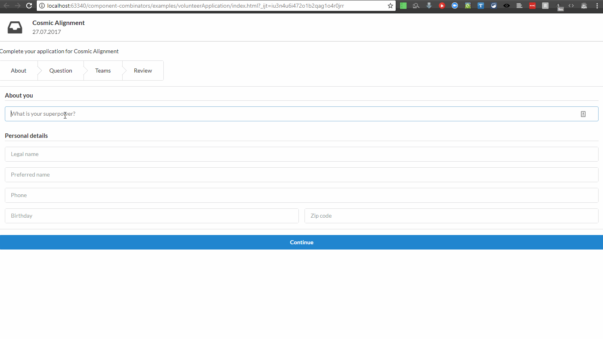

## Motivation
This example implements a non-trivial application process, which is a typical part of enterprise applications. This process has a series of steps, with conditions (*business rules*) for moving from one step to another. Additionally, we use this example to show how an iterative specification and development process works with state machines.

## First iteration
In the initial iteration, the designers produce high-level user flows and the development team refines more detailed specifications from those user flows.
 
### Specifications
Here are the initial specifications for the volunteer application workflow, as extracted from the UX designers. Those initial specifications are light in details, being simple lo-fi wireframes. However the user flow summarizes nicely the key user scenarios:





Furthermore, the following must hold for a good user experience and to guarantee a valid user application:

- it should be possible for the user to interrupt at any time its application and continue it later from where it stopped 
- user-generated data must be validated 
- after entering all necessary data for his application, the user can review them and decide to modify some of them, by returning to the appropriate screen (cf. pencil icons in the wireframe)

### Modelization
Modelizing the user flows with a state machine surfaces issues that did not appear in the high-level user flow, which catered mostly to the happy path for the user. We have to handle data fetching and error flows nicely. The resulting state machine, which acts as detailed specifications, is as follows:





Using this machine as a basis for a working prototype **without reaching the implementation phase**, new requirements emerge and the modelization is subsequently updated. 

## Second iteration
In the second iteration, some improvements on user experience are decided. 

### Specifications
We end up with the following specifications:

- A valid completed application contains the following fields: 
  - personal information: super power, legal name, preferred name, phone, birthday, zip code
    - all previously quoted fields are subject to validation
    - any field failing validation must result in a detailed error message displayed
    - min length > X: super power, legal name, preferred name
    - mandatory fields: phone, birthday, zip code, opportunity question's answer, team motivational question's answer 
  - answer to a motivational question specific to the opportunity
  - a non-empty set of teams that the volunteer want to join
  - for any selected team, a non-empty answer to a motivational question specific to the team
- The user will be able to start filling in an application, interrupt the application, and resume it at a later point in the stage where it stopped
- The user can review its application before applying, and modify it
- : To avoid having to reenter information, previously entered information should be kept
- : The user will be able to join a team, but also to unjoin it, if it was joined previously. The same button will be used to that purpose, with the corresponding action displayed (i.e. Join if the team is not joined yet, Unjoin if the team is already joined)

### Modelization
The resulting updated machine is as follows:


 


## Cyclejs implementation

A (re-)implementation (to avoid licensing issues) was realized with `cycle.js`, a stream-based front-end framework. I reproduce here an animated gif:





The state machine implementation can be found in the [repository](https://github.com/brucou/cycle-state-machine-demo/blob/first-iteration-fix/src/processApplication/fsmSpecs.js). We won't reproduce it here as it is 175 lines of code.

## Svelte implementation
I plan to do yet another implementation with Svelte.

