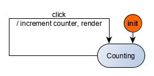

Remember how in a previous section, we explained that a user interface can be specified by a relation between events received by the user interfaces and actions to be performed as a result on the interfaced system. We identified equivalent function $f$ and $g$ such that

$$\begin{cases} actions &=& f(state, event) \\
(actions_n, state_{n+1}) &=& g (state_n, event_n) &\forall n& \end{cases} $$

We then explained that a state machine is just a breakdown of the `state` variable into a control state variable and an extended state variable. We now introduce a pure function $h$ which allows us to perform testing. That gives us three equivalent versions of the same relation:

$$\begin{cases} actions &=& f(state, event) \\
(actions_n, state_{n+1}) &=& g (state_n, event_n)  &\forall n& \\
[actions_1, ..., actions_n] &=& h([event_1, ..., event_n]) &\forall n& \end{cases}$$

Intuitively this is easy to see. If you take a user interface in its initial state, given that its internal state is only modified by itself as a result of incoming events, given that actions are only emitted as a result of incoming events, then the sequence of events entirely determines the sequence of actions. Having a pure function, we have a straightforward testing methodology. We generate input sequences for the machine, we observe the sequence of outputs of the machine and compare that with what is expected per the specifications.

Let's see this in practice with the simple counter application:



The machine only accepts one event (`clicked`) and has only one state (`counting`):

```js
const fsmDef = {
  states: { counting: "" },
  events: ["clicked"],
  initialExtendedState: { count: 0 },
  initialControlState: "counting",
  transitions: [
    {
      from: "counting",
      event: "clicked",
      to: "counting",
      action: incCounterAndDisplay
    }
  ],
  updateState
};
```

Any legal sequence of events can be described by the regular expression `e+` where `e` stands for the click event `{clicked: void 0}`. Here is a portion of the $h$ functional mapping:

| Event sequence | Actions sequence |
|:---:|:---|
| e | `[ [display counter 1] ]` |
| e | `[ [display counter 1], [display counter 2] ]` |
| e | `[ [display counter 1], [display counter 2], [display counter 3] ]` |

`display counter n` here represents the render command produced by the machine. We denote that by $g(n)$:

```js
{
  command: "render",
  params: n
}
```





We just describe one testing strategy for the Kingly's machine: produce input sequences, run them through the machine, compare the resulting output sequences to the expected output sequences. In this simple case, we have a formula for the output sequences. We call that an **oracle**, not in honour of a famous database company, but alluding to a "priest or priestess acting as a medium through whom advice or prophecy was sought from the gods in classical antiquity". An oracle is a function which applied to an input sequence gives us the expected output sequences.

Our test space for the `e+` is infinite. We need only pick a number $n$ of repetitions to describe our test sequence so the test space is equivalent to ($~[1, \infty[$), and we won't be going through an infinite test space in finite time, so we will naturally only generate a limited amount of tests. Ideally we pick those tests so that they maximize our confidence in the good behaviour of our application, or identify bugs in our implementation. One way to do this here would be to pick a random number $n$, generate the sequence and compare the results with the oracle. This technique is called **random testing** and belongs to the statistical testing techniques. Random testing may be used to eliminate the bias from the tester when manually picking input sequences from a large test space.

A broader technique is to establish properties that the output sequences must fulfill, and use that to test against the results. The oracle which tells us that $h([e, \ldots, e]) = [g(1), \ldots , g(n)]$ is itself a property. Another property could be that whatever the length of the input sequence made of repeated `e`, the last output of the output sequence is $g(n)$: $\forall n, h([e, \ldots, e])  = [..., g(n)]$.

That technique is called **property-based testing**, and is pretty useful when there is no oracle available for verifying the output sequences. Incidentally, there is a core property that all Kingly's machine must have: they must compute something! That means that they cannot throw an exception. When there is nothing else we can say about a machine, we can always at least check that it does not throw exceptions under any input sequences.

Alright, this was a little bit of a trivial example. We will take it up a notch when we will test the password meter and the chess games from the tutorials. However, we will apply the same techniques, so it is good if you get familiar with them with a simple example.
