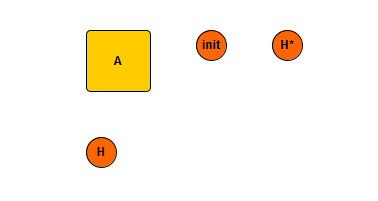
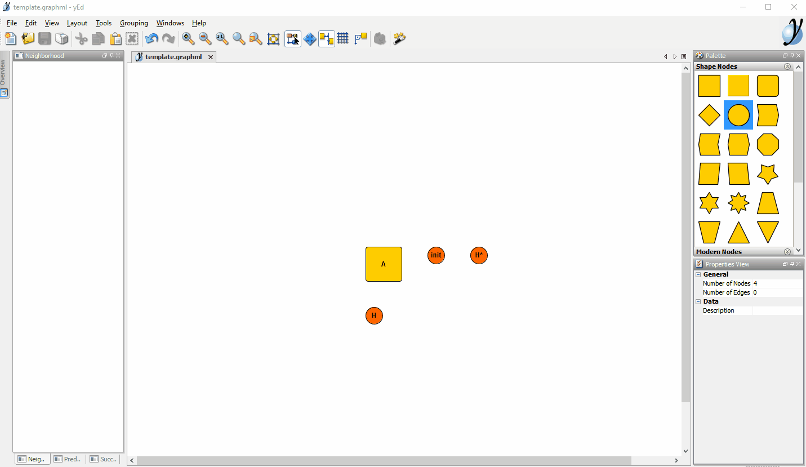
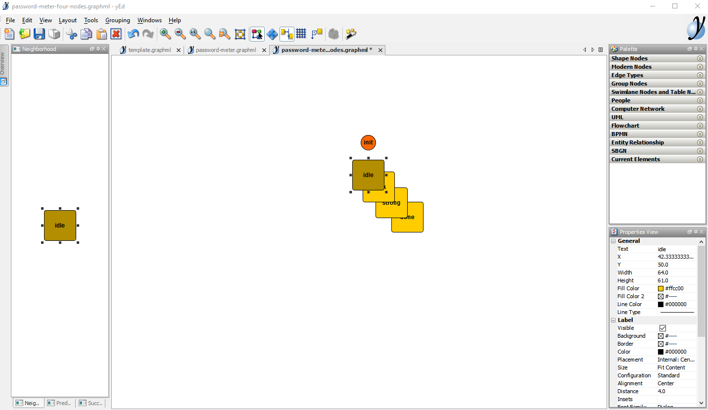
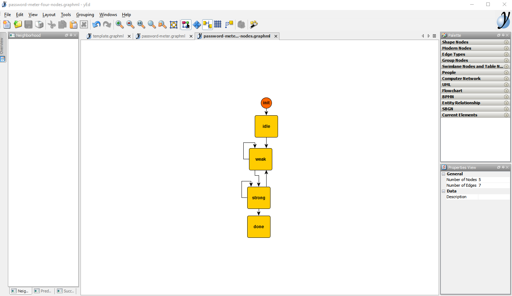
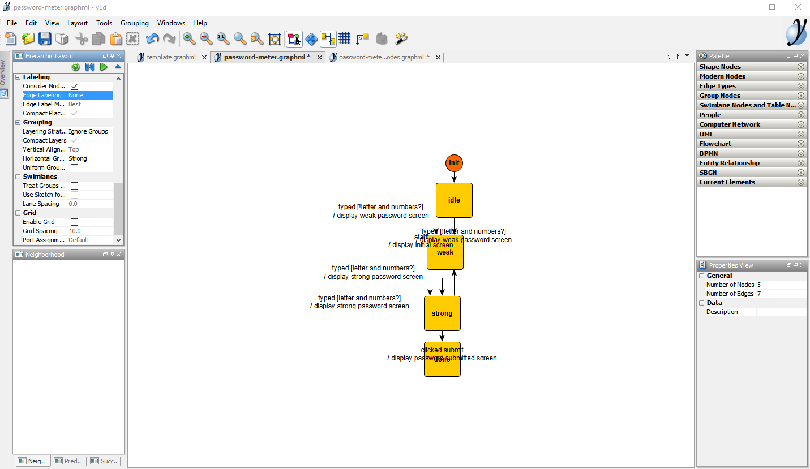
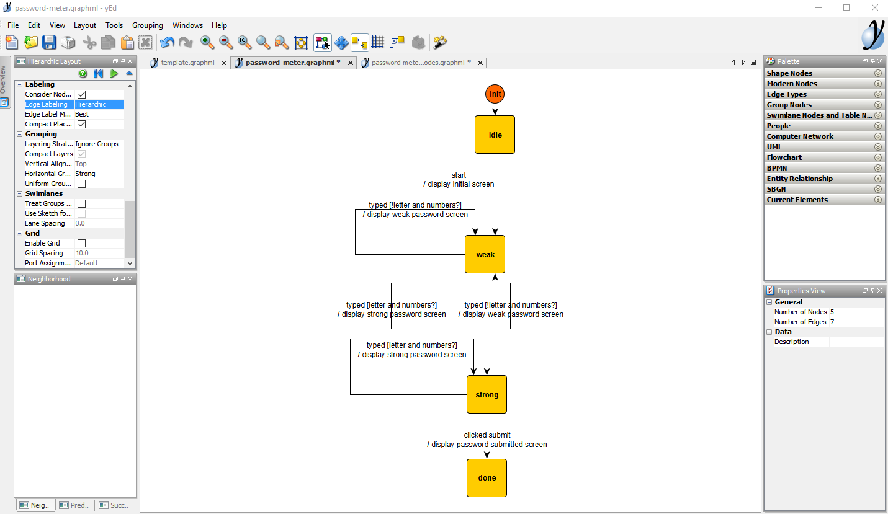
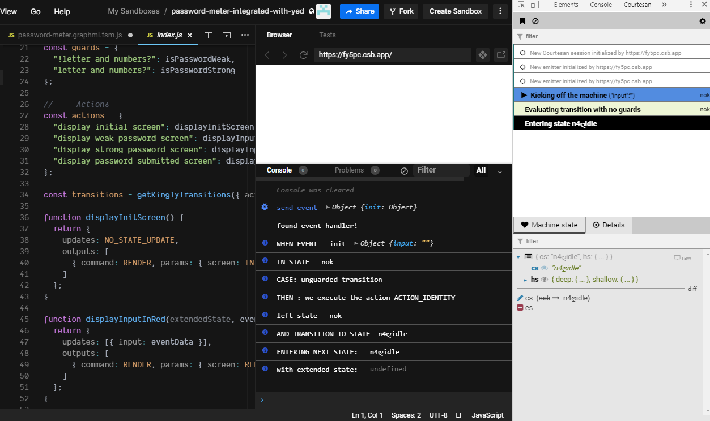

In the previous sections, we specified, designed, and implemented a password meter. In this section, we are going to reach the same implementation but this time, instead of writing the machine's transitions manually, we are going to draw them in a graph editor and convert the drawing to standard JavaScript. 

This section aims at showcasing the yEd graph editor which is the preferred tool to create and maintain Kingly state machines. yEd is simple to use, offers a series of automatic layouts, allows us to zoom in and out of compound states, and can save the machine graph in an XML textual format that can be versioned on GitHub.

## Install yEd
- Go to the [yEd website](https://www.yworks.com/products/yed)
- Download the desktop graph editor (click on [*Download now*](https://www.yworks.com/products/yed/download#download))
  - you can alternatively try [yEd live](https://www.yworks.com/yed-live/) in the browser, but we recommend downloading the desktop version if you are going to draw more than one state machine 
- run/install the downloaded executable

## Creating a graph
To make it easy to start drawing a graph representing a Kingly machine behavior, we recommend to open a template file that will contain the four elements that you will need in any graph:



The [template file can be downloaded](https://raw.githubusercontent.com/brucou/yed2Kingly/master/template.graphml) from GitHub.

Your editor should then look like this:



yEd has many interesting options that we will explain later. For now, let's reproduce the [graph for our password meter](https://brucou.github.io/documentation/v1/tutorials/password-meter.html#Model):

- open a new file (*File -> New*)
- save that file as password-meter (the editor will save the file as `password-meter.graphml`)

We are now ready to edit:
- navigate to the previous tab (`template.graphml`) -- you can use <kbd>Ctrl-Tab</kbd> to navigate the tabs in the editor
- copy the init node (click on the init node then <kbd>Ctrl-C</kbd>)
- navigate to the password meter tab and paste the init node (<kbd>Ctrl-V</kbd>)

We have our initial pseudo-state! Let's draw now the nodes:
- navigate back to the template tab
- copy the yellow node
- navigate to the password meter tab
- paste the yellow node 4 times
- update the labels for each of those three nodes to: *idle*, *weak*, *strong*, *done*

You should now have:





Let's now do the edges:
- click on *init* node and drag to the *idle* node and let go. This should create an arrow between those two nodes
- do the same between the *idle* and *weak* nodes
- do the same between the *weak* and *strong* nodes
- do the same between the *strong* and *weak* nodes
- do the same between the *strong* and *done* nodes
- do the same between the *strong* and *strong* nodes (a circle should appear as the origin and target node are the same)
- do the same between the *weak* and *weak* nodes (a circle should appear as the origin and target node are the same)

You can move nodes here and there to make space for you to drag the arrow.

Your graph at this moment is probably not well laid out. We are going to ask yEd to lay it out for us:

- Select the hierarchical layout (*Layout -> Hierarchical* or <kbd>Alt-Shift-H</kbd>)
- You will see a rich list of options that allows you to customize the layout, just click ok for now

You should now see this:





Now let's do the labels. The labels must follow the `event [guard] / action` format. Here, we are going again to copy from the [already-made modelization](https://brucou.github.io/documentation/v1/tutorials/password-meter.html#Model):


`\n` represents a new line and can be introduced by clicking <cmd>Shift-Enter</cmd>


- the label between the *init* node and the *weak* node is *navigated to URL \n / display initial screen*. To insert a label, click on an edge, then press <kbd>F2</kbd>. A caret will appear, and you will be able to type a text
- the label between the *weak* node and the *weak* node is *typed [!letter and numbers?] \n / display weak password screen*
- the label between the *strong* node and the *weak* node is also *typed [!letter and numbers?] \n / display weak password screen*
- the label between the *weak* node and the *strong* node is *typed [letter and numbers?] \n / display strong password screen*
- the label between the *strong* node and the *strong* node is also *typed [letter and numbers?] \n / display strong password screen*
- the label between the *strong* node and the *done* node is *clicked submit \n / display password submitted screen*
- apply the hierarchic layout again. This time, instead of clicking *Ok*, click on *Dock* -- this will set a panel on the left side, with a play button. Click that play button to activate the hierarchic layout. Docking a layout is practical if you are going to use it several times.

The result is not very readable:





Let's adjust the layout by modifying a setting:
- in the docked hierarchical layout panel, select *Edge labeling* in the *Labeling* section and set it to `Hierarchic`
- rerun the layout (play button)

The layout reruns:





The final result is as follows:




**Et voila!** With this, we have recreated the modelization for the password meter behavior that we have shown in previous sections. We let yEd do the layout for us. Drawing a graph is as simple as copy-pasting-dragging nodes.

yEd has far more options that are very useful and other insightful layouts, but we will not introduce them at this stage of the tutorial.

Let's now use our graph in order to create our machine in JavaScript.

## Converting to JavaScript
We now have a graph, but what we need is a machine that we can use from JavaScript (we often call that an executable version of the machine). To achieve that, we will now showcase the `yed2kingly` utility script. That script will take a `.graphml` file and turn into a JavaScript file that can be used to derive an executable state machine.

To do so:
- [install yed2kingly](https://brucou.github.io/documentation/v1/tooling/graph_editing.html#Install)
- go the directory where you saved the `password-meter.graphml` file
- run 
```bash
> yed2kingly password-meter.graphml
```

This should create two files in the same directory:
- `password-meter.graphml.fsm.js` (for consumption in browser environments) 
- `password-meter.graphml.fsm.cjs` (for consumption in node environments)

The `password-meter.graphml.fsm.js` is as follows:

```js
// Copy-paste help
// For debugging purposes, guards and actions functions should all have a name
// Using natural language sentences for labels in the graph is valid
// guard and action functions name still follow JavaScript rules though
// -----Guards------
// const guards = {
//   "!letter and numbers?": function (){},
//   "letter and numbers?": function (){},
// };
// -----Actions------
// const actions = {
//   "display initial screen": function (){},
//   "display weak password screen": function (){},
//   "display strong password screen": function (){},
//   "display password submitted screen": function (){},
// };
// ----------------
function contains(as, bs) {
  return as.every(function (a) {
    return bs.indexOf(a) > -1;
  });
}
var NO_OUTPUT = [];
var NO_STATE_UPDATE = [];
var events = ["start", "typed", "clicked submit"];
var states = { n1ღdone: "", n2ღstrong: "", n3ღweak: "", n4ღidle: "" };
function getKinglyTransitions(record) {
  var aF = record.actionFactories;
  var guards = record.guards;
  var actionList = [
    "display initial screen",
    "display weak password screen",
    "display strong password screen",
    "display password submitted screen",
    "ACTION_IDENTITY",
  ];
  var predicateList = ["!letter and numbers?", "letter and numbers?"];
  aF["ACTION_IDENTITY"] = function ACTION_IDENTITY() {
    return {
      outputs: NO_OUTPUT,
      updates: NO_STATE_UPDATE,
    };
  };
  if (!contains(actionList, Object.keys(aF))) {
    console.error({ actionFactories: Object.keys(aF), actionList });
    throw new Error("Some action are missing either in the graph, or in the action implementation object!");
  }
  if (!contains(predicateList, Object.keys(guards))) {
    console.error({ guards: Object.keys(guards), predicateList });
    throw new Error("Some guards are missing either in the graph, or in the guard implementation object!");
  }
  const transitions = [
    { from: "n4ღidle", event: "start", to: "n3ღweak", action: aF["display initial screen"] },
    {
      from: "n3ღweak",
      event: "typed",
      guards: [
        { predicate: guards["!letter and numbers?"], to: "n3ღweak", action: aF["display weak password screen"] },
        { predicate: guards["letter and numbers?"], to: "n2ღstrong", action: aF["display strong password screen"] },
      ],
    },
    {
      from: "n2ღstrong",
      event: "typed",
      guards: [
        { predicate: guards["letter and numbers?"], to: "n2ღstrong", action: aF["display strong password screen"] },
        { predicate: guards["!letter and numbers?"], to: "n3ღweak", action: aF["display weak password screen"] },
      ],
    },
    { from: "n2ღstrong", event: "clicked submit", to: "n1ღdone", action: aF["display password submitted screen"] },
    { from: "nok", event: "init", to: "n4ღidle", action: aF["ACTION_IDENTITY"] },
  ];

  return transitions;
}

export { events, states, getKinglyTransitions };
```

From the previous code, we are going to use the exported variables to create the machine:

```js
import { NO_STATE_UPDATE, createStateMachine } from "kingly";
import { tracer } from "courtesan";
import {
  events,
  states,
  getKinglyTransitions
} from "./password-meter.graphml.fsm";
    
// -----Guards------
const guards = {
  "!letter and numbers?": isPasswordWeak,
  "letter and numbers?": isPasswordStrong
};

//-----Actions------
const actions = {
  "display initial screen": displayInitScreen,
  "display weak password screen": displayInputInRed,
  "display strong password screen": displayInputInGreen,
  "display password submitted screen": displaySubmittedPassword
};

const transitions = getKinglyTransitions({ actionFactories: actions, guards });

const pwdFsmDef = {
  // initialControlState,
  initialExtendedState,
  states,
  events,
  transitions,
  updateState
};

window.pwdFsm = createStateMachine(pwdFsmDef, {
  debug: { console },
  devTool: { tracer }
});

```

In this code, you can observe that:
- we reused the action factories and guards from the previous implementation. This is expected as we did not change anything in our specifications!
- we however map the text that was entered in the yEd graph to the corresponding JavaScript code. Because our labels have the shape `event [guard] / action`, we need to map the text corresponding to `guard` to a JavaScript predicate function, and do the same for the text corresponding to `action`. You can thus use natural language in the yEd graph;
- the transitions are computed with the `getKinglyTransitions` factory which takes as arguments the mapping we previously mentioned;
- there is no longer an initial control state to pass: the transitions computed by `getKinglyTransitions` already include that information.


You can have a look at the resulting reimplementation in the following playground:

<iframe src="https://codesandbox.io/embed/fy5pc?fontsize=12&hidenavigation=1" title="Counter app" style="width:1000px; height:700px; border:0; border-radius: 4px; overflow:hidden;" sandbox="allow-modals allow-forms allow-popups allow-scripts allow-same-origin"></iframe>

To check that nothing has changed vs. the previous implementation, we rerun the same command sequences in the playground as before:

```bash
pwdFsm()
pwdFsm({})
pwdFsm({rqwe: 314})
pwdFsm({"start": void 0})
pwdFsm({"clicked submit":void 0})
pwdFsm({"clicked submit":void 0})
pwdFsm({"typed":'a'})
pwdFsm({"clicked submit":void 0})
pwdFsm({"typed":'a2'})
pwdFsm({"clicked submit":void 0})
```

We can also check in the dev tool that we produce the same results, and that the machine ends in the *done* control state: 





Given that we reproduced the exact same Kingly machine, albeit from a yEd file, the rest of the user interface implementation for the password meter is **exactly** the same: you can reuse the previous view implementation with no changes.

This is it! We successfully modelized a password meter behavior, we implemented that behavior with a Kingly state machine by two methods: first, directly implementing the machine manually; second, using a professional graph editor with automatic layouting.

It is important that you review carefully what we have done here, as all the examples in this documentation are indeed produced with the yEd editor; and it is a great productivity saving tool. One best practice when it comes to state machine implementation is to modelize the machine first in a graph editor, not write code by hand. The automated tooling that Kingly provides ensures that there are no mistakes made when translating the graph into code. You can focus afterward on implementing the guards and actions with JavaScript. If you configure a watcher to automatically convert `.graphml` files into JavaScript, this gives for a fairly smooth implementation process. The hardest part will always be to design the machine.
