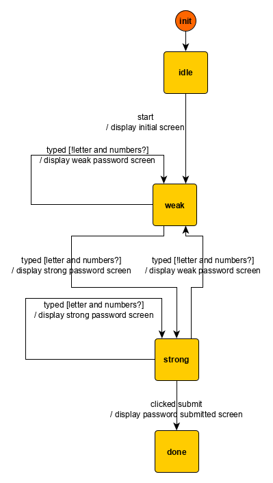

In this section, we will use a simple user interface to further illustrate  basic state machine concepts like control state, extended state, transitions, guards, action factories, and commands. 

## Model
The user interface to specify is a [password meter](https://cdn.dribbble.com/users/522131/screenshots/4467712/password_strength.png). Visually, the user interface consists of a *password* input field and a *submit* password button. Its behavior is the following:
- the user types,
- for each new value of the password input, the input is displayed in green if the password is strong, and in red otherwise --- for the sake of simplicity, a password is considered strong if there are both letters and numbers in the password,
- if the password is not strong, the user click on the `submit` button is ignored. Otherwise, the password is set to the value of the password input.


Follows some screenshots of the application in different states:

|Initial screen|Weak password|Strong password|
|:---:|:---:|:---:|
||||

As we obliquely introduced in the previous section, a state machine is a function that maps events to commands and manages two encapsulated pieces of state: control state and extended state. There are *a priori* infinitely many ways to pick the encapsulated pieces of state. We pick this one:


|Control state|Extended state|Event|Commands|New control state|New extended state|
|:---|:---|:---|:---|:---|---:|
|**Idle**|`input: ""`|start|display initial password screen|**Weak**|`input: ""`|
|**Weak**|`input: ""`|typed `a`|display weak password screen|**Weak**|`input: "a"`|
|**Weak**|`input: "a"`|typed `2`|display strong password screen|**Strong**|`input: "a2"`|
|**Strong**|`input: "a2"`|clicked submit|display password submitted screen|**Done**|`input: "a2"`|
|**Weak**|`input: "a"`|typed `b`|display weak password screen|**Weak**|`input: "ab"`|
|**Weak**|`input: "ab"`|clicked submit|  |**Weak**| `input: "ab"` |


The behavior that the previous table mapping encodes can be accurately and entirely represented with a graph that **links together the control states**:

The graph concepts (nodes, edges) map to state machines concepts as follows:


Kingly's visual formalism has other features that we do not detail here as they are not necessary to understand the models in this section. For a full description of the syntax for edge labels, [see here](../tooling/graph_editing.html#Syntax-reference).


- nodes are *control states*; and
- edges, also called *transitions*, link an *origin control state* to a *target control state* and may contain a triple `event [guard] / actions`. Such triple means that when the `event` occurs, if the machine is in the origin control state and the `guard` is fulfilled, then the `actions` are output. Additionally, the control state for the machine changes to the target control state.

## Free guarantees
Our state machine concisely represents the fact, or property, that whatever input we receive in the *Weak* control state, it will only go to the *Strong* control state if some fixed condition is fulfilled (e.g. the password contains both numbers and letters). Similarly, it will only compute the *submit password* command if the *clicked submit* event is received while it is in the *Strong* state.

The starting state and these two properties can be combined into another fundamental property of the design: the machine will compute the *submit password* command if and only if the password is strong. In short, we are able to **reason formally** about the machine and extract properties from its definition -- **without even testing**. This is just one of the many attractive characteristics of state machines which makes them a tool of choice for the robust implementation of applications. In practice, we still have to test. While the machine behavior is correct, its constituting functions may be erroneous. We may have inadvertently written the predicate that checks that a password is strong wrong. However, if our guards and action factories are correct, and our visual model is correct, Kingly guarantees that the machine will be correct.
