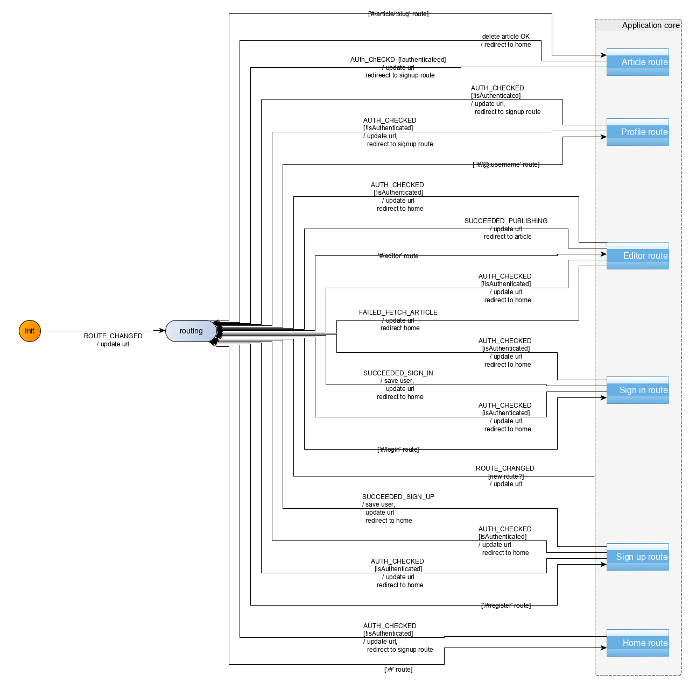
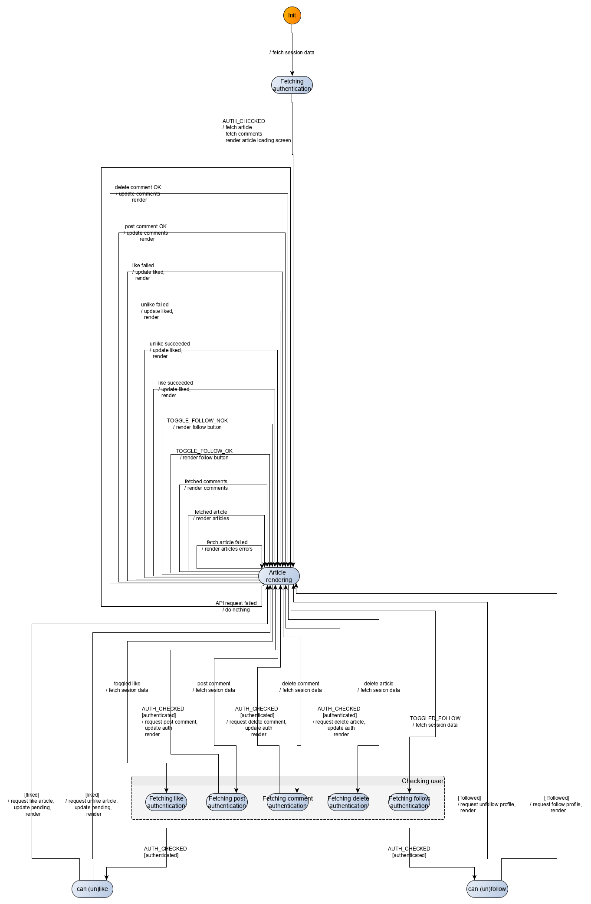

In this section, we will modelize and implement the user flows related to the *Article* route. In that route, the navigating user can view an article's content. If the navigating user is also the article's author, he can edit or delete the article. Otherwise, he can follow the article's author and like/unlike the article. In all cases, the navigating user can additionally post comments about the article, and can delete the comments he posted.

An example of article route is as follows: `/#/article/real-worl-editor-9zlwb7`.

The user needs not be authenticated to access the *Article* route. However, if the user tries to follow or like/unlike an article's author, he will be redirected to the *Sign up* route. Additionally, if the user is not authenticated, he cannot post comments.

## UI
We already have identified the screens in the *Specifications* section. Ler's remind them here:



|Route|State|Main screen|
|:---|:---|:---:|
|`#/article/real-world-is-cool-dtp7j9`|Not authenticated, article chosen||
|`#/article/real-world-is-cool-dtp7j9`|Authenticated, article chosen, not my article||
|`#/article/desktop-game-editor-...-soioli`|Authenticated, article chosen, my article, comment posted||



The UI for the *Article* route will be implemented with a *Article* Svelte component. The [full source code](https://github.com/brucou/realworld-kingly-svelte/blob/with-article-route/src/UI/Article.svelte) for the `Article` component can be accessed in the repository.


## UI testing
As before, we test the UI with [Storybook](https://storybook.js.org/). The [corresponding stories](https://github.com/brucou/realworld-kingly-svelte/tree/with-article-route/stories) are available in the source repository.

## Commands
We have the following commands for the *Article* route (some of which also being used for the *User Profile* route):

| Command | Command parameters |Description|
|:---|:---|:---|
| `REDIRECT`| hash to redirect to| redirects the user to a new/same hash location| 
| `FETCH_AUTHENTICATION`| -- | fetches user session data if any| 
| `FETCH_ARTICLE`| slug| sends an API request to the [*Get Article* end point](https://github.com/gothinkster/realworld/tree/master/api#get-article)|
| `FETCH_COMMENTS`| slug| sends an API request to the [*Get Comments from an Article* end point](https://github.com/gothinkster/realworld/tree/master/api#get-comments-from-an-article)|
| `DELETE_COMMENT`| slug, comment id| sends an API request to the [*Delete Comment* end point](https://github.com/gothinkster/realworld/tree/master/api#delete-comment)|
| `POST_COMMENT`| slug, comment to post| sends an API request to the [*Add Comments to an Article* end point](https://github.com/gothinkster/realworld/tree/master/api#add-comments-to-an-article)|
| `DELETE_ARTICLE`| slug| sends an API request to the [*Delete Article* end point](https://github.com/gothinkster/realworld/tree/master/api#delete-article)|
| `FAVORITE_ARTICLE`| article slug| sends an [API request](https://github.com/gothinkster/realworld/tree/master/api#favorite-article) to like an article| 
| `UNFAVORITE_ARTICLE`| article slug| sends an [API request](https://github.com/gothinkster/realworld/tree/master/api#unfavorite-article) to unlike an article| 
| `FOLLOW_PROFILE`| username | sends an API request to the [*Follow user* end point](https://github.com/gothinkster/realworld/tree/master/api#follow-user)|
| `UNFOLLOW_PROFILE`| username | sends an API request to the [*Unfollow user* end point](https://github.com/gothinkster/realworld/tree/master/api#unfollow-user)|

## Commands implementation
The `REDIRECT`, `FETCH_AUTHENTICATION`, `FETCH_ARTICLE`, `FAVORITE_ARTICLE`, `UNFAVORITE_ARTICLE`, `FOLLOW_PROFILE`, `UNFOLLOW_PROFILE`, have already been written when implementing the *User profile* route. For the rest of commands, we defer to the [API](https://github.com/gothinkster/realworld/tree/master/api) passed on through effect handlers:

```javascript
  [FETCH_COMMENTS]: (dispatch, params, effectHandlers) => {
    const { fetchComments } = effectHandlers;
    const slug = params;

    fetchComments({ slug })
      .then(({ comments }) => dispatch({ [FETCH_COMMENTS_OK]: comments }))
      .catch(err => dispatch({ [FETCH_COMMENTS_NOK]: err }));
  },
  [DELETE_COMMENT]: (dispatch, params, effectHandlers) => {
    const { deleteComment } = effectHandlers;
    const {slug, id} = params;

    deleteComment({ slug, id })
      .then(({ profile }) => dispatch({ [DELETE_COMMENTS_OK]: void 0 }))
      .catch(err => dispatch({ [DELETE_COMMENTS_NOK]: err }));
  },
  [POST_COMMENT]: (dispatch, params, effectHandlers) => {
    const { createComment } = effectHandlers;
    const {slug, comment} = params;

    createComment({ slug, comment})
      .then(({ comment }) => dispatch({ [POST_COMMENTS_OK]: comment }))
      .catch(err => dispatch({ [POST_COMMENTS_NOK]: err }));
  },
  [DELETE_ARTICLE]: (dispatch, params, effectHandlers) => {
    const { deleteArticle } = effectHandlers;
    const slug = params;

    deleteArticle({ slug })
      .then(({ profile }) => dispatch({ [DELETE_ARTICLE_OK]: profile }))
      .catch(err => dispatch({ [DELETE_ARTICLE_NOK]: err }));
  },

```

## Events
We have the following events for the *Article* route:


| Event | Event data |Occurs when|
|:---|:---|:---|
|`ROUTE_CHANGED`| hash | direct href linking or redirection for authentication |
|`AUTH_CHECKED`| user| user session data is retrieved|
|`FETCHED_ARTICLE`|article data|api response to a *Get profile* request|
|`FAILED_FETCH_ARTICLE`|--|api response to a *Get profile* request|
|`FETCH_COMMENTS_OK`|comments|api error response to a *Get profile* request|
|`FETCH_COMMENTS_NOK`|--|api error response to a *Get profile* request|
|`DELETE_COMMENTS_OK`|--|comment is successfully deleted|
|`DELETE_COMMENTS_NOK`|--|comment is not successfully deleted|
|`POST_COMMENTS_OK`|created comment (with id)|comment is successfully posted|
|`POST_COMMENTS_NOK`|--|comment is not successfully posted|
|`DELETE_ARTICLE_OK`|--|article is successfully deleted|
|`DELETE_ARTICLE_NOK`|--|article is not successfully deleted|
|`FAVORITE_OK`|article and slug data|article was successfully liked by the user|
|`FAVORITE_NOK`|error and slug data|user failed to like the article|
|`UNFAVORITE_OK`|article and slug data|article was successfully unliked by the user|
|`UNFAVORITE_NOK`|error and slug data|user failed to unlike the article|
|`TOGGLE_FOLLOW_OK`|profile data|user successfully followed/unfollowed a profile|
|`TOGGLE_FOLLOW_NOK`|err and profile data|user failed to follow/unfollow a profile|
|`CLICKED_DELETE_ARTICLE`| article's slug| user clicks the delete article button|
|`CLICKED_CREATE_COMMENT`|article's slug and comment|user clicks on the *Post comment* button|
|`CLICKED_DELETE_COMMENT`|article's slug and unique id of the comment|user clicks on the *Trash* icon in the lower right corner of a comment|
|`UPDATED_COMMENT`|comment|user modifies the content of the comment text area|
|`TOGGLED_FAVORITE`|article's slug and whether the article is favorited at the moment of the toggling|user clicks to like or unlike an article|
|`TOGGLED_FOLLOW`|username to follow|user clicks to follow or unfollow a user|



## Behaviour modelization
The modelization we reach is the following:





Zooming in on the *Article route* compound control state:





## Refactor
We used a `API_REQUEST_FAILED` event gathering failure for some API requests for which we have the same failure processing: *post comment*, *delete article*, *delete comments*, *fetch comments*. As a matter of fact, if any of these three API calls fail, we just ignore that failure. We do not include however in that list the *fetch article* API call, as we think it is important to show some message to the user in that case to indicate that something went wrong fetching the article. Similarly, the follow/unfollow and like/unlike feature are also excluded from the list, as the corresponding button is re-enabled in case of request failure. The `API_REQUEST_FAILED` event thus replaces the following events: `POST_COMMENTS_NOK`, `DELETE_ARTICLE_NOK`, `DELETE_ARTICLE_NOK`, `FETCH_COMMENTS_NOK`.

Second refactor we did, is isolate the common path structure describing the execution of an API which requires user authentication. Here, the following features require authentication: *post comment*, *delete article*, *delete comments*, *like/unlike article*, *follow/unfollow user*. The common structure then goes as follows:


The parameters (*trigger*, *cond*, *API call*, *Start*, *Next*, *Fallback*, *fallback*) allow to fully specify the sought-out behaviour.

## User scenarios test
As before, we pick our user scenarios to fulfill the *all-transitions* coverage criteria. 

In our main cases, we distinguish between unauthenticated users:

|Subset| Event sequence |
|---|---|
|not authenticated, like article| fetched article, like article, is redirected to sign up|
|not authenticated, follow profile| fetched article, follow profile, is redirected to sign up|

and authenticated users:

|Subset| Event sequence |
|---|---|
|authenticated, like article| fetched article, like article, like successful|
|authenticated, unlike article| fetched article, unlike article, unlike successful|
|authenticated, follow profile| fetched article, follow profile, follow successful|
|authenticated, unfollow profile| fetched article, unfollow profile, unfollow successful|
|authenticated, post comment| fetched article, post comment, post successful|
|authenticated, delete comment| fetched article, delete comment, delete successful|
|authenticated, delete article| fetched article, delete article, delete successful, is redirected to *Home* route|

Additionally, our edge cases are as follows:

|Subset| Event sequence |
|---|---|
|not authenticated, article does not exist| article fetch fails|
|authenticated, post comment| fetched article, post comment, post unsuccessful|
|authenticated, delete comment| fetched article, delete comment, delete unsuccessful|
|authenticated, delete article| fetched article, delete article, delete unsuccessful|
|authenticated, like/unlike article| fetched article, like article, like unsuccessful|
|authenticated, follow/unfollow profile| fetched article, follow profile, follow unsuccessful|

## Behaviour implementation
The implementation (`src/behaviour/article.js`) derives directly from the modelization. We reproduce here the main part which are the transitions:

```javascript
export const articleTransitions = [
  {
    from: "article",
    event: INIT_EVENT,
    to: "fetching-auth-for-article",
    action: fetchAuthentication
  },
  {
    from: "fetching-auth-for-article",
    event: AUTH_CHECKED,
    to: "article-rendering",
    action: fetchArticleCommentsAndInitialRender
  },
  {
    from: "article-rendering",
    event: UPDATED_COMMENT,
    to: "article-rendering",
    action: renderUpdatedComment
  },
  {
    from: "article-rendering",
    event: FETCHED_ARTICLE,
    to: "article-rendering",
    action: renderFetchedArticle
  },
  {
    from: "article-rendering",
    event: FAILED_FETCH_ARTICLE,
    to: "article-rendering",
    action: renderFailedFetchArticle
  },
  {
    from: "article-rendering",
    event: FETCH_COMMENTS_OK,
    to: "article-rendering",
    action: renderFetchedComments
  },
  {
    from: "article-rendering",
    event: TOGGLE_FOLLOW_OK,
    to: "article-rendering",
    action: renderToggledFollow
  },
  {
    from: "article-rendering",
    event: TOGGLE_FOLLOW_NOK,
    to: "article-rendering",
    action: renderFailedToggledFollow
  },
  {
    from: "article-rendering",
    event: FAVORITE_OK,
    to: "article-rendering",
    action: renderFavoritedArticle
  },
  {
    from: "article-rendering",
    event: FAVORITE_NOK,
    to: "article-rendering",
    action: renderFailedFavoriteArticle
  },
  {
    from: "article-rendering",
    event: UNFAVORITE_OK,
    to: "article-rendering",
    action: renderUnfavoritedArticle
  },
  {
    from: "article-rendering",
    event: UNFAVORITE_NOK,
    to: "article-rendering",
    action: renderFailedUnfavoriteArticle
  },
  {
    from: "article-rendering",
    event: POST_COMMENT_OK,
    to: "article-rendering",
    action: renderPostedComment
  },
  {
    from: "article-rendering",
    event: DELETE_COMMENT_OK,
    to: "article-rendering",
    action: renderDeletedComment
  },
  {
    from: "article-rendering",
    event: API_REQUEST_FAILED,
    to: "article-rendering",
    action: renderFailedApiRequest
  },
  getAuthedApiPartialMachine({
    states: { fetching: "fetching-auth-for-like", next: "can-like" },
    events: { trigger: TOGGLED_FAVORITE },
    actions: { call: updateAuth }
  }),
  getAuthedApiPartialMachine({
    states: { fetching: "fetching-auth-for-follow", next: "can-follow" },
    events: { trigger: TOGGLED_FOLLOW },
    actions: { call: updateAuth }
  }),
  getAuthedApiPartialMachine({
    states: { fetching: "fetching-auth-for-post-comment", next: "article-rendering" },
    events: { trigger: CLICKED_CREATE_COMMENT },
    actions: { call: postCommentUpdateAuthAndRender }
  }),
  getAuthedApiPartialMachine({
    states: { fetching: "fetching-auth-for-delete-comment", next: "article-rendering" },
    events: { trigger: CLICKED_DELETE_COMMENT },
    actions: { call: deleteCommentUpdateAuthAndRender }
  }),
  getAuthedApiPartialMachine({
    states: { fetching: "fetching-auth-for-delete-article", next: "article-rendering" },
    events: { trigger: CLICKED_DELETE_ARTICLE },
    actions: { call: deleteArticleUpdateAuthAndRender }
  }),
  {
    from: "can-like", event: void 0, guards: [
      { predicate: isArticleLiked, to: "article-rendering", action: unlikeArticleAndRender },
      { predicate: not(isArticleLiked), to: "article-rendering", action: likeArticleAndRender },
    ]
  },
  {
    from: "can-follow", event: void 0, guards: [
      { predicate: isProfileFollowed, to: "article-rendering", action: unfollowProfileAndRender },
      { predicate: not(isProfileFollowed), to: "article-rendering", action: followProfileAndRender },
    ]
  },
  { from: "article-rendering", event: DELETE_ARTICLE_OK, to: "routing", action: redirectToHome },
  { from: "article", event: ROUTE_CHANGED, to: "routing", action: updateURL }
].flat();
```

## Summary
We implemented the *Article* route of our Conduit clone demo application. We recognized recurring behaviour patterns and abstracted them to compose the machine modelizing the route's behaviour.
