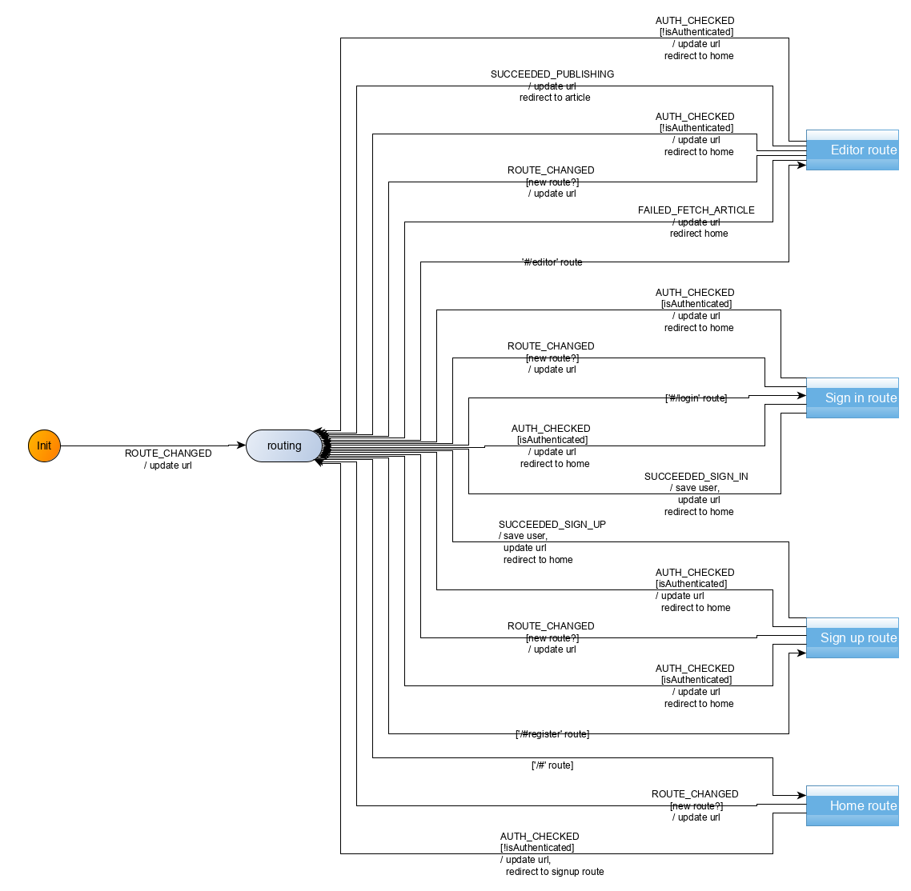
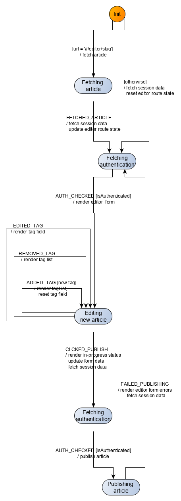
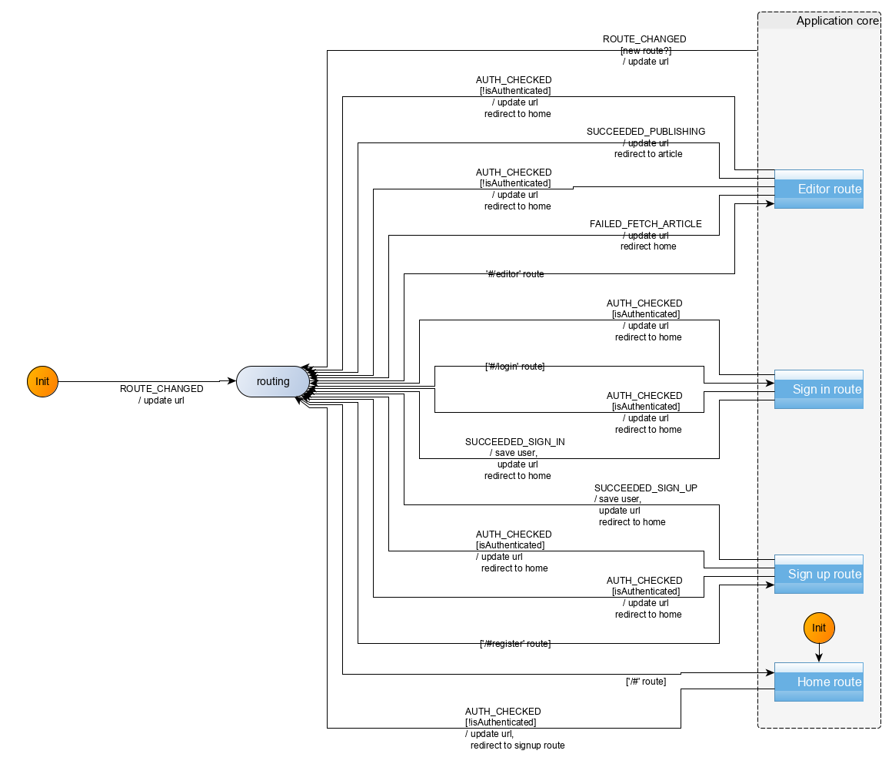
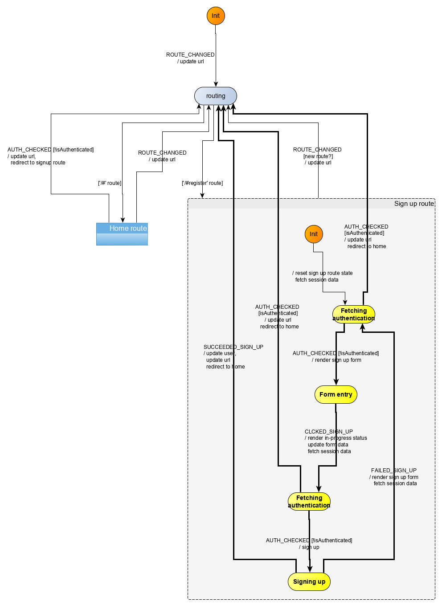
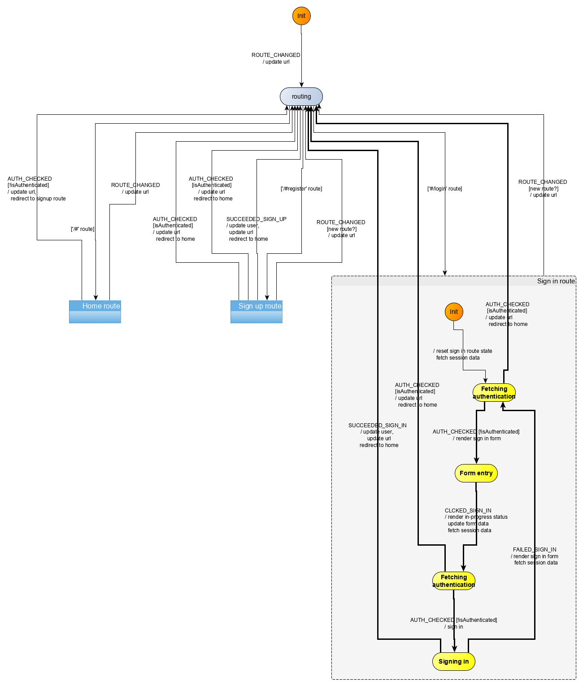
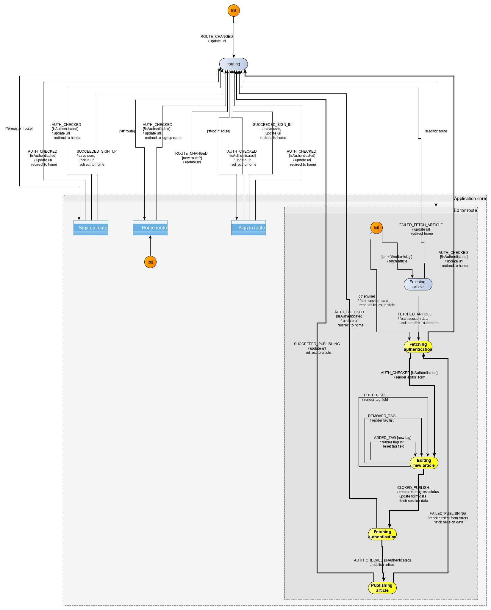
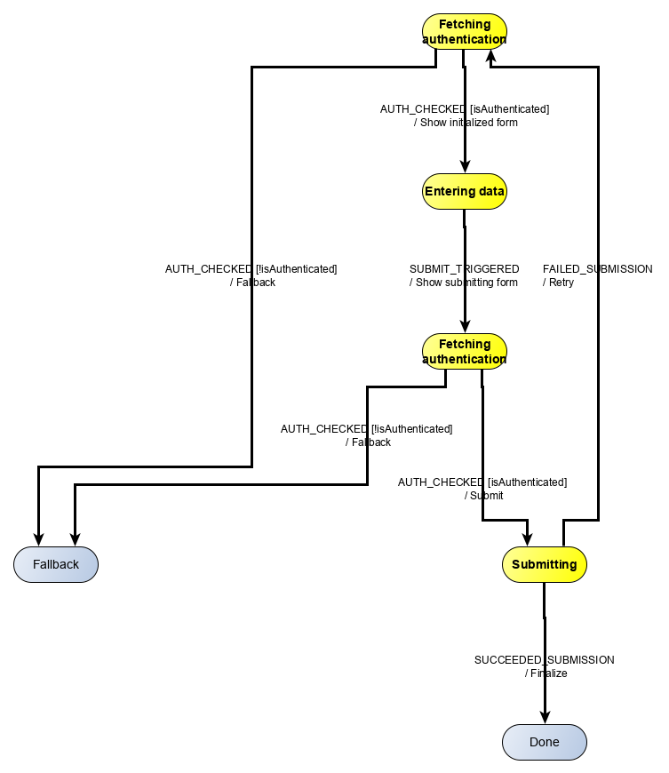

In this section, we will modelize and implement the user flows related to the *editor* route. In that route, the user may:
- edit an existing article (`#/editor/:slug`)
- create a new article (`#/editor/`)
- publish a new or edited article

Articles may have a title, a subject, [*Markdown*](https://www.markdownguide.org/) content, and a list of tags. Tags are entered in a dedicated field, and added to the tag list by pressing the *Enter* key.
 
The following rules apply:
- unauthenticated users navigating to the *editor* page should be redirected to the *home* route
- unauthenticated users cannot publish articles. Any attempt to do so will trigger a redirection to the *home* route 
- the editor form fields must be validated for the article to be added to the articles database. Validation happens server-side with the API returns validation errors in the form of an object.
- users cannot add a tag that is already present in the tag list
- if there is no corresponding article (assuming user navigated to a `#/editor/:slug` route), the user is redirected to the *home* route

## Events
We have the following events for the *editor* route:


| Event | Event data |Occurs when|
|:---|:---|:---|
| `CLICKED_PUBLISH`| form data (`{title, description, body, currentTag, tagList}`)| user submits the form| 
| `FAILED_PUBLISHING`| errors (as returned from the publishing API)| user submitted the form but the request failed|
| `SUCCEEDED_PUBLISHING`| article data as [returned by the API](https://github.com/gothinkster/realworld/tree/master/api#single-article)| user submitted the form and the request succeeded|
| `PRESSED_ENTER`| *keyup* event data| user clicks enter when form focus is on the tag field|
| `FAILED_FETCH_ARTICLE`| ?? | API call fails|
| `FETCHED_ARTICLE`| article data as [returned by the API](https://github.com/gothinkster/realworld/tree/master/api#single-article)| API call succeeds|
| `REMOVED_TAG`| clicked tag| user clicks on a tag from the tag list|


Additionally, the user may click on links (like *settings*). However, this is not handled directly by the machine. Instead, this is handled by the browser as any other links, triggering a change of url, which then triggers a *ROUTE_CHANGED* event to the machine.

And..... there is one more thing that a lot of people may trip up on the first time (I did), so we talk about it here separately. This has to do with the concept of [controlled vs. uncontrolled](https://stackoverflow.com/questions/42522515/what-are-controlled-components-and-uncontrolled-components) fields. 

We render the `title`, `description`, `body` fields with their initial value, and we never need to update these fields after that. So our *prop* `title` would actually better read as `initialTitle`, to indicate that this title value is not an evolving value, but the value of the field when the form is first created. The field values on the screen, i.e. in the DOM may change freely without necessity of the application to be notified. Such free-evolving fields are called *uncontrolled* fields.

The situation changes for the `tag` DOM field. As the name indicates, the `currentTag` *prop* indicates the value of the tag at the time of rendering. This means than the *Render* command means to update the `tag` field on the form. In other words, the `currentTag` *prop* represents the evolving value of the `tag` field in the DOM. In yet other words, `currentTag` is **bound** to the value of the `tag` field. Some UI libraries implement this logic with [two-way binding](https://medium.com/front-end-weekly/what-is-2-way-data-binding-44dd8082e48e) (Svelte is one of those). Other UI libraries implement the binding by tracking the events triggered by the field modification (typically *keyup*) and synchronize the internal field value with the field value as stored in the OM. The `currentTag` is said to be a *controlled field*.

In our case, because we want the *Render* `currentTag` to mean to display the form with the corresponding `tag` field set to the `currentTag` value, it means we have to track i.e. control the `tag` DOM form field. That then means we need to add an event `EDITED_TAG` to do that tracking. 

As a result, our events are now as follows:


| Event | Event data |Occurs when|
|:---|:---|:---|
| `CLICKED_PUBLISH`| form data (`{title, description, body, currentTag, tagList}`)| user submits the form| 
| `FAILED_PUBLISHING`| errors (as returned from the publishing API)| user submitted the form but the request failed|
| `SUCCEEDED_PUBLISHING`| article data as [returned by the API](https://github.com/gothinkster/realworld/tree/master/api#single-article)| user submitted the form and the request succeeded|
| `PRESSED_ENTER`| *keyup* event data| user clicks enter when form focus is on the tag field|
| `REMOVED_TAG`| clicked tag| user clicks on a tag from the tag list|
| `EDITED_TAG`| value of the `tag` field| user modifies the `tag` field|


## Commands
We have the following commands for the *editor* route:

| Command | Command parameters |Description|
|:---|:---|:---|
| `REDIRECT`| hash to redirect to| redirects the user to a new/same hash location| 
| `PUBLISH_ARTICLE`| article data (`{title, description, body, tagList}`)| sends an API request to the publishing end point|
| `UPDATE_ARTICLE`| article data including slug (`{slug, title, description, body, tagList}`)| sends an API request to the publishing end point|

## UI
We already have identified the screens in the *Specifications* section. Ler's remind them here:



|Route|State|Main screen|
|:---|:---|:---:|
|`#/editor`|Authenticated, new article||
|`#/editor/<title>-x4fafc`|Authenticated, edit article||



The UI for the *editor* route will be implemented with a *Editor* Svelte component. The [full source code](https://github.com/brucou/realworld-kingly-svelte/blob/with-editor-route/src/UI/Editor.svelte) for the `Editor` component can be accessed in the repository.

## UI testing
As before, we test the UI with [Storybook](https://storybook.js.org/). The [corresponding stories](https://github.com/brucou/realworld-kingly-svelte/tree/with-settings-route/stories) are available in the source repository.

## Commands implementation
To implement the `PUBLISH_ARTICLE` and `UPDATE_ARTICLE` command, we defer to the API. The logic, as before is enclosed into functions passed as effect handlers (`saveArticle`, and `updateArticle`):

```javascript
  [PUBLISH_ARTICLE]: (dispatch, params, effectHandlers) => {
    const { title, description, body, tagList } = params;
    const { saveArticle } = effectHandlers;

    saveArticle({ title, description, body, tagList })
      .then(data => {
        dispatch({ [SUCCEEDED_PUBLISHING]: data.article });
      })
      .catch(({ errors }) => {
        dispatch({ [FAILED_PUBLISHING]: errors });
      });
  },
  [UPDATE_ARTICLE]: (dispatch, params, effectHandlers) => {
    const { slug, title, description, body, tagList } = params;
    const { updateArticle } = effectHandlers;

    updateArticle({ slug, title, description, body, tagList })
      .then(({ article }) => {
        dispatch({ [SUCCEEDED_PUBLISHING]: article });
      })
      .catch(({ errors }) => {
        dispatch({ [FAILED_PUBLISHING]: errors });
      });
  }
```

## User scenarios test
We test five key user scenarios, checking the aforementioned behaviour rules, the content of which should be clear from their identifiers in the code:

```javascript
const userStories = [
  [
    UNAUTH_USER_ON_EDITOR_NEW_ARTICLE_SEES_FORM,
    UNAUTH_USER_ON_EDITOR_NEW_ARTICLE_SEES_FORM_INPUTS,
    UNAUTH_USER_ON_EDITOR_NEW_ARTICLE_SEES_FORM_COMMANDS
  ],
  [
    UNAUTH_USER_ON_EDITOR_EDIT_ARTICLE_SEES_FORM,
    UNAUTH_USER_ON_EDITOR_EDIT_ARTICLE_SEES_FORM_INPUTS,
    UNAUTH_USER_ON_EDITOR_EDIT_ARTICLE_SEES_FORM_COMMANDS
  ],
  [
    AUTH_USER_ON_EDITOR_NEW_ARTICLE_SEES_FORM_ADDS_TWICE_SAME_TAGS_AND_PUBLISHES,
    AUTH_USER_ON_EDITOR_NEW_ARTICLE_SEES_FORM_ADDS_TWICE_SAME_TAGS_AND_PUBLISHES_INPUTS,
    AUTH_USER_ON_EDITOR_NEW_ARTICLE_SEES_FORM_ADDS_TWICE_SAME_TAGS_AND_PUBLISHES_COMMANDS
  ],
  [
    AUTH_USER_ON_EDITOR_EDIT_ARTICLE_SEES_FORM_ADDS_TWO_TAGS_REMOVES_ONE_PUBLISHES_EMPTY_SEES_ERRORS,
    AUTH_USER_ON_EDITOR_EDIT_ARTICLE_SEES_FORM_ADDS_TWO_TAGS_REMOVES_ONE_PUBLISHES_EMPTY_SEES_ERRORS_INPUTS,
    AUTH_USER_ON_EDITOR_EDIT_ARTICLE_SEES_FORM_ADDS_TWO_TAGS_REMOVES_ONE_PUBLISHES_EMPTY_SEES_ERRORS_COMMANDS
  ]
];

```

## Behaviour modelization
The modelization we reach is the following:





Zooming in on the *Editor route* compound control state:





## Refactoring
We have two reasons for refactoring appearing. On the one hand, all compound states have a transition towards the `routing` control state. That transitions relates to the user clicking links, which cause a change of route and possibly a redirection to another part of the application. We have those transitions for the four routes we have modelized so far, and we can expect that to remain true for any new route that we are going to modelize. This means we can **factor** those transitions out into a single transition from a compound control state comprising all the route control states: 





We created here a compound control state called *Application core* with a transition triggered by the `ROUTE_CHANGED` event. We thus replaced four transitions by a single one, simplifying the graph, while keeping the exact same semantics. To remind semantics of the visual formalism, an event triggering a transition from a compound state to a target control state (`ROUTE_CHANGED` is such an event) is equivalent to an event on each sub-states of that compound state triggering a transition to the same target control state. 

If you are familiar with algebra, we simply **factorized** $(a \underset{event}{\rightarrow}b , a \underset{event}{\rightarrow} c , a \underset{event}{\rightarrow} d  , a \underset{event}{\rightarrow} e)$ into $a \underset{event}{\rightarrow}(b,c,d,e)$ where the $a \underset{event}{\rightarrow}b $ indicates a transition from $a$ to $b$ triggered by $event$ and $(a,b)$ indicates two control states which are part of the same compound control state. To make it more obvious, this is the same as expressing $ab+ac+ad+ae$ as $a(b+c+d+e)$, where $ab$ is the same as $a \underset{event}{\rightarrow}b$, and $a+b$ is the same as $(a,b)$.

That refactoring is useful as, not only we removed here three edges from our visualization, making it more readable, but also, as we keep on adding route, the same transition triggered by `ROUTE_CHANGED` will still be valid. Thus for $n$ similar transitions, we will have saved $n-1$ edges from the visualization.

The second reason for refactoring is directed by reuse purposes. The forms from the *sign in* route, the *sign up* route and the *editor* route behave in similar ways. In all three routes, the user can only see the form if he is authenticated, then the submitting operation can only go through if the user is authenticated, and if the submitting operation is not successful, errors are displayed on the form, otherwise, the user is redirected.

To make this obvious, let's compare the *sign up* route and the *editor* routes' modelization:


|sign up route |sign in route|
|:---:|:---:|
| ||



Let's now look at the *editor* visualization with the same emphasis:


|sign up route |editor route|
|:---:|:---:|
| ||


We have highlighted the common graph structure shared by those three visualizations, i.e. the common behaviour shared by these three parts of the application. By the *rule of three*, we have found a candidate target for [DRY refactoring](https://apiumhub.com/tech-blog-barcelona/dry-dont-repeat-yourself/).

How would we proceed and factor this common behaviour so it can be reused in the implementation of all three routes? We already isolated the common behaviour, next we abstract or lift as parameters the parts constituting the common behaviour, i.e. the events, action factories, commands involved in that behaviour. Concretely, our common behaviour can be represented by the following machine part:

 

Now that is not a valid machine, as there is no initial control state. However, this machine part has all the transitions that figure in all previous three routes implementation. We thus define a function which compute the transitions to add to a given machine to implement the authenticated form submitting behaviour ([`src/behaviour/abstracted.js`](https://github.com/brucou/realworld-kingly-svelte/blob/with-editor-route/src/behaviour/abstracted.js)):

```javascript
/**
 * @param {{events: AuthFormEvents, actionFactories: AuthFormActionFactories, states: AuthFormStates,
 *   isAuthenticatedGuard: Guard}} def
 * @return {*[]}
 */
export function getAuthenticatedFormPageTransitions(def) {
  const { events, states, actionFactories, isAuthenticatedGuard } = def;
  const { AUTH_CHECKED, SUBMIT_TRIGGERED, FAILED_SUBMISSION, SUCCEEDED_SUBMISSION } = events;
  const {
    fetchingAuthenticationPreForm,
    fetchingAuthenticationPreSubmit,
    enteringData,
    fallback: fallbackState,
    submitting,
    done
  } = states;
  const {
    showInitializedForm,
    showSubmittingForm,
    submit,
    fallback: fallbackActionF,
    retry,
    finalize
  } = actionFactories;
  const isNotAuthenticatedGuard = isNot(isAuthenticatedGuard);

  return [
    {
      from: fetchingAuthenticationPreForm,
      event: AUTH_CHECKED,
      guards: [
        { predicate: isAuthenticatedGuard, to: enteringData, action: showInitializedForm },
        { predicate: isNotAuthenticatedGuard, to: fallbackState, action: fallbackActionF }
      ]
    },
    {
      from: enteringData,
      event: SUBMIT_TRIGGERED,
      to: fetchingAuthenticationPreSubmit,
      action: showSubmittingForm
    },
    {
      from: fetchingAuthenticationPreSubmit,
      event: AUTH_CHECKED,
      guards: [
        { predicate: isAuthenticatedGuard, to: submitting, action: submit },
        { predicate: isNotAuthenticatedGuard, to: fallbackState, action: fallbackActionF }
      ]
    },
    { from: submitting, event: SUCCEEDED_SUBMISSION, to: done, action: finalize },
    { from: submitting, event: FAILED_SUBMISSION, to: fetchingAuthenticationPreForm, action: retry }
  ];
}

```


We use that function to write the transitions for the implementation of the *editor* route modelization, as will be shown in the upcoming implementation section.


## Behaviour implementation 
The implementation (`src/behaviour/editor.js`) derives directly from the modelization. We reproduce here the main part which are the transitions:

```javascript
export const editorTransitions = [
  {
    from: "editor",
    event: INIT_EVENT,
    guards: [
      {
        predicate: isEditorEditArticleRoute,
        to: "fetching-article-editor",
        action: fetchArticle
      },
      {
        predicate: isNot(isEditorEditArticleRoute),
        to: "fetching-authentication-editor-pre-form",
        action: resetEditorRouteStateAndFetchAuth
      }
    ]
  },
  { from: "editor", event: ROUTE_CHANGED, to: "routing", action: updateURL },
  {
    from: "fetching-article-editor",
    event: FETCHED_ARTICLE,
    to: "fetching-authentication-editor-pre-form",
    action: updateEditorRouteStateAndFetchAuth
  },
  {
    from: "fetching-article-editor",
    event: FAILED_FETCH_ARTICLE,
    to: "routing",
    action: redirectToHome
  },
  {
    from: "editing-new-article",
    event: EDITED_TAG,
    to: "editing-new-article",
    action: renderTagField
  },
  {
    from: "editing-new-article",
    event: ADDED_TAG,
    guards: [{ predicate: isNewTag, to: "editing-new-article", action: addTagAndRender }]
  },
  {
    from: "editing-new-article",
    event: REMOVED_TAG,
    to: "editing-new-article",
    action: removeTagAndRenderTagList
  },
  getAuthenticatedFormPageTransitions({
    events: {
      AUTH_CHECKED,
      SUBMIT_TRIGGERED: CLICKED_PUBLISH,
      FAILED_SUBMISSION: FAILED_PUBLISHING,
      SUCCEEDED_SUBMISSION: SUCCEEDED_PUBLISHING
    },
    states: {
      fetchingAuthenticationPreForm: "fetching-authentication-editor-pre-form",
      fetchingAuthenticationPreSubmit: "fetching-authentication-editor-pre-publish",
      enteringData: "editing-new-article",
      fallback: "routing",
      submitting: "publishing-article",
      done: "routing"
    },
    isAuthenticatedGuard: isAuthenticated,
    actionFactories: {
      showInitializedForm: renderEditorForm,
      showSubmittingForm: fetchAuthenticationAndRenderInProgressAndUpdateFormData,
      submit: publishArticle,
      fallback: redirectToHome,
      retry: renderEditorFormWithErrorsAndFetchAuth,
      finalize: updateUrlAndRedirectToArticle
    }
  })
].flat();

```

Note how we use the transitions computed by the `getAuthenticatedFormPageTransitions` function and how we integrate them in the *editor* route machine. As a final note, we have decided (for now) against refactoring the other two routes which exhibits the behaviour we just abstracted. Those routes are already written and tested, so we don't have a productivity advantage here. If the behaviour abstracted in the `getAuthenticatedFormPageTransitions` should require tweaking in the future (because of bugs or else), we will then consider moving the other two routes to using it, so they also benefit from that tweaking. But as of now, we don't have much to win by doing rewriting the existing implementation of those two routes exhibiting a common behaviour.

## Summary
We modelized and implemented the *Editor* route portion of our Conduit clone app. Our modelization allowed us to handle nested routing very naturally. We handled some specific aspects of forms (controlled fields vs. uncontrolled fields), and decided to control the `tag` field of the editor form. We refactored our visual modelization by factoring the `ROUTE_CHANGED` event into an *Application core* compound state containing all the route substates. We also refactored the implementation of the machine for the *editor* route by extracting the common parts of three of the previously implemented routes and abstracting the varying parts into parameters for a factory function. 

The first refactoring enhances readability of the visualization, and the capacity to communicate the application hehaviour to stakeholders in a more concise way. It is important to note that this refactoring is merely visual: the semantics addressed by the visualization are exactly the same. We have not reduced or increased the complexity of our application, we instead reduced the complexity of the visualization, and slightly that of the implementation. This refactoring additionally has slightly increased maintainability, as, when new routes will be added to the *Application core* compound state, they will automatically be subject to the transition triggered by the `ROUTE_CHANGED` event.

The second refactoring does not pursue a reduction in lines of code. Actually it may often be that lines of code increase as a result of the indirection caused by the `getAuthenticatedFormPageTransitions` function. Rather, the idea is to reuse a logic that have already been implemented several times, speeding up the implementation of new occurrences of that logic, and removing possible mistakes occurring when duplicating that logic. The more complex a shared behaviour is, the more beneficial it is to capture it in a reusable form. It is up to the programmer to determine when the benefits compensate the indirection cost of the reusable abstraction.

We decided for instance against abstracting the following behaviour of an API call:


We believe this behaviour is simple enough to not be worth being abstracted.

Lastly, we do not recommend to abstract too early. It is important to evaluate the generality of the abstraction (the rule of three is a good rule of thumb), its current benefits and its future applicability.
