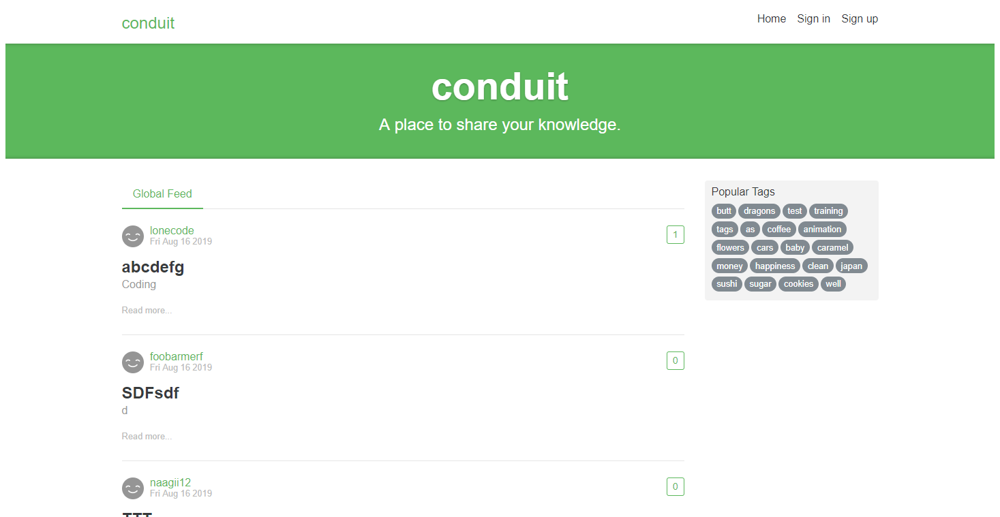
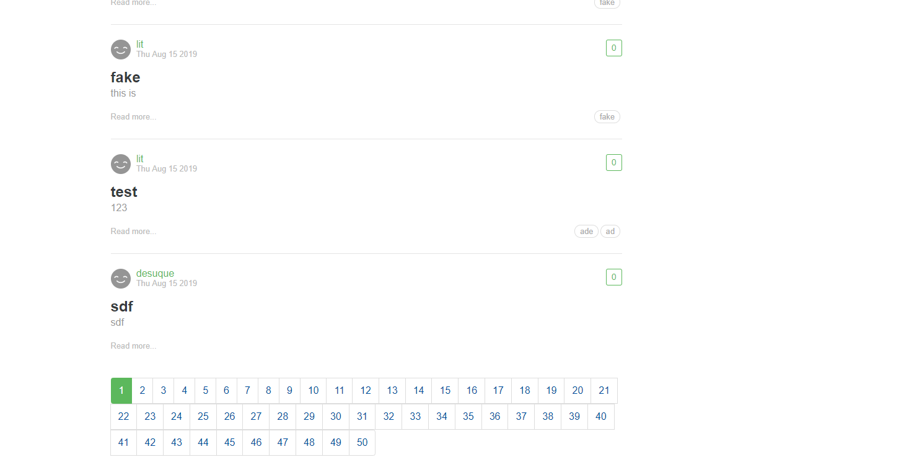
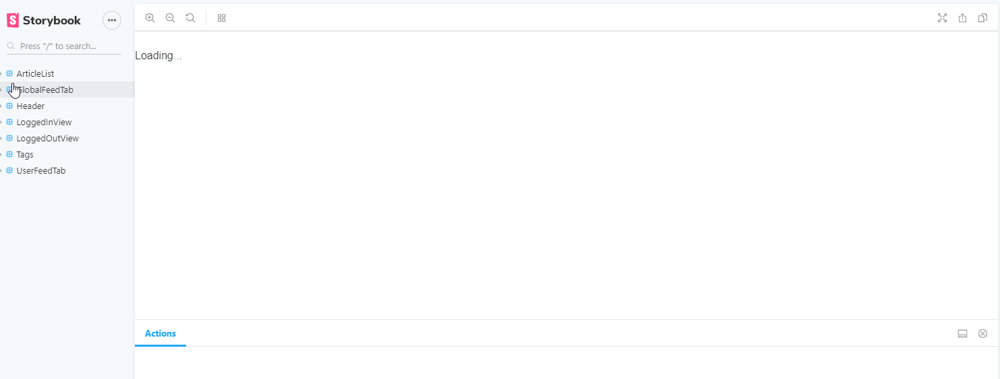
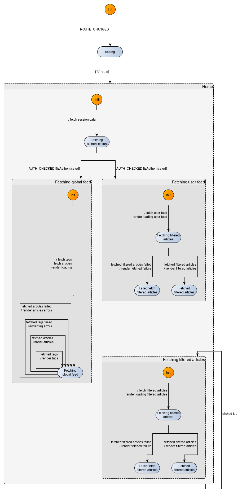
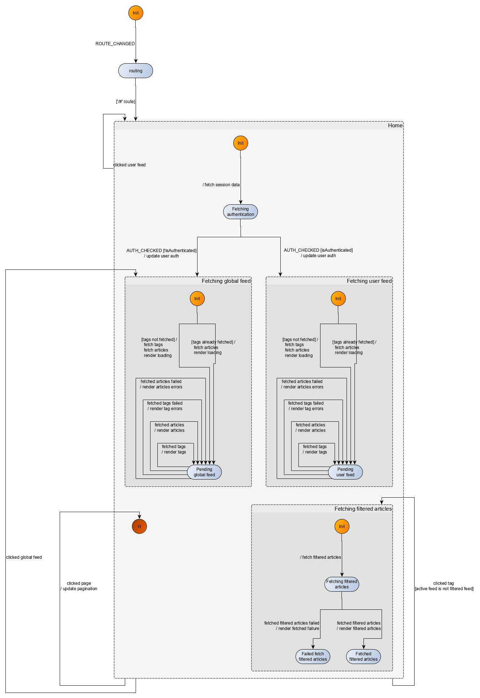
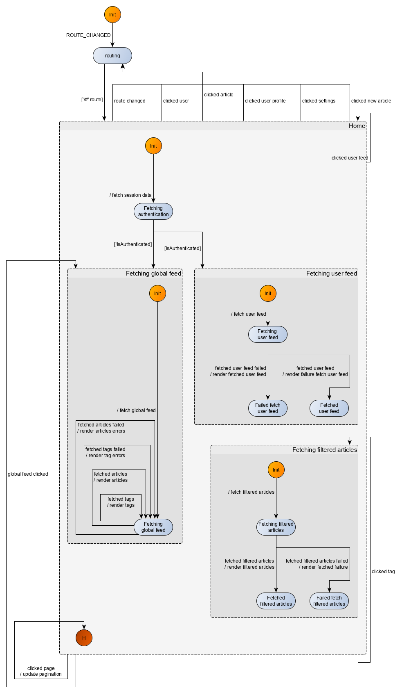

## Set-up
Following the [instructions](https://svelte.dev/blog/the-easiest-way-to-get-started) in Svelte repo:

```bash
npx degit sveltejs/rw-kingly-svelte
cd rw-kingly-svelte
npm install
npm run dev
```

and check in a browser that everything is working in `localhost:5000` (you should see *Hello world*).

That done, we add:

```bash
npm install --save kingly
```

We may need `marked` for the markdown commenting at some point but that is all we should need for the home page, so we'll add marked later.

Last, we initialize git:

```bash
git init
```

The [template we are using](https://github.com/sveltejs/template) builds the Svelte app with `rollup` (cf. `rollup.config.js` file). 

To build (with a watcher):

```bash
npm run autobuild
```

To run:

```bash
npm run start
```

To run in dev:

```bash
npm run dev
```

## Events and Actions
We have the following user events for the *Home* route (*#/*):

| Event | Fired when | Mandatory data|
|:---|:---|:---|
|ROUTE_CHANGED|user clicks on a link (direct linking or redirection for authentication)| hash| 
|ROUTE_CHANGED|user clicks on the browser's back or forward button| hash| 
|TAG_CLICKED|user clicks on a tag|tag|
|PAGE_CHANGED|user clicks on a page number| page number|
|ARTICLE_CLICKED|user clicks on an article|article data|
|AUTHOR_CLICKED|user clicks on a link identifying an article author|author data|
|LIKE_CLICKED|user clicks on the like button|related article data|
|HOME_NAV_CLICKED|user clicks on the *Home* navigation link|none|
|HOME_NAV_CLICKED|user clicks on the *Conduit* navigation link|none|
|SIGN_IN_NAV_CLICKED|user clicks on the *Sign in* navigation link|none|
|SIGN_UP_NAV_CLICKED|user clicks on the *Sign up* navigation link|none|
|NEW_ARTICLE_NAV_CLICKED|user clicks on the *New article* navigation link|none|
|NEW_ARTICLE_NAV_CLICKED|user clicks on the *Settings* navigation link|none|
|USER_PROFILE_NAV_CLICKED|user clicks on the *User* navigation link|none|
 
Note that we only included, for each event, the data that necessarily must be included in the event. We may however decide, as we implement more and more features, to include extra data, according to other needs appearing.
 
We have the following actions for the *Home* route (*#/*):

| Command | Description | Parameters|
|:---|:---|:---|
|RENDER|Triggers an update of the screen|Any relevant data participating in the display logic| 
|NAVIGATE|Changes the route|hash|
|FETCH_GLOBAL_FEED_FILTERED_BY_TAG|Fetches a list of articles filtered by a tag|filter-by tag, any other relevant data|
|FETCH_USER_FEED|Fetches a list of articles for a user feed|user data|
|FETCH_GLOBAL_FEED|Fetches a list of articles for the global feed|none|
|FETCH_ARTICLE|Fetches an article|any relevant article data|
|FETCH_AUTHOR|Fetches data relevant to the author of an article |any relevant author data|
|FETCH_AUTH_STATUS|Fetches user authentication data|none -- all data should stored locally|
|UPDATE_LIKES|Updates the number of likes for an article|amount positive or negative by which to increment the number of likes|

Note that other intermediate events or unforeseen actions may appear in the course of the implementation. We may also decide to aggregate or remove some events, due to refactoring. Those events and actions however constitute a good starting list.

We additionally have *safety* properties (*Precondition* => *Assertion*) that we **must** guarantee. This is designed to protect against states of the system which can never occur. As a matter of fact, accurate specifications describe what must, may or should occur, but also what must not occur:

| Precondition| Assertion |
|:---|:---|
|The user is not authenticated|User cannot create a new article| 
|The user is not authenticated|User cannot see or update settings| 
|The user is not authenticated|User cannot see or update profile| 
|The user is not authenticated|User cannot see any user feed (*Your Feed* tab)|

Those safety properties are not part of the specification per se, given that there are no proper specifications to start with. We however mention this and keep in mind for testing purposes.

We have a lot of events and actions here. As a first sub-step, we are going to assume the user is not authenticated and write the machine describing the behaviour of the application for the *Home* route. 
 
## User not authenticated
### Scenarios
We are going to modelize the following scenarios:

```gherkin
  Background:
    Given the user is not authenticated
    And the user navigated to the home page

  Scenario: Unauthenticated user navigates to *Home* page and sees a loading page
    Then the application attempts to fetch the global feed
    And the interface notifies that the fetch is in progress 

  Scenario: Unauthenticated user navigates to *Home* page and sees the full global feed
    Given the application attempted to fetch the global feed
    When the fetch is successful
    Then the interface displays the global feed

  Scenario: Unauthenticated user navigates to *Home* page and sees an incomplete global feed
    Given the application attempted to fetch the global feed
    When the fetch fails
    Then the interface displays the results it obtained and indicates missing data
```

The first scenario corresponds to a Kingly machine with the following mapping:

| Input | Output|
|:---|:---|
|ROUTE_CHANGED (*home*)|RENDER loading screen, FETCH_GLOBAL_FEED (tags and articles)|

The second scenario goes as follows:


Note that in what follows, we chose to immediately display the results of fetch operations (tags and articles) when they arrive, instead of waiting for both fetches to be completed before updating the UI. We thereby replicate the behaviour of the Conduit official implementation. This may also be better in terms of UX.


| Input | Output|
|:---|:---|
|ROUTE_CHANGED (*home*)|RENDER loading screen, FETCH_GLOBAL_FEED (tags and articles)|
|TAGS_FETCHED_OK |RENDER tags|
|ARTICLES_FETCHED_OK |RENDER articles|

The sequence of events could also be:

| Input | Output|
|:---|:---|
|ROUTE_CHANGED (*home*)|RENDER loading screen, FETCH_GLOBAL_FEED (tags and articles)|
|ARTICLES_FETCHED_OK |RENDER articles|
|TAGS_FETCHED_OK |RENDER tags|

The third scenario goes as follows:

| Input | Output|
|:---|:---|
|ROUTE_CHANGED (*home*)|RENDER loading screen, FETCH_GLOBAL_FEED (tags and articles)|
|ARTICLES_FETCHED_NOK |RENDER errors|
|TAGS_FETCHED_OK |RENDER tags|

or:

| Input | Output|
|:---|:---|
|ROUTE_CHANGED (*home*)|RENDER loading screen, FETCH_GLOBAL_FEED (tags and articles)|
|ARTICLES_FETCHED_OK |RENDER articles|
|TAGS_FETCHED_NOK |RENDER errors|

or:

| Input | Output|
|:---|:---|
|ROUTE_CHANGED (*home*)|RENDER loading screen, FETCH_GLOBAL_FEED (tags and articles)|
|ARTICLES_FETCHED_NOK |RENDER errors|
|TAGS_FETCHED_NOK |RENDER errors|

or the 3 other mappings obtained by switching in the previous mappings the order of `ARTICLES_FETCHED_...` and `TAGS_FETCHED_...`. 

We thus have 9 tests that our Kingly machine must pass. 

### Modelization
Let's now modelize the machine passing those tests:


Let's explain again the formalism for the visual representation of our machines:

- a node is a control state
- the *Init* node is the initial control state for the state machine
- an edge between nodes is called a transition and is labelled with an (optional) event, a (optional) guard, and (optional) actions.
- Typically we write a transition in the form `event [ guard ] / actions`

Then let's repeat here some necessary terminology:

- a control state which contains other control states is called a *compound control state*
- a control state which does not contain other control states is called an *atomic control state*
- a control state which does not have any outgoing transitions is called a *terminal control state*
- a control state which does not have any incoming transitions is called an *initial control state*
- a transition whose label does not include an event is called an *eventless transition*
- a control state which has an eventless transition is called an *eventless control states* or *transient control state*

As a final reminder, let's recall how the visual representation maps to the semantics for the corresponding machine:

- the machine is always in one of the represented control states
- a transition with label `event [ guard ] / actions` evaluates to `true` against an incoming event if and only if the incoming event matches the `event` in the transition label, and the guard is fulfilled 
- when an event occurs, the transitions originating from the current control state of the machine are evaluated
  - the first evaluated transition that is fulfilled will be taken, leading to a new control state for the machine, the update of the machine extended state, and the machine computing an output (here outputs are commands for the interfaced systems). These computations relate to the `actions` part of the transition label (`event [ guard ] / actions`)
- when an event occurs, if no transitions evaluates to `true`, the machine remains in its current control state, with identical extended state, and outputs a zero action (represented by the constant `NO_OUTPUT` in Kingly). This is akin to a no-op.
- if the machine is in a transient control state, the outgoing transitions for that control states are eveluated **immediately** when the machine enters the transient control state
- note that Kingly does not accept a machine whose initial control state is a transient control state
 
With this in mind, you should be able to check that the previous machine visualization indeed implements the behaviour referred to in our 9 test sequences:

- the machine starts in the *Init* control state
- when receiving the routing event it transitions to the *routing* control state, which is a transient control state
- the machine then immediately transitions to the *Fetching global feed* control state if that the route data contained in the `ROUTE_CHANGED` event corresponds to the home route. The machine outputs commands instructing the application to fetch tags and articles for the global feed, and display loading information to the end user
- once in the *Fetching global feed* control state, it will receive either success or failure information from the tags and articles being fetched and react accordingly, staying always in the *Fetching global feed* control state

Alright, let's move up to implementing that machine.

### Machine implementation
In the previous visualization, we focused on the control flow of the application and skipped key information which matter for implementation purposes:

- we detailed the events but did not clearly define the shape of the data carried in the event
- we introduce commands but did not present the parameters associated to those commands
- we entirely skipped discussing the extended state of the state machine
- we obviously did not include any code for the guards and actions

We also did not discuss the handling of the machine commands and the UI representation, except that we will be using Svelte as a UI library. We did mention that we will need to hook listeners for the `popstate` and `hashchange` events, without being too specific. We will need to include all the missing information for the implementation, which is what we will do in this section.

Let's start with the tests for the machine. We will use good old QUnit as a test runner and parcel as a test bundler. This allows us to test in a real browser.

We run in the home directory of the repository:

```bash
npm install --save-dev qunitjs
npm install --save-dev parcel
```

We update the package json to include our test script:

```diff
{
  (...)
  "scripts": {
    "build": "rollup -c",
    "autobuild": "rollup -c -w",
    "dev": "run-p start:dev autobuild",
    "start": "sirv public --single",
    "start:dev": "sirv public --single --dev",
+    "test": "parcel tests/index.html"
  }
}
```

We create an html file (`tests/index.html`) to run QUnit with:

```html
<!doctype html>
<html class="no-js" lang="">
<head>
    <meta charset="utf-8">
    <title></title>
    <!-- Qunit testing stylesheets -->
    <link rel="stylesheet" href="https://cdnjs.cloudflare.com/ajax/libs/qunit/2.9.2/qunit.css">
</head>

<body>

<!-- Add your site or application content here -->
<div id="app">
</div>

<!-- Qunit old-->
<div id="qunit"></div>
<div id="qunit-fixture"></div>
<!-- Qunit new-->
<h1 id="qunit-header">QUnit Test Suite</h1>
<h2 id="qunit-banner"></h2>
<div id="qunit-testrunner-toolbar"></div>
<h2 id="qunit-userAgent"></h2>
<ol id="qunit-tests">test markup, hidden.</ol>
<script src="./index.js"></script>

</body>
</html>

```

We create two new JavaScript files to hold our tests:

- `tests/index.js` 

```javascript
import QUnit from "qunit"
import './home-route-fsm.specs'

QUnit.dump.maxDepth = 50;

QUnit.test("QUnit works", function exec_test(assert) {
  assert.ok(true)
});
```

- `tests/home-route-fsm.specs.js`

```javascript
import QUnit from "qunit"

QUnit.module("Testing home route fsm", {});

```

Running the tests (`npm run test`) should display our first passing test:

 

That was for the QUnit setup. Now let's do the setup for our tests. We will need to:
- explicit the shape of machine inputs (events), and machine outputs (commands)
- have at hand a set of fixtures to serve as event data
- import the state machine and any other test relevant data

This is where you realize that TDD is less about testing than it is about development. Writing the tests first forces us to think ahead about how we organize our modules, and how we define their interfaces. We will make the following choices:
- we will have a separate file for the state machine: `src/fsm.js`
- that file will export the events and commands issued by the state machine
- we will have a separate file to hold all constants relevant to the applications and which fit nowhere else
- we will have fixtures files in a fixture directory (`tests/fixtures`). Fixtures file will be organized per domain object (tags, articles, etc.)

We thus create the following files:
- `tests/fixtures/tags` to hold tags test data  
- `tests/fixtures/articles` to hold articles test data  
- `tests/home-route-fsm-specs` to hold tests related to the home route

Our current tests thus goes like this (`tests/home-route-fsm-specs`): 

```javascript
import QUnit from "qunit"
import { NO_OUTPUT } from "kingly"
import { commands, events, fsmFactory } from "../src/fsm"
import { loadingStates, routes } from "../src/constants"
import { articlesErrorFixture, articlesFixture } from "./fixtures/articles"
import { tagsErrorFixture, tagsFixture } from "./fixtures/tags"

...testing helper functions...

QUnit.module("Testing home route fsm", {});

const [ROUTE_CHANGED, TAGS_FETCHED_OK, TAGS_FETCHED_NOK, ARTICLES_FETCHED_OK, ARTICLES_FETCHED_NOK] = events;
const [RENDER, FETCH_GLOBAL_FEED] = commands;
const { home } = routes;
const [TAGS_ARE_LOADING, ARTICLES_ARE_LOADING] = loadingStates;

const HOME_ROUTE_LOADING_SEQ = [
  { [ROUTE_CHANGED]: {hash:home} }
];

const HOME_ROUTE_LOADED_OK_TA_SEQ = HOME_ROUTE_LOADING_SEQ.concat([
  { [TAGS_FETCHED_OK]: tagsFixture },
  { [ARTICLES_FETCHED_OK]: articlesFixture },
]);

const HOME_ROUTE_LOADED_OK_AT_SEQ = HOME_ROUTE_LOADING_SEQ.concat([...]);

const HOME_ROUTE_LOADING_NOK_TA_SEQ = HOME_ROUTE_LOADING_SEQ.concat([
  { [TAGS_FETCHED_NOK]: tagsErrorFixture },
  { [ARTICLES_FETCHED_NOK]: articlesErrorFixture },
]);

...other 5 scenarios...

const HOME_ROUTE_LOADING_SEQ_COMMANDS = [
  [
    { command: FETCH_GLOBAL_FEED, params: {page: 0} },
    { command: RENDER, params: { tags: TAGS_ARE_LOADING, articles: ARTICLES_ARE_LOADING } }
  ]
];

...

const HOME_ROUTE_LOADED_OK_AT_SEQ_COMMANDS = HOME_ROUTE_LOADING_SEQ_COMMANDS.concat([
  [{ command: RENDER, params: { articles: articlesFixture } }],
  [{ command: RENDER, params: { tags: tagsFixture } }],
]);

...

const fsmMapping = [
  [`Loading `, HOME_ROUTE_LOADING_SEQ, HOME_ROUTE_LOADING_SEQ_COMMANDS],
  [`Successfully loading `, HOME_ROUTE_LOADED_OK_TA_SEQ, HOME_ROUTE_LOADED_OK_TA_SEQ_COMMANDS],
  [`Successfully loading `, HOME_ROUTE_LOADED_OK_AT_SEQ, HOME_ROUTE_LOADED_OK_AT_SEQ_COMMANDS],
  [`Failed loading - tags and articles`, HOME_ROUTE_LOADING_NOK_TA_SEQ, HOME_ROUTE_LOADING_NOK_TA_SEQ_COMMANDS],
  [`Failed loading - tags and articles`, HOME_ROUTE_LOADING_NOK_AT_SEQ, HOME_ROUTE_LOADING_NOK_AT_SEQ_COMMANDS],
  [`Failed loading - tags`, HOME_ROUTE_LOADING_NOK_T$_SEQ, HOME_ROUTE_LOADING_NOK_T$_SEQ_COMMANDS],
  [`Failed loading - tags`, HOME_ROUTE_LOADING_NOK_$T_SEQ, HOME_ROUTE_LOADING_NOK_$T_SEQ_COMMANDS],
  [`Failed loading - articles`, HOME_ROUTE_LOADING_NOK_A$_SEQ, HOME_ROUTE_LOADING_NOK_A$_SEQ_COMMANDS],
  [`Failed loading - articles`, HOME_ROUTE_LOADING_NOK_$A_SEQ, HOME_ROUTE_LOADING_NOK_$A_SEQ_COMMANDS],
];

// const fsmSettings = { debug: { console, checkContracts: fsmContracts } };
const fsmSettings = { debug: { console } };

fsmMapping.forEach(([scenario, inputSeq, outputsSeq]) => {
  QUnit.test(`Home route: ${scenario}`, function exec_test(assert) {
    const fsm = fsmFactory(fsmSettings);

    const actualOutputsSeq = computeCleanedActualOutputs(fsm, inputSeq);

    let indexWhenFailed = -1;
    const isTestPassed = inputSeq.every((input, index) => {
      const outputs = actualOutputsSeq[index];
      const expected = outputsSeq[index];
      const isTestPassed = deepEqual(outputs, expected);
      if (!isTestPassed) {indexWhenFailed = index}

      return isTestPassed
    });

    const errorMessage = `Actual outputs sequence differ from expected outputs sequence at index ${indexWhenFailed}`;
    const okMessage = `Alles gut!`;
    const message = isTestPassed ? okMessage : errorMessage;

    assert.deepEqual(actualOutputsSeq, outputsSeq, message);
  });
});
```

Let's put the minimal information necessary in `src/fsm.js` to test our setup configuration:

```javascript
export const events = [
  "ROUTE_CHANGED",
  "TAGS_FETCHED_OK",
  "TAGS_FETCHED_NOK",
  "ARTICLES_FETCHED_OK",
  "ARTICLES_FETCHED_NOK"
];

export const commands = ["RENDER", "FETCH_GLOBAL_FEED"];

export const fsmFactory = (settings) => () => {return -1}
```

Our tests runner now gives us a list of failing tests:





Nice! We have our test setup running. We can now implement the machine.


It is also possible to **compile** at build time the data structure into a standard JavaScript function. This avoids having to import the Kingly library and may result in smaller payloads. The compiler functionality is not yet fully tested hence not published.

With Kingly, a state machine is defined through a data structure `fsmDef`, which is then used by a factory to construct an executable version of the machine. That executable version is a mere JavaScript function, which is generated by the factory `createStateMachine`. The factory also admits `settings` by which dependencies can be injected and debugging/tracing behaviour can be configured. You should always start by using the debugging options when implementing a machine, till you have enough confidence that the machine syntax is correct. A value of `{debug: {console}}` will output to the console tracing information about the execution of the machine. A value of `{debug: {checkContracts: fsmContracts}}` will check that the machine definition `fsmDef` fulfills all contracts enforcing the machine syntax and semantics. We use both options in our `tests/home-route-fsm.specs`.

Let's fill the fields for the machine data structure one by one:

1. `initialControlState`: per the modelization we start with `INIT`
2. `initialExtendedState`: per the tests we already wrote, most of the information we needed was in the event data. We will however need to keep track of the current page for the pagination feature to render correctly the home route. So for now we pick  `{currentPage: 0}`.
3. `updateState`: as a reducer, we use a variant of `Object.assign` to incorporate the state updates into the old state 
4. `events`: that is an array of the 5 events (1 user event, 4 system events), we already identified in our tests.
5. `states`: we have a flat structure for now. We will have very simply:
```javascript
const states = {
  [INIT]: "",
  'routing': "",
  'fetching-global-feed': ""
};
```

I left the more interesting (`transitions`) for the end.

The `transitions` property is an array whose elements are the edges of the machine modelization. We now have to add the level of precision that we dispensed of at modeling time. The `actions` in `event [ guard ] / actions` are generated by an action factory. The `guard` becomes a guard function which takes the extended state of the machine, the incoming event data, and the injected settings, and produces a boolean. The action factory takes the same parameters than the guards but return an object with two properties:
- `updates`: the list of updates to perform on the machine's extended state
- `outputs`: values to aggregate to the outputs of the machine as a result of receiving the incoming event

For more detail on Kingly syntax, please refer to the [API section](/documentation/v1/api/index.html).

The final code is as follows:
```javascript
const transitions = [
  { from: INIT, to: "routing", event: ROUTE_CHANGED, action: ACTION_IDENTITY },
  {
    from: "routing",
    event: void 0,
    guards: [
      {
        predicate: isHomeRoute,
        to: "fetching-global-feed",
        action: fetchGlobalFeedAndRenderLoading
      }
    ]
  },
  {
    from: "fetching-global-feed",
    to: "fetching-global-feed",
    event: TAGS_FETCHED_OK,
    action: renderGlobalFeedTags
  },
  {
    from: "fetching-global-feed",
    to: "fetching-global-feed",
    event: ARTICLES_FETCHED_OK,
    action: renderGlobalFeedArticles
  },
  {
    from: "fetching-global-feed",
    to: "fetching-global-feed",
    event: TAGS_FETCHED_NOK,
    action: renderGlobalFeedTagsFetchError
  },
  {
    from: "fetching-global-feed",
    to: "fetching-global-feed",
    event: ARTICLES_FETCHED_NOK,
    action: renderGlobalFeedArticlesFetchError
  }
];

// Guards
function isHomeRoute(extendedState, eventData, settings) {
  return eventData.hash === home;
}

// Action factories
function fetchGlobalFeedAndRenderLoading(extendedState, eventData, settings) {
  const { currentPage } = extendedState;
  
  return {
    updates: [],
    outputs: [
      { command: FETCH_GLOBAL_FEED, params: { page: currentPage } },
      {
        command: RENDER,
        params: { tags: TAGS_ARE_LOADING, articles: ARTICLES_ARE_LOADING }
      }
    ]
  };
}

...

```

You can review and run the tests in the branch `home-route-unauthenticated` of the [repository](https://github.com/brucou/realworld-kingly-svelte).

### Coupling the machine to the interfaced systems
We have tested our machine, but we still haven't connected the user and system events to the inputs of the machine. Also we haven't described how the machine outputs (commands) are executed so that requests are performed and the user interface is displayed on the screen. We are going to do that now and by thus construct an app shell in which all subsequent features will be added as our iterative implementation progresses.

The interfaced systems we have to link our machine with, as identified in our [preliminary architecture](/documentation/v1/tutorials/real-world.html#Architecture), are:

- the browser's routing mechanism (we need that to check that the current route matches the *home* route)
- the browser's local storage which persists authentication data (though as of yet we have no authentication tasks to perform)
- the browser's DOM (though as of yet we do not handle user events, such as pagination or tag filtering)
- the remote API server (we need that to fetch the global feed)

In line with the [Hexagonal Architecture](https://dzone.com/articles/hexagonal-architecture-is-powerful) guidelines, we precise our preliminary architecture and limit our command handlers responsibilities to orchestrating requests to and responses from the interfaced systems. Concretely, we will introduce an *effect handlers* module which will link with the interfaced systems, performing requests and producing responses. The command handlers module will thus not interact directly with the interfaced systems, but do so through calling the effect handlers. However, command handlers will interact with the state machine, through events. The refined architecture can be represented as follows:





Effect handlers thus produce effects involving the interfaced systems while the command handlers' only effect is communication with the application logic (fsm). In particular, effect handlers take responsibility for calling domain methods. Domain methods themselves may interface with a session repository, and result in low-level API calls (CRUD operations). We use an an API gateway pattern to match domain methods and API call orchestration. We take the pain to define an architecture with an increased level of decoupling in order to be able to test easily, debug faster, and to reduce the impact of a change in specifications on any of our modules. As a matter of fact, with our architecture, we can test the machine independently, we can test the command handlers by mocking the effect handlers, the effect handlers are easy to test as they usually have a single concern.

Concretely:
 - we define a `src/SvelteFsm` component which will operate the machine and link it with external events and the command handler module.
 - we define an `src/App` component which will serve as the application shell and bootstrap the application

The `src/SvelteFsm` component goes like this:

```html
<script>
  import { NO_OUTPUT } from "kingly";

  // Svelte defines props for a component with the `export let` proprietary syntax
  export let eventHandler;
  export let fsmFactory;
  export let commandHandlers;
  export let effectHandlers;
  export let env;
  export let initEvent;

 // The following is executed once, every time the component is instantiated

  // Create the machine
  const fsm = fsmFactory(Object.assign({}, env));
  const next = eventHandler.next.bind(eventHandler);

  // Subscribing to machine events
  eventHandler.subscribe({
    next: event => {
      // 1. Run the input on the machine to obtain the actions to perform
      const actions = fsm(event);

      // 2. Execute the actions, if any
      if (actions === NO_OUTPUT) {
        return void 0;
      } else {
        const filteredActions = actions.filter(action => action !== NO_OUTPUT);
        filteredActions.forEach(action => {
          const { command, params } = action;

          const commandHandler = commandHandlers[command];
          if (!commandHandler || typeof commandHandler !== "function") {
            throw new Error(
              `Machine: Could not find command handler for command ${command}!`
            );
          }

          commandHandler(next, params, effectHandlers);
        });

        return void 0;
      }
    },
    error: error => {
      // We may get there for instance if there was a preprocessor throwing an exception
      console.error(
        `<Machine/>: an error in the event processing chain! The machine will not process
            any additional events. Remember that command handlers ought never throw, 
            but should pass errors as events.`,
        error
      );
    },
    complete: () => {}
  });

  initEvent && next(initEvent);
</script>

<slot />
```

The `src/SvelteFsm` component will link the Kingly state machine to incoming events and execute the commands computed by the machine. It accepts the following *props*:

- *eventHandler*: this is an object fulfilling both the *Observer* and *Obervable* interface, i.e. an object with a `subscribe` method (*Observable* side) by which it receives events, and `next`, `error`, `complete` methods (*Observer* side) by which it notifies and propagates data to its subscribers. We use the event handler to receive user or system events. We subscribe to the event handler to process the received events through the machine. If you are familiar with the *[Rxjs](https://github.com/ReactiveX/rxjs/tree/6.x)* library or the *[Observer pattern](https://en.wikipedia.org/wiki/Observer_pattern)*, such event handler is called a *Subject*. 
- *fsmFactory*: this is a factory function which takes an environment variable which is used to inject dependencies into the machine, and additionally includes debugging configuration. The current version of Kingly allows to configure logging and contract checking.
- *commandHandlers*: this is an object whose properties must correspond to the `command` property of the commands issued by the Kingly machine. Every command issued by the machine should have a corresponding command handler configured as property of the `commandHandlers` object. 
- *effectHandlers*: this is an object which will be injected into the command handlers. It is used to decouple the domain layer from the application layer. 
- *env*: the environment variables may contain any relevant data or dependency of interest for the machine to compute its commands.
- *initEvent*: this optional parameter represents an event which must be sent to the machine immediately after creation. This is used typically for bootstrapping reasons, and typically serve for the machine to generate the first render command, which generate the initial screen for the application. 

The `<slot />` instruction at the end of the `src/SvelteFsm` component tell Svelte to render whatever content is included within the `src/SvelteFsm` tag. If you are familiar with [`Vue`](https://vuejs.org/v2/guide/components-slots.html), or the [Web Component standard](https://www.webcomponents.org/specs#composition-and-slots), Svelte slots offer a similar functionality.

The previous code simply creates a state machine with the `fsmFactory`, injecting `env` into it. It then subscribes to the `eventHandler` to receive incoming events, computes commands from the machine (`actions = fsm(event);`), and execute them, filtering out empty commands. 

On the other hand, the `src/App` shell does the following:
- create an event handler
- subscribe the event handler to the  *Window*'s `hashchange` event
- create the command handlers, effect handlers, and initial event *props* to pass to the `src/SvelteFsm` component
- render the `src/SvelteFsm` component with the `src/UI/RealWorld` component as a child slot

Here is an extract from the `src/App` shell:

```html
<script>

...imports and other glue code...

  // Event emitter
  const eventEmitter = eventEmitterFactory(emitonoff);
  const next = eventEmitter.next.bind(eventEmitter);

  // We set in place the API for storing authentication data
  const sessionRepository = sessionRepositoryFactory(
    window.localStorage,
    window.addEventListener
  );

  // We set in place the APIs for calling domain methods
  const { fetchGlobalFeed, fetchTags } = apiGatewayFactory(
    fetch,
    sessionRepository
  );

 // Render handler: we update props one by one to allow for some preprocessing
  const DEFAULT_PAGE = 0;
  const updateProps = {
    page: _page => (page = _page || DEFAULT_PAGE),
    tags: _tags => {
      if (_tags instanceof Error) {
        tags = { data: void 0, fetchStatus: NOK };
      } else if (typeof _tags === "string") {
        tags = { data: void 0, fetchStatus: LOADING };
      } else if (typeof _tags === "object") {
        tags = { data: _tags.tags, fetchStatus: OK };
      }
    },
    articles: _articles => {
      if (_articles instanceof Error) {
        articles = { data: void 0, fetchStatus: NOK, count: void 0 };
      } else if (typeof _articles === "string") {
        articles = { data: void 0, fetchStatus: LOADING, count: void 0 };
      } else if (typeof _articles === "object") {
        articles = {
          data: _articles.articles,
          fetchStatus: OK,
          count: _articles.articlesCount
        };
      }
    }
  };

  function render(props) {
    const propList = Object.keys(props);
    propList.forEach(prop => {
      if (!updateProps[prop])
        console.warn(`App > commandHandlers: Unknown prop ${prop}!`);
      else updateProps[prop](props[prop]);
    });
  }

  // Command and effect handlers
  const commandHandlers = {
    [RENDER]: (dispatch, params, effectHandlers) => {
      const { render } = effectHandlers;
      render(params);
    },
    [FETCH_GLOBAL_FEED]: (dispatch, params, effectHandlers) => {
      const { page } = params;
      const { fetchGlobalFeed, fetchTags } = effectHandlers;

      fetchGlobalFeed({ page })
        .then(res => dispatch({ [ARTICLES_FETCHED_OK]: res }))
        .catch(err => dispatch({ [ARTICLES_FETCHED_NOK]: err }));

      fetchTags()
        .then(res => dispatch({ [TAGS_FETCHED_OK]: res }))
        .catch(err => dispatch({ [TAGS_FETCHED_NOK]: err }));
    }
  };

  const effectHandlers = {
    render,
    fetchTags,
    fetchGlobalFeed
  };

  // kick start the app with the routing event corresponding to the current route
  const initEvent = { [ROUTE_CHANGED]: { hash: getCurrentHash() } };
</script>

<Fsm
  {fsmFactory}
  {env}
  eventHandler={eventEmitter}
  {commandHandlers}
  {effectHandlers}
  {initEvent}>
  <RealWorld {tags} {articles} {page} />
</Fsm>

```

The `src/UI/RealWorld` component will display all the screens of our Conduit clone, using only its *props*. This means that the `RealWorld` component will need no local state, or any other functionality that is not related to UI rendering. Any relevant information to rendering a screen will be encoded in the component's *props*. At the moment, we only need *tags*, *articles* and *page* properties. Our `RealWorld` component is conveniently, and as usual, broken down into smaller UI components. The following Svelte code for `RealWorld` illustrates this point:

```html
<script>
  import Banner from "./Banner.svelte";
  import Header from "./Header.svelte";
  import ArticleList from "./ArticleList.svelte";
  import Tags from "./Tags.svelte";
  import GlobalFeedTab from "./GlobalFeedTab.svelte";

  // Props
  export let tags;
  export let articles;
  export let page;

  // Svelte ensures that the left expression 
  // is always equal to the right expression after $:
  // The following can thus be seen as an equation
  $: articleList = articles && articles.data;
  $: articlesCount = (articles && articles.count) || 0;
  $: tagList = tags && tags.data;
  $: tagsFetchStatus = tags && tags.fetchStatus;
  $: articlesFetchStatus = articles && articles.fetchStatus;
  $: currentPage = page;
</script>

<div>
  <Header />
  <div class="home-page" data-testId="home-page">
    <Banner />
    <div class="container page">
      <div class="row">
        <div class="col-md-9">
          <div class="feed-toggle">
            <ul class="nav nav-pills outline-active">
              <GlobalFeedTab />
            </ul>
          </div>
          <ArticleList
            articles={articleList}
            {articlesCount}
            {currentPage}
            fetchStatus={articlesFetchStatus} />
        </div>
        <div class="col-md-3">
          <div class="sidebar">
            <p>Popular Tags</p>
            <Tags tags={tagList} fetchStatus={tagsFetchStatus} />
          </div>
        </div>
      </div>
    </div>
  </div>
</div>

```

As mentioned before, the `RealWorld` app derive the HTML to render into the DOM purely from its *props*. It also uses smaller components, such as `GlobalFeedTab`, `Header`, `Banner`, `ArticleList` or `Tags`. Those components must be imported before usage.

The previous code is available in the project repository in the [dedicated branch](https://github.com/brucou/realworld-kingly-svelte/tree/home-route-unauthenticated-with-interfaced-systems).

Running the application gives us the following screenshots, taken from the top and bottom portion of the screen:

- **top with header and banner**


- **bottom with pagination area**



This is it for the unauthenticated user scenario of the *home* route! This was a lot of work to reach that stage. On the bright side, a significant part of the work has been setting in place an architecture which will make future development tasks more productive (adding screens, behaviours, features, tests, and so on). 

### Summary
Let's summarize what we have done here. In a first phase:

- we isolated some scenarios from the specifications
- we wrote basic tests for the machine which implements the behaviour related to those scenarios
- we visually modelled the machine without getting too deep into implementation details (internal state updates, etc.)
- we then implemented the machine and passed the tests

In a second phase:

- we defined a layered architecture which explicits the relationship of our machine with the other application modules, and the responsibilities of each module
- we implemented the remaining modules, that is API requests, routing, and so on.     

In the rest of our tutorial we will no longer need discuss architecture as it will not change going forwards. We are also going to focus on behaviour modelization in the subsequent sections, being this tutorial specifically about Kingly state machines.

## User can filter feeds per tags
In this section, we are going to implement a larger part of our specs. We are no longer going to assume that our user is unauthenticated. We are thus going to deal separately with the cases where the user is and is not authenticated. Additionally, we are also going to implement the tag filtering feature.

As mentioned, we will go a bit faster now. We basically follow the same process detailed in than the previous section except that now we will start with the UI. We test the UI with [Storybook](https://storybook.js.org/docs/guides/guide-svelte/). We then identify scenarios and we draw the machine that realizes those scenarios. We write the machine implementation that passes the tests derived from the scenarios.

We changed the order of our implementation process for two reasons. We mentioned that our machine is decoupled from the view. That means that our machine's extended state is decoupled from the view's model (also called view model in reference to the [MVVVM pattern]((https://en.wikipedia.org/wiki/Model%E2%80%93view%E2%80%93viewmodel)). In other words, changing the machine's extended state need not result in changing the view model. We thus can start indifferently with the view or the machine, or assign each to a different team. However:

- because the view model is derived from the machine's extended state, knowing the view model reveals what pieces of state must be part of the machine's extended state
- modifying the machine's extended state means in the worse case having to potentially revise both the tests and the **whole machine**, in particular the initial extended state, guards, and action factories. That means we want to get the machine's extended state right in as few iterations as possible to minimize the revision costs. It is not rare, even for experienced modellers, to forget some piece of state, and have to add it back later, incurring the revision cost we mentioned.

So, let's start with the view.

### User interface
Our `src/RealWorld.svelte` now becomes:

```diff
<script>
  import Banner from "./Banner.svelte";
  import Header from "./Header.svelte";
  import ArticleList from "./ArticleList.svelte";
  import Tags from "./Tags.svelte";
  import GlobalFeedTab from "./GlobalFeedTab.svelte";
+  import UserFeedTab from "./UserFeedTab.svelte";
+  import TagFilterTab from "./TagFilterTab.svelte";
+  import { viewModel } from "../constants";

  // Props
  export let tags;
  export let articles;
  export let page = 0;
+  export let activeFeed;
+  export let user;
+  export let selectedTag;
+  export let onClickTag = () => {};

   const {
    tabs: [USER_FEED, GLOBAL_FEED, TAG_FILTER_FEED]
    } = viewModel;

  $: articleList = articles && articles.data;
  $: articlesCount = (articles && articles.count) || 0;
  $: tagList = tags && tags.data;
  $: tagsFetchStatus = tags && tags.fetchStatus;
  $: articlesFetchStatus = articles && articles.fetchStatus;
  $: currentPage = page || 0;
  $: isUserFeed = activeFeed === USER_FEED;
  $: isFilterTagFeed = activeFeed === TAG_FILTER_FEED;
</script>

<div>
+  <Header {user} />
  <div class="home-page">
+    {#if !user}
      <Banner />
+    {/if}
    <div class="container page">
      <div class="row">
        <div class="col-md-9">
          <div class="feed-toggle">
            <ul class="nav nav-pills outline-active">
+            { #if isUserFeed }
+              <UserFeedTab tab={activeFeed} {user} />
+            { /if}
+             <GlobalFeedTab tab={activeFeed} />
+            { #if isFilterTagFeed }
+              <TagFilterTab tab={activeFeed} tag={selectedTag} />
+            { /if}
            </ul>
          </div>
          <ArticleList
            articles={articleList}
            {articlesCount}
            {currentPage}
            fetchStatus={articlesFetchStatus} />
        </div>
        <div class="col-md-3">
          <div class="sidebar">
            <p>Popular Tags</p>
+            <Tags tags={tagList} fetchStatus={tagsFetchStatus} {onClickTag} />
          </div>
        </div>
      </div>
    </div>
  </div>
</div>

```

Because we now handle authentication and tag filtering, we need to add the following properties to the view component:

- the active feed (`activeFeed`)
- the user authentication data (`user` will contain any relevant data to an authenticated user, or otherwise be null)
- the filtering tag the user clicks on
- the corresponding click handler for the tag clicked on  

Note that we also changed the `Header` component interface, as the header will be different according to whether a user is logged in or not. Similarly, the `UserFeedTab` and `GlobalFeedTab` will be displayed differently according to whether they are the active tab or not. Interestingly, the `ArticleList` does not have to change: it just displays a list of results. That list of results will be computed according to the application logic (user feed, global feed, or filtered feed): it is an application concern, not a view concern. This is proof of our decoupling. The view only handles the view logic and needs no state management or else.

Because our views are dumb, they are easy to test. We used Storybook to that purpose. You will find the *stories* in the `stories` directory. You can run our storybook in the relevant branch with `npm run storybook`.

Here is a screenshot of how stories appear in our story book:





Note how we created stories to test our happy path but also edge cases and illegal cases. Taking the `src/UI/ArticleList` component as an example:

```javascript
storiesOf('ArticleList', module)
  .add('ArticleList list loading - undefined articles', () => ({
    Component: ArticleList,
    props: { articles: void 0, articlesCount: 999, currentPage: 0, fetchStatus: LOADING },
    on: {},
  }))
  .add('ArticleList list loading - null articles', () => ({
    Component: ArticleList,
    props: { articles: null, articlesCount: 99, currentPage: 0, fetchStatus: LOADING },
    on: {},
  }))
  .add('ArticleList list loading - fetched articles', () => ({
    Component: ArticleList,
    props: { articles, articlesCount, currentPage: 0, fetchStatus: LOADING },
    on: {},
  }))
  .add('ArticleList fetched - non empty article list', () => ({
    Component: ArticleList,
    props: { articles, articlesCount, currentPage: 0, fetchStatus: OK },
    on: {},
  }))
  .add('ArticleList fetched - empty article list', () => ({
    Component: ArticleList,
    props: { articles: [], articlesCount, currentPage: 0, fetchStatus: OK },
    on: {},
  }))
  .add('ArticleList fetched - undefined article list', () => ({
    Component: ArticleList,
    props: { articles: void 0, articlesCount, currentPage: 0, fetchStatus: OK },
    on: {},
  }))
  .add('ArticleList fetch failed ', () => ({
    Component: ArticleList,
    props: { articles: articlesErrorFixture, fetchStatus: NOK },
    on: {},
  }))
  .add('no articles property!', () => ({
    Component: ArticleList,
    props: {},
    on: {},
  }))

```

We could complement this manual testing with automated testing and why not, visual testing, but we won't do that now. Three reasons for that:

- the UI is the part that changes the most in an application. So till you have reasonably stable specs, you want to delay automated testing as much as it makes sense to.
- we don't want to test implementation details involving how we chose to break down our `RealWorld` UI component into smaller components. So automated testing would be about testing the `RealWorld` UI component's HTML output and behaviour (reaction to clicks etc.). Because our `RealWorld` UI component exclusively depends on its *props*, and the final specification will not change, we will wait till our last iteration to write our UI tests.
- our manual testing with Storybook hopefully catches already the most obvious bugs

Let's modelize the application behaviour now.

### Modelization
Here, we have two scenarios: the user is authenticated, and the user is not authenticated. Additionally we want to handle the user clicking on a tag, which leads to a new feed tab, whose content is the global feed articles filtered according to the clicked tag. If the user is authenticated, the application should display two feeds, the user feed, and the global feed. If the user is not authenticated, the application should display only the global feed, which is the case we implemented in the previous section. 

Long story short, the machine implementing those scenarios goes like this:





Note that *Fetching user feed* and *Fetching filtered articles* are machines with a similar structure, as they essentially perform the same fetch operation, on a different endpoint. The *Fetching global feed* that we modelized earlier has however a different structure. This comes from the fact that there we do two fetches, and we want to update the screen as the fetch results are coming in. 

The previous modelization has compound control states. Let's recall semantics related to compound states:

- when a machine enters a compound control state, it immediately transitions to the initial control state of that compound state. That initial control is an atomic state and necessarily has at least one transition towards another control state (i.e. the initial control state for a compound state is a transient control state). 
- The outgoing transitions from the initial control state for the compound state are immediately evaluated, resulting in the machine exiting the initial control state
- There can be no transitions towards the initial control state of a compound control state.

As an example related to the modelization at hand:
 - when the `ROUTE_CHANGED` event is received, the machine progresses to the *routing* control state
 - the *routing* control state is a transient control state (it has eventless transitions)
 - the eventless transitions are immediately evaluated, and if we are on the home route, the machine transitions to the *Home* compound control state
 - it then transitions immediately to the nested *init* control state, from which it immediately evaluates the outgoing transitions.
 - if the user is authenticated, the machine enters the *Fetching global feed* compound control state, else it enters the *Fetching user feed* compound control state
 - this process continues till the machine reaches an atomic control state, without eventless transitions, in which case the machine remains in that stable control state till another event occurs. All the outputs/actions which have been met along the way will be aggregated and constitute the outputs/actions of the machine for the current incoming event.

We have the modelization, let's write a few scenarios to serve as tests for our upcoming implementation of the modelization.

### Scenarios
This time we want to cover the key portions of the test space corresponding to our key scenarios:
- user is authenticated vs. not authenticated
- remote data fetching successful vs. failed
- user filtered feed by tag vs. user did not

This gives us the 8 (2 x 2 x 2) following key scenarios which we are going to test against:

<details> 
  <summary> Scenarios </summary> 

```gherkin
  Background:
    Given the user is not authenticated
    And the user navigated to the home page

  Scenario: Unauthenticated user navigates to *Home* page and sees the full global feed
    Then the application attempts to fetch the global feed
    And the interface notifies that the fetch is in progress 
    When the fetch is successful
    Then the interface displays the global feed

  Scenario: Unauthenticated user navigates to *Home* page and sees an incomplete global feed
    Then the application attempts to fetch the global feed
    And the interface notifies that the fetch is in progress 
    When the fetch fails
    Then the interface displays the results it obtained and indicates missing data

  Background:
    Given the user is authenticated
    And the user navigated to the home page

  Scenario: Authenticated user navigates to *Home* page and sees his personal feed
    Then the application attempts to fetch the user's personal feed
    And the interface notifies that the fetch is in progress 
    When the fetch is successful
    Then the interface displays the user's personal feed

  Scenario: Authenticated user navigates to *Home* page and sees an incomplete personal feed
    Then the application attempts to fetch the user's personal feed
    And the interface notifies that the fetch is in progress 
    When the fetch fails
    Then the interface displays the results it obtained and indicates missing data

  Background:
    Given the user is not authenticated
    And the user navigated to the home page
    And the user sees the full global feed

  Scenario: Unauthenticated user filters the global feed with a tag
    When the user clicks on a tag in the tag list
    Then the application attempts to fetch the global feed filtered by that tag 
    And the interface notifies that the fetch is in progress 
    When the fetch is successful
    Then the interface displays the filtered feed

  Scenario: Unauthenticated user filters the global feed with a tag and sees incomplete results
    When the user clicks on a tag in the tag list
    Then the application attempts to fetch the global feed filtered by that tag 
    And the interface notifies that the fetch is in progress 
    When the fetch fails
    Then the interface displays the results it obtained and indicates missing data

  Background:
    Given the user is authenticated
    And the user navigated to the home page
    And the user sees his full personal feed

  Scenario: Authenticated user filters his personal feed with a tag
    When the user clicks on a tag in the tag list
    Then the application attempts to fetch the personal feed filtered by that tag 
    And the interface notifies that the fetch is in progress 
    When the fetch is successful
    Then the interface displays the filtered feed

  Scenario: Authenticated user filters his global feed with a tag and sees incomplete results
    When the user clicks on a tag in the tag list
    Then the application attempts to fetch his personal feed filtered by that tag 
    And the interface notifies that the fetch is in progress 
    When the fetch fails
    Then the interface displays the results it obtained and indicates missing data
```
  
</details>
  

We are going to use this time a unique input sequence for each scenario instead of exhausting the test space corresponding to a scenario. Reason is we are using those tests to get some minimal confidence in our implementation. We will see later how to write more tests with property-based testing.

| | Input sequence | Outputs sequence
|:---:|:---|:----|
|1.| ROUTE_CHANGED (*home*)|FETCH_AUTHENTICATION|
| | AUTH_CHECKED (not authenticated)|update user authentication, FETCH_GLOBAL_FEED, RENDER  loading screen|
| | TAGS_FETCHED_OK (tags) |RENDER  tags|
| | ARTICLES_FETCHED_OK (articles) |RENDER articles|
|2.| ROUTE_CHANGED (*home*)|FETCH_AUTHENTICATION|
| | AUTH_CHECKED (not authenticated)|update user authentication, FETCH_GLOBAL_FEED, RENDER  loading screen|
| | TAGS_FETCHED_OK (tags) |RENDER tags|
| | ARTICLES_FETCHED_NOK (error) |RENDER error message|
|3.| ROUTE_CHANGED (*home*)|FETCH_AUTHENTICATION|
| | AUTH_CHECKED (authenticated)|update user authentication, FETCH_USER_FEED, RENDER  loading screen|
| | TAGS_FETCHED_OK (tags) |RENDER tags|
| | ARTICLES_FETCHED_OK (articles) |RENDER articles|
|4.| ROUTE_CHANGED (*home*)|FETCH_AUTHENTICATION|
| | AUTH_CHECKED (authenticated)|update user authentication, FETCH_USER_FEED, RENDER  loading screen|
| | TAGS_FETCHED_OK (tags) |RENDER tags|
| | ARTICLES_FETCHED_NOK (error) |RENDER error message|

// be careful that whn I load the home page, I fetch both tags and articles but when I fetch the user feed or global feed, no tags fetching anymore
 
**TODO** the state of the machine (implementation) add active feed and user 

## User can also change feeds and pages
**TODO**

Long story short, this is the modelization:

**TODO** make an event of [!authenticated] and make fetchAuth emit with next! impact is just add event instead of eventless





## User can also navigate out of the home route
**TODO**

Long story short, this is the modelization:





In each step, we will follow the same process:
- identify the events and actions to perform as a result of those events
- modelize the behaviour of the application
- implement the corresponding Kingly machine
- perform some basic testing of user flows
- implement the UI
- implement the actions
