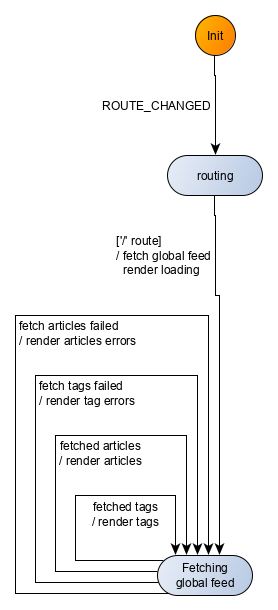

## Set-up
Let's do our application and tests setup. 

Following the [instructions](https://svelte.dev/blog/the-easiest-way-to-get-started) in Svelte repo:

```bash
npx degit sveltejs/rw-kingly-svelte
cd rw-kingly-svelte
npm install
npm run dev
```

and check in a browser that everything is working in `localhost:5000` (you should see *Hello world*).

That done, we add:

```bash
npm install --save kingly
```

We may need `marked` for the markdown commenting at some point but that is all we should need for the home page, so we'll add marked later.

Last, we initialize git:

```bash
git init
```

The [template we are using](https://github.com/sveltejs/template) builds the Svelte app with `rollup` (cf. `rollup.config.js` file). 

To build (with a watcher):

```bash
npm run autobuild
```

To run:

```bash
npm run start
```

To run in dev:

```bash
npm run dev
```

Following with tests setup, we will use good old *QUnit* as a test runner and *parcel* as a test bundler. This allows us to test in a real browser, and not to bother with configuration, given *parcel*'s sane defaults.

We run in the home directory of the repository:

```bash
npm install --save-dev qunitjs
npm install --save-dev parcel
```

We update the package json to include our test script:

```diff
{
  (...)
  "scripts": {
    "build": "rollup -c",
    "autobuild": "rollup -c -w",
    "dev": "run-p start:dev autobuild",
    "start": "sirv public --single",
    "start:dev": "sirv public --single --dev",
+    "test": "parcel tests/index.html"
  }
}
```

We create an html file (`tests/index.html`) to run QUnit with:

```html
<!doctype html>
<html class="no-js" lang="">
<head>
    <meta charset="utf-8">
    <title></title>
    <!-- Qunit testing stylesheets -->
    <link rel="stylesheet" href="https://cdnjs.cloudflare.com/ajax/libs/qunit/2.9.2/qunit.css">
</head>

<body>

<!-- Add your site or application content here -->
<div id="app">
</div>

<!-- Qunit old-->
<div id="qunit"></div>
<div id="qunit-fixture"></div>
<!-- Qunit new-->
<h1 id="qunit-header">QUnit Test Suite</h1>
<h2 id="qunit-banner"></h2>
<div id="qunit-testrunner-toolbar"></div>
<h2 id="qunit-userAgent"></h2>
<ol id="qunit-tests">test markup, hidden.</ol>
<script src="./index.js"></script>

</body>
</html>

```

We create two new JavaScript files to hold our tests:

- `tests/index.js` 

```javascript
import QUnit from "qunit"
import './home-route-fsm.specs'

QUnit.dump.maxDepth = 50;

QUnit.test("QUnit works", function exec_test(assert) {
  assert.ok(true)
});
```

- `tests/home-route-fsm.specs.js`

```javascript
import QUnit from "qunit"

QUnit.module("Testing home route fsm", {});

```

Running the tests (`npm run test`) should display our first passing test:

 

That was for the QUnit setup. 

## Application shell
We are going to have an architecture where the Kingly machine receives events from event sources, and outputs commands to command handlers. 


Following the terminology used in the [*Observer pattern*](https://en.wikipedia.org/wiki/Observer_pattern), and in [Rxjs](https://rxjs-dev.firebaseapp.com/guide/subject), we will sometimes say that the event bus is a *Subject*, defined as an object which implements both the [Observer](http://reactivex.io/rxjs/class/es6/MiscJSDoc.js~ObserverDoc.html) (listener) and [Observable](http://reactivex.io/rxjs/class/es6/Observable.js~Observable.html) (emitter) interface.


Events will come from user inputs (clicks on links or other parts of the app) and external inputs (mostly responses to API calls). Clicking on links will trigger a (hash) route change, so we will need to listen for the browser window's location changes. Other events will be emitted by the application and we will need to proxy those events to the Kingly machine. To that purpose we are going to use an event bus. The event bus must be both an event listener which can subscribe to event sources, and an event emitter which the machine can subscribe to.

Our interfaced systems include the screen (browser DOM), the browser window's location, the API endpoint (`https://conduit.productionready.io/api`), and the user session (for authentication purposes). As detailed in our [preliminary architecture](/documentation/v1/tutorials/real-world.html#Architecture), we will define command handlers for each command issued by the machine. In line with the [Hexagonal Architecture](https://dzone.com/articles/hexagonal-architecture-is-powerful) guidelines, we refine our preliminary architecture and limit our command handlers responsibilities to orchestrating requests to and responses from the interfaced systems. Concretely, we will introduce an *effect handlers* module which isolate domain methods (fetch articles, like article, etc.), so that effect handlers have a single concern which is to handle a specific domain operation. 

Separating effect handlers from command handlers is not strictly necessary but it is good practice for a separation of concern point of view, but also for testing purposes as it allows to test the command handlers by mocking the effect handlers. We take the pain to define an architecture with an increased level of decoupling in order to be able to test easily, debug faster, and to reduce the impact of a change in specifications on any of our modules. As a matter of fact, with our architecture, we can:
 - test the machine independently of the other modules, simply by passing input sequences
 - test the command handlers by mocking the effect handlers
 - test easily the effect handlers, as they usually have a single concern

The refined architecture can be represented as follows:





We group the API calls in a [*API gateway*](https://docs.microsoft.com/en-us/dotnet/architecture/microservices/architect-microservice-container-applications/direct-client-to-microservice-communication-versus-the-api-gateway-pattern#what-is-the-api-gateway-pattern) which further decouple the effect handlers from the endpoint. This is also not strictly necessary but also fits the hexagonal architecture.

We additionally create a session repository interface to hold our authentication data. The session repository allows us to abstract storage (here local storage, but it could be any other persistent storage method) and surface a custom authentication API (typically CRUD operations such as retrieving or updating user authentication data). 

To render to the DOM, we will need a render command handler. The render command handler is specific to the UI library used (here Svelte) and your mileage may vary. Our render command will issue updated *props* for the component which renders the application (called `App` through sheer lack of imagination). Here we are going to use the `$set` API of Svelte to update `App`'s *props*. Our `<App />` component:

 
 The `src/App` component renders the `SvelteFsm` component with a slot content conditionally set to the `RealWorld` component if the latter should be rendered (at initialization time, we have nothing yet to render).
  

 ```html
<script>
  import Fsm from "./SvelteFsm.svelte";
  import RealWorld from "./UI/RealWorld.svelte";

  export let _fsm;
  export let _shouldRender = false;
  // Other props
  export let ...

  const {
    fsmFactory,
    env,
    eventBus,
    commandHandlers,
    effectHandlers,
    initEvent
  } = _fsm;

  const next = eventBus.next.bind(eventBus);
</script>

<Fsm
  {fsmFactory}
  {env}
  {eventBus}
  {commandHandlers}
  {effectHandlers}
  {initEvent}>
  {#if _shouldRender}
    <RealWorld
      [other props]
      dispatch={next} />
  {/if}
</Fsm>

```
 
 
 The `src/SvelteFsm` component simply creates a state machine with the `fsmFactory`, injecting `env` into it. It then subscribes to the `eventHandler` to receive incoming events, computes commands from the machine (`actions = fsm(event)`), and execute them, filtering out empty commands.
 
 The `<slot />` instruction at the end of the `src/SvelteFsm` component tell Svelte to render whatever content is included within the `src/SvelteFsm` tag (here the `RealWorld` component which displays the application's user interface). If you are familiar with [`Vue`](https://vuejs.org/v2/guide/components-slots.html), or the [Web Component standard](https://www.webcomponents.org/specs#composition-and-slots), Svelte slots offer a similar functionality.

  
 
 will use a  custom-made `SvelteFsm` component (`src/SvelteFsm.svelte`) which receives events, passes them through the machines and runs the commands:

```html
<script>
  import { NO_OUTPUT } from "kingly";

  // Svelte defines props for a component with the `export let` proprietary syntax
  export let eventHandler;
  export let fsmFactory;
  export let commandHandlers;
  export let effectHandlers;
  export let env;
  export let initEvent;

  // Create the machine
  const fsm = fsmFactory(Object.assign({}, env));
  const next = eventHandler.next.bind(eventHandler);

  // Subscribing to machine events
  eventHandler.subscribe({
    next: event => {
      // 1. Run the input on the machine to obtain the actions to perform
      const actions = fsm(event);

      // 2. Execute the actions, if any
      if (actions === NO_OUTPUT) {
        return void 0;
      } else {
        actions
          .filter(action => action !== NO_OUTPUT)
          .forEach(action => {
            const { command, params } = action;

            const commandHandler = commandHandlers[command];
            if (!commandHandler || typeof commandHandler !== "function") {
              throw new Error(
                `Machine: Could not find command handler for command ${command}!`
              );
            }

            commandHandler(next, params, effectHandlers);
          });

        return void 0;
      }
    },
    error: error => {
      // We may get there for instance if there was a preprocessor throwing an exception
      console.error(
        `<SvelteFsm />: an error occurred in the event sources the event bus is subscribed to!`,
        error
      );
    },
    complete: () => {}
  });

  initEvent && next(initEvent);
</script>

<slot />
```


The `fsmFactory` *prop* will create the Kingly machine controlling the application. The `eventBus` is the event bus we mentioned previously. We already discussed the `commandHandlers` and `effectHandlers` *props*. The `env` variable is used to inject dependencies or parameters into the machine (here we pass parameters to ensure the machine's execution is traced and its contracts checked). `initEvent` when present run an initial event through the machine immediately after creation.

Note that we won't pass an `initEvent` *prop* to the `SvelteFsm` component but manually send it from the app shell. The app shell (`src/main.js`) thus goes like this:

 
 The `src/main` app shell:
 - creates an event bus
 - subscribes the event bus to the  *Window*'s `hashchange` event
 - creates the command handlers, effect handlers, and initial event *props* to pass to the `src/SvelteFsm` component
 - renders the `src/SvelteFsm` component with the `src/UI/RealWorld` component as a child slot
  

```javascript
import App from "./App.svelte";
import emitonoff from "emitonoff";
import { fsmContracts } from "kingly";
import sessionRepositoryFactory from "./sessionRepository";
import apiGatewayFactory from "./apiGateway";
import apiRouterFactory from "./apiRouter";
import eventEmitterFactory from "./eventEmitter";
import { commands, fsmFactory } from "./fsm";
import { events } from "./constants"

// Commands
const [
  RENDER,
  ...
] = commands;
const [
  ROUTE_CHANGED,
  ...
] = events;
// We want to log trace messages in the console and check the machine contracts before using it
const env = { debug: { console, checkContracts: fsmContracts } };

// Event emitter
const eventBus = eventEmitterFactory(emitonoff);
const next = eventBus.next.bind(eventBus);

// We set in place the API for storing authentication data
const sessionRepository = sessionRepositoryFactory(
  window.localStorage,
  window.addEventListener
);

// We set in place the APIs for executing domain methods
const { ... } = apiGatewayFactory(
  fetch,
  sessionRepository
);

// We set in place route handling
function hashChangeHandler({ newURL, oldURL, hash }) {
  next({ [ROUTE_CHANGED]: { newURL, oldURL, hash } });
}

const { subscribe: hashChangeSubscribe, getCurrentHash } = apiRouterFactory(
  window.location,
  window.addEventListener
);
hashChangeSubscribe(hashChangeHandler);

function render(props) {
  // This allows to toggle rendering when an actual render command has to be executed
  app.$set(Object.assign({}, props, { _shouldRender: true }));
}

// Command and effect handlers
const commandHandlers = {
  [RENDER]: (dispatch, params, effectHandlers) => {
    const { render } = effectHandlers;
    render(params);
  },
  [other command handlers]
};

const effectHandlers = {
  render,
  [other effect handlers]
};

const app = new App({
  target: document.body,
  props: {
    _shouldRender: false,
    _fsm: {
      fsmFactory,
      env,
      eventBus,
      commandHandlers,
      effectHandlers,
    },
    [other props]
  }
});

// kick start the app with the routing event corresponding to the current route
const initEvent = { [ROUTE_CHANGED]: { hash: getCurrentHash() } };
next(initEvent);

export default app;
```


## Testing strategy
Let's quickly note that TDD is less about testing than it is about development. Writing the tests first forces us to **think ahead** about the features we want to implement, how we organize the implementation's modules, how we define their interfaces, how, and in which order we test the implementation. None of these actually implies writing tests but thinking tests first is how we arrived in the first place to the chosen architecture made of decoupled modules and the [implementation strategy](/documentation/v1/tutorials/real-world.html#Implementation-strategy) mentioned in a previous section.

The UI will be tested with Storybook. The machine will be tested by matching its outputs to the expected outputs originating from its specifications. The command handlers won't be tested, being fairly trivial. The effect handlers come already tested out of the box (we took them from another Conduit clone).

Regarding our machine tests, we will need to:
- explicit the shape of machine inputs (events), and machine outputs (commands)
- have at hand a set of fixtures to serve as event data
- import the state machine and any other test relevant data

Structure-wise, we will make the following choices:
- we will have a separate file for the state machine: `src/fsm.js`
- that file will export the events and commands issued by the state machine
- we will have a separate file to hold all constants relevant to the applications and which fit nowhere else
- we will have fixtures files in a fixture directory (`tests/fixtures`). Fixtures file will be organized per domain object (tags, articles, etc.)

We thus create the following files/directory:
- `tests/home-route-fsm-specs` to hold tests related to the home route
- `tests/fixtures`

In what follows, we are going to implement our application by implementing a series of user scenarios, the sum of which covers the whole set of specifications for the home route. Let's start small, considering unauthenticated user scenarios, to later incorporate authenticated users scenarios, and the rest of the specifications. We follow the [implementation strategy](/documentation/v1/tutorials/real-world.html#Implementation-strategy) mentioned in the previous section.

## Unauthenticated user sees global feed
We are first going to implement the following scenarios:

```gherkin
  Background:
    Given the user is not authenticated
    And the user navigated to the home page

  Scenario: Unauthenticated user navigates to *Home* page and sees a loading message
    Then the application attempts to fetch the global feed
    And the interface notifies that the fetch is in progress 

  Scenario: Unauthenticated user navigates to *Home* page and sees the global feed
    Given the application attempted to fetch the global feed
    When the fetch is successful
    Then the interface displays the global feed

  Scenario: Unauthenticated user navigates to *Home* page and sees an error message
    Given the application attempted to fetch the global feed
    When the fetch fails
    Then the interface displays the results it obtained and indicates missing data
```

### Events and actions
The global feed involves fetching separately the tags and the articles. We thus have the following events for the *Home* route (*#/*):

| Event | Fired when | Mandatory data|
|:---|:---|:---|
|ROUTE_CHANGED|user clicks on a link (direct linking or redirection for authentication)| hash| 
|TAGS_FETCHED_OK|tag fetch API call executed successfully| tags| 
|TAGS_FETCHED_NOK|tag fetch API call failed| error| 
|ARTICLES_FETCHED_OK|articles fetch API call executed successfully| articles| 
|ARTICLES_FETCHED_NOK|articles fetch API call failed| error| 
 
Note that we only included, for each event, the data that necessarily must be passed with the event. We may however decide, as we implement more and more features, to include extra data, according to other needs appearing.

We also have two commands to implement:

| Command | Description | Mandatory data|
|:---|:---|:---|
|RENDER| renders a given state of the application | Any relevant data participating in the display logic| 
|FETCH_GLOBAL_FEED|fetches a paged list of articles and tags or issues an error|page (limited to 10 items)|

### User interface
The `src/UI/RealWorld` component will display all the screens of our Conduit clone, using only its *props*. This means that the `RealWorld` component will need no local state, or any other functionality that is not purely related to UI rendering. Any relevant information to rendering a screen will be encoded in the component's *props*.

Per the Conduit demo app screenshot, we need, in the home route, a screen which displays:
- a header
- a banner
- a loading status when tags or articles are being fetched
- the tags or articles when they are successfully fetched
- pagination for the articles (10 articles are displayed at a time)
- the current page highlighted
- a global feed tab

We thus will use the following properties for the `<RealWorld />` Svelte component:
- `tags`: a string with the loading message, or an error (tags fetch not successful), or an array of tags (tags fetch successful)
- `articles`: a string with the loading message, or an error (articles fetch not successful), or an array of tags (articles fetch successful)
- `page`: the current page

The `<RealWorld />` component can be broken down into smaller components as usual. Here we use smaller components such as `GlobalFeedTab`, `Header`, `Banner`, `ArticleList` or `Tags`. Those components must be imported before usage.

This gives us the following code for `src/UI/RealWord.svelte`:

```html
<script>
  import Banner from "./Banner.svelte";
  import Header from "./Header.svelte";
  import ArticleList from "./ArticleList.svelte";
  import Tags from "./Tags.svelte";
  import GlobalFeedTab from "./GlobalFeedTab.svelte";
  import { viewModel } from "../constants";
  import { events } from "../constants";

  // Props
  export let tags;
  export let articles;
  export let page;
  // Unused for now
  export let dispatch;

  const {
    tabs: [USER_FEED, GLOBAL_FEED, TAG_FILTER_FEED],
    fetchStatus: [LOADING, NOK, OK]
  } = viewModel;

  function computeFetchStatus(obj) {
    if (obj instanceof Error) {
      return NOK;
    } else if (typeof obj === "string") {
      return LOADING;
    } else if (typeof obj === "object") {
      return OK;
    } else {
      throw `computeFetchStatus: invalid parameter!`;
    }
  }
  // - It seems like Svelte does not currently allows destructuring in reactive statements!
  // - It seems you can't reuse a reactive assignment's left side on the right side, hence the dup typeof tags
  $: articleList =
    typeof articles === "object" ? articles && articles.articles : void 0;
  $: articlesCount =
    typeof articles === "object" ? articles && articles.articlesCount : 0;
  $: tagList = typeof tags === "object" ? tags && tags.tags : void 0;
  $: tagsFetchStatus = computeFetchStatus(tags);
  $: articlesFetchStatus = computeFetchStatus(articles);
  $: currentPage = page || 0;

</script>

<div>
  <Header />
  <div class="home-page" data-testId="home-page">
    <Banner />
    <div class="container page">
      <div class="row">
        <div class="col-md-9">
          <div class="feed-toggle">
            <ul class="nav nav-pills outline-active">
              <GlobalFeedTab />
            </ul>
          </div>
          <ArticleList
            articles={articleList}
            {articlesCount}
            {currentPage}
            fetchStatus={articlesFetchStatus} />
        </div>
        <div class="col-md-3">
          <div class="sidebar">
            <p>Popular Tags</p>
            <Tags tags={tagList} fetchStatus={tagsFetchStatus} />
          </div>
        </div>
      </div>
    </div>
  </div>
</div>

```

### User interface tests
We use [Storybook](https://storybook.js.org/) to test our user interface. Storybook is a component explorer, which provides a sandbox to design, build, test and organize UI components in isolation. Developers document use cases as stories and can navigate through the stories to check the correct behaviour of components. Storybook works with several UI libraries, including Svelte. To install Storybook for Svelte, follow the [instructions](https://storybook.js.org/docs/guides/guide-svelte/) published by Storybook.

Thanks to Storybook, we can define stories corresponding to diverse points of the `<RealWorld />` component parameter space and check that the correct view is displayed. Additionally we use Storybook addons to check the behaviour of event handlers, or test the UI with [snapshots](https://storybook.js.org/docs/testing/structural-testing/). Storybook also allows [interaction testing](https://storybook.js.org/docs/testing/interaction-testing/) and [automated visual testing](https://storybook.js.org/docs/testing/automated-visual-testing/). 

The following stories allows us to check manually that the screens generated by our UI component is correct:  





### Command handling
The command `FETCH_GLOBAL_FEED` fetches a list of articles and tags from the API end point and reports possible errors. The command needs a page parameter to run, as it will fetch only a limited portion of the articles and tags available at the end point. Commands receive three parameters:

- `dispatch`: this is the event bus converted to an event emitter connected to the Kingly machine 
- `params`: this is the parameters necessary to execute the command
- `effectHandlers`: object which gathers all effects which are to be performed as part of executing a command 

The implementation is as follows (`src/main.js`):


Note how the `apiGatewayFactory` abstracts out the implementation details (fetching method, storage, end point) of the domain methods. Also, as mentioned, the command handler only does orchestration of effects which are delegated to the effect handlers. I have not structured the code for command handlers and effect handlers to be tested separately, as the command handlers are pretty simple, and the effect handlers are taken verbatim from another Conduit clone implementation, and come already tested out of the box.


```javascript

  const { fetchGlobalFeed, fetchTags } = apiGatewayFactory(
    fetch,
    sessionRepository
  );

  const effectHandlers = {
    [...],
    fetchTags,
    fetchGlobalFeed
  };

  const commandHandlers = {
    [...],
    [FETCH_GLOBAL_FEED]: (dispatch, params, effectHandlers) => {
      const { page } = params;
      const { fetchGlobalFeed, fetchTags } = effectHandlers;

      fetchGlobalFeed({ page })
        .then(res => dispatch({ [ARTICLES_FETCHED_OK]: res }))
        .catch(err => dispatch({ [ARTICLES_FETCHED_NOK]: err }));

      fetchTags()
        .then(res => dispatch({ [TAGS_FETCHED_OK]: res }))
        .catch(err => dispatch({ [TAGS_FETCHED_NOK]: err }));
    }
  };

```

### Machine tests 
The first scenario corresponds to a Kingly machine with the following mapping:

| Input | Output|
|:---|:---|
|ROUTE_CHANGED (*home*)|RENDER loading screen, FETCH_GLOBAL_FEED (tags and articles)|

The second scenario goes as follows:


Note that in what follows, we chose to immediately display the results of fetch operations (tags and articles) when they arrive, instead of waiting for both fetches to be completed before updating the UI. We thereby replicate the behaviour of the Conduit official implementation. This may or may not be better in terms of UX.


| Input | Output|
|:---|:---|
|ROUTE_CHANGED (*home*)|RENDER loading screen, FETCH_GLOBAL_FEED (tags and articles)|
|TAGS_FETCHED_OK |RENDER tags|
|ARTICLES_FETCHED_OK |RENDER articles|

The sequence of events could also be:

| Input | Output|
|:---|:---|
|ROUTE_CHANGED (*home*)|RENDER loading screen, FETCH_GLOBAL_FEED (tags and articles)|
|ARTICLES_FETCHED_OK |RENDER articles|
|TAGS_FETCHED_OK |RENDER tags|

The third scenario goes as follows:

| Input | Output|
|:---|:---|
|ROUTE_CHANGED (*home*)|RENDER loading screen, FETCH_GLOBAL_FEED (tags and articles)|
|ARTICLES_FETCHED_NOK |RENDER errors|
|TAGS_FETCHED_OK |RENDER tags|

or:

| Input | Output|
|:---|:---|
|ROUTE_CHANGED (*home*)|RENDER loading screen, FETCH_GLOBAL_FEED (tags and articles)|
|ARTICLES_FETCHED_OK |RENDER articles|
|TAGS_FETCHED_NOK |RENDER errors|

or:

| Input | Output|
|:---|:---|
|ROUTE_CHANGED (*home*)|RENDER loading screen, FETCH_GLOBAL_FEED (tags and articles)|
|ARTICLES_FETCHED_NOK |RENDER errors|
|TAGS_FETCHED_NOK |RENDER errors|

or the 3 other mappings obtained by switching in the previous mappings the order of `ARTICLES_FETCHED_...` and `TAGS_FETCHED_...`. 

We thus have 9 tests that our Kingly machine must pass. 

Our tests thus goes like this (`tests/home-route-fsm-specs`): 

```javascript
import QUnit from "qunit"
import { NO_OUTPUT } from "kingly"
import { commands, events, fsmFactory } from "../src/fsm"
import { loadingStates, routes } from "../src/constants"
import { articlesErrorFixture, articlesFixture } from "./fixtures/articles"
import { tagsErrorFixture, tagsFixture } from "./fixtures/tags"

...testing helper functions...

QUnit.module("Testing home route fsm", {});

const [ROUTE_CHANGED, TAGS_FETCHED_OK, TAGS_FETCHED_NOK, ARTICLES_FETCHED_OK, ARTICLES_FETCHED_NOK] = events;
const [RENDER, FETCH_GLOBAL_FEED] = commands;
const { home } = routes;
const [TAGS_ARE_LOADING, ARTICLES_ARE_LOADING] = loadingStates;

const HOME_ROUTE_LOADING_SEQ = [
  { [ROUTE_CHANGED]: {hash:home} }
];

const HOME_ROUTE_LOADED_OK_TA_SEQ = HOME_ROUTE_LOADING_SEQ.concat([
  { [TAGS_FETCHED_OK]: tagsFixture },
  { [ARTICLES_FETCHED_OK]: articlesFixture },
]);

const HOME_ROUTE_LOADED_OK_AT_SEQ = HOME_ROUTE_LOADING_SEQ.concat([...]);

const HOME_ROUTE_LOADING_NOK_TA_SEQ = HOME_ROUTE_LOADING_SEQ.concat([
  { [TAGS_FETCHED_NOK]: tagsErrorFixture },
  { [ARTICLES_FETCHED_NOK]: articlesErrorFixture },
]);

...other 5 scenarios...

const HOME_ROUTE_LOADING_SEQ_COMMANDS = [
  [
    { command: FETCH_GLOBAL_FEED, params: {page: 0} },
    { command: RENDER, params: { tags: TAGS_ARE_LOADING, articles: ARTICLES_ARE_LOADING } }
  ]
];

...

const HOME_ROUTE_LOADED_OK_AT_SEQ_COMMANDS = HOME_ROUTE_LOADING_SEQ_COMMANDS.concat([
  [{ command: RENDER, params: { articles: articlesFixture } }],
  [{ command: RENDER, params: { tags: tagsFixture } }],
]);

...

const userStories = [
  [`Loading `, HOME_ROUTE_LOADING_SEQ, HOME_ROUTE_LOADING_SEQ_COMMANDS],
  [`Successfully loaded`, HOME_ROUTE_LOADED_OK_TA_SEQ, HOME_ROUTE_LOADED_OK_TA_SEQ_COMMANDS],
  [`Successfully loaded`, HOME_ROUTE_LOADED_OK_AT_SEQ, HOME_ROUTE_LOADED_OK_AT_SEQ_COMMANDS],
  [`Failed loading - tags and articles`, HOME_ROUTE_LOADING_NOK_TA_SEQ, HOME_ROUTE_LOADING_NOK_TA_SEQ_COMMANDS],
  [`Failed loading - tags and articles`, HOME_ROUTE_LOADING_NOK_AT_SEQ, HOME_ROUTE_LOADING_NOK_AT_SEQ_COMMANDS],
  [`Failed loading - tags`, HOME_ROUTE_LOADING_NOK_T$_SEQ, HOME_ROUTE_LOADING_NOK_T$_SEQ_COMMANDS],
  [`Failed loading - tags`, HOME_ROUTE_LOADING_NOK_$T_SEQ, HOME_ROUTE_LOADING_NOK_$T_SEQ_COMMANDS],
  [`Failed loading - articles`, HOME_ROUTE_LOADING_NOK_A$_SEQ, HOME_ROUTE_LOADING_NOK_A$_SEQ_COMMANDS],
  [`Failed loading - articles`, HOME_ROUTE_LOADING_NOK_$A_SEQ, HOME_ROUTE_LOADING_NOK_$A_SEQ_COMMANDS],
];

// const fsmSettings = { debug: { console, checkContracts: fsmContracts } };
const fsmSettings = { debug: { console } };

userStories.forEach(([scenario, inputSeq, outputsSeq]) => {
  QUnit.test(`Home route: ${scenario}`, function exec_test(assert) {
    const fsm = fsmFactory(fsmSettings);

    const actualOutputsSeq = computeCleanedActualOutputs(fsm, inputSeq);

    let indexWhenFailed = -1;
    const isTestPassed = inputSeq.every((input, index) => {
      const outputs = actualOutputsSeq[index];
      const expected = outputsSeq[index];
      const isTestPassed = deepEqual(outputs, expected);
      if (!isTestPassed) {indexWhenFailed = index}

      return isTestPassed
    });

    const errorMessage = `Actual outputs sequence differ from expected outputs sequence at index ${indexWhenFailed}`;
    const okMessage = `Alles gut!`;
    const message = isTestPassed ? okMessage : errorMessage;

    assert.deepEqual(actualOutputsSeq, outputsSeq, message);
  });
});
```

Let's start with the minimal information necessary in `src/fsm.js` to run our tests:

```javascript
export const commands = ["RENDER", "FETCH_GLOBAL_FEED"];

export const fsmFactory = (settings) => () => {return -1}
```

Our tests runner now gives us a list of failing tests:





Nice! We have our tests running but failing. We can now implement the machine which passes the tests.


### Modelization
A machine passing the previously defined tests can be modelized as follows:



To be able to understand the machine behaviour from the previous graph, it is useful to remember the formalism for the visual representation of state machines:

- a node is a control state
- the *Init* node is the initial control state for the state machine
- an edge between nodes is called a transition and is labelled with an (optional) event, a (optional) guard, and (optional) actions.
- Typically we write a transition in the form `event [ guard ] / actions`

Let's also recall here some necessary terminology:

- a control state which contains other control states is called a *compound control state*
- a control state which does not contain other control states is called an *atomic control state*
- a control state which does not have any outgoing transitions is called a *terminal control state*
- a control state which does not have any incoming transitions is called an *initial control state*
- a transition whose label does not include an event is called an *eventless transition*
- a control state which has an eventless transition is called an *eventless control states* or *transient control state*

As a final reminder, the visual representation maps to the semantics for the corresponding machine as follows:

- the machine is always in one of the represented control states
- a transition with label `event [ guard ] / actions` evaluates to `true` against an incoming event if and only if the incoming event matches the `event` in the transition label, and the guard is fulfilled 
- when an event occurs, the transitions originating from the current control state of the machine are evaluated
  - the first evaluated transition that is fulfilled will be taken, leading to a new control state for the machine, the update of the machine extended state, and the machine computing an output (here outputs are commands for the interfaced systems). These computations relate to the `actions` part of the transition label (`event [ guard ] / actions`)
- when an event occurs, if no transitions evaluates to `true`, the machine remains in its current control state, with identical extended state, and outputs a zero action (represented by the constant `NO_OUTPUT` in Kingly). This is akin to a no-op.
- if the machine is in a transient control state, the outgoing transitions for that control states are eveluated **immediately** when the machine enters the transient control state
- note that Kingly does not accept a machine whose initial control state is a transient control state
 
With this in mind, you should be able to check that the previous machine visualization indeed implements the behaviour referred to in our 9 test sequences:

- the machine starts in the *Init* control state
- when receiving the routing event it transitions to the *routing* control state, which is a transient control state
- the machine then immediately transitions to the *Fetching global feed* control state if that the route data contained in the `ROUTE_CHANGED` event corresponds to the home route. The machine outputs commands instructing the application to fetch tags and articles for the global feed, and display loading information to the end user
- once in the *Fetching global feed* control state, it will receive either success or failure information from the tags and articles being fetched and react accordingly, staying always in the *Fetching global feed* control state

Alright, let's move up to implementing that machine.

### Machine implementation
In the previous visualization, we focused on the control flow of the application and skipped key information which matter for implementation purposes:

- we entirely skipped discussing the extended state of the state machine
- we obviously did not include any code for the guards and actions

We have to precise all that now. 


It is also possible to **compile** at build time the data structure into a standard JavaScript function. This avoids having to import the Kingly library and may result in smaller payloads. The compiler functionality is not yet fully tested hence not published.


With Kingly, a state machine is defined through a data structure `FsmDef`, which is then used by a factory to construct an executable version of the machine. That executable version is a mere JavaScript function, which is generated by the factory `createStateMachine`. The factory also admits `settings` by which dependencies can be injected and debugging/tracing behaviour can be configured. You should always start by using the debugging options when implementing a machine, till you have enough confidence that the machine syntax is correct. A value of `{debug: {console}}` will output to the console tracing information about the execution of the machine. A value of `{debug: {checkContracts: fsmContracts}}` will check that the machine definition `fsmDef` fulfills all contracts enforcing the machine syntax and semantics.

Let's fill the fields for the `FsmDef` machine data structure one by one:

1. `initialControlState`: per the modelization we start with `INIT`
2. `initialExtendedState`: per the tests we already wrote, most of the information we needed was in the event data. We will however need to keep track of the current page for the pagination feature to render correctly the home route. So for now we pick  `{currentPage: 0}`.
3. `updateState`: as a reducer, we use a variant of `Object.assign` to incorporate the state updates into the old state 
4. `events`: that is an array of the 5 events (1 user event, 4 system events), we already identified in our tests.
5. `states`: we have a flat structure for now. We will have very simply:

```javascript
const states = {
  [INIT]: "",
  'routing': "",
  'fetching-global-feed': ""
};
```

I left the more interesting (6. `transitions`) for the end.


For more detail on Kingly syntax, please refer to the [API section](/documentation/v1/api/index.html).


The `transitions` property is an array whose elements are the edges of the graph used to visually represent the machine modelization. The `actions` in `event [ guard ] / actions` are generated by an action factory. The `guard` becomes a guard function which takes the extended state of the machine, the incoming event data, and the injected settings, and produces a boolean. 


If you are familiar with [Elm](https://elm-lang.org/) and its `update:: Msg -> Model ` `-> (Model, Cmd Msg)` function, you should feel in familiar waters. The action factory is akin to the `update` function: it turns an incoming event (`Msg`) into updates on the machine's extended state (`Model`) and commands (`Cmd Msg`). The only difference is that the Elm's update function directly produces a new state from the old state, while action factories produce updates to the old state which, combined with the `updateState` property of a Kingly machine, produce the new state.


The action factory takes the same parameters than the guards but return an object with two properties:
- `updates`: the list of updates to perform on the machine's extended state
- `outputs`: values to aggregate to the outputs of the machine as a result of receiving the incoming event

The final code is as follows:
```javascript
const initialControlState = INIT;
const initialExtendedState = {
  currentPage: 0
};
const states = {
  [INIT]: "",
  routing: "",
  "fetching-global-feed": ""
};
const transitions = [
  { from: INIT, to: "routing", event: ROUTE_CHANGED, action: ACTION_IDENTITY },
  {
    from: "routing",
    event: void 0,
    guards: [
      {
        predicate: isHomeRoute,
        to: "fetching-global-feed",
        action: fetchGlobalFeedAndRenderLoading
      }
    ]
  },
  {
    from: "fetching-global-feed",
    to: "fetching-global-feed",
    event: TAGS_FETCHED_OK,
    action: renderGlobalFeedTags
  },
  {
    from: "fetching-global-feed",
    to: "fetching-global-feed",
    event: ARTICLES_FETCHED_OK,
    action: renderGlobalFeedArticles
  },
  {
    from: "fetching-global-feed",
    to: "fetching-global-feed",
    event: TAGS_FETCHED_NOK,
    action: renderGlobalFeedTagsFetchError
  },
  {
    from: "fetching-global-feed",
    to: "fetching-global-feed",
    event: ARTICLES_FETCHED_NOK,
    action: renderGlobalFeedArticlesFetchError
  }
];

// Guards
function isHomeRoute(extendedState, eventData, settings) {
  return eventData.hash === home;
}

// Action factories
function fetchGlobalFeedAndRenderLoading(extendedState, eventData, settings) {
  const { currentPage } = extendedState;
  
  return {
    updates: [],
    outputs: [
      { command: FETCH_GLOBAL_FEED, params: { page: currentPage } },
      {
        command: RENDER,
        params: { tags: TAGS_ARE_LOADING, articles: ARTICLES_ARE_LOADING }
      }
    ]
  };
}

...

```

You can review the full code and run the tests in the [dedicated branch](https://github.com/brucou/realworld-kingly-svelte/tree/home-route-unauthenticated-with-interfaced-systems).

### Summary
This is it for the unauthenticated user scenario of the *home* route! 

Let's summarize what we have done here. In a preliminary phase, we, once and for all:
- set up an architecture which separates concerns and layers and  facilitates testing in isolation
- set up our application shell and tests shell so we can iteratively add features and tests as we implement larger parts of our specifications

In a second phase, we proceeded to implement portions of our specifications:

- we isolated some scenarios from the specifications
- we identified the events and commands related to those scenarios
- we implemented the UI and tested it with Storybook
- we wrote the command handlers for the new commands appearing in the scenarios
- we wrote basic tests for the machine which implements the behaviour related to the scenarios
- we modelized the machine passing the tests, without getting too deep into implementation details (internal state updates, etc.)
- we implemented that machine and passed the tests

In the next steps and till we complete the home route scenarios, we are going to focus on the machine modelization, and skip the parts about UI and machine testing.

## Unauthenticated user clicks on a page

One could argue that the tags may have changed and it could be a good idea to fetch them anew, but we stay true here to the behaviour of the demo app.


In this new scenario, we have to handle a page click user event `CLICKED_PAGE`), and fetching the global feed for the clicked page. The main changes vs. the previous scenarios is that we should not fetch twice the tags, as the [demo Conduit app](https://demo.realworld.io/#/) does not. This means that we need to keep track of whether the tags have already been successfully fetched, and if that is the case, we should only fetch the articles for the given page.

This leads us to update the modelization of our machine as follows:


This modelization showcases specific aspects of the visualization semantics (namely linked to compound states, history pseudo-states) which we recall thereafter:
- when a machine transitions to a compound state, it immediately evaluates the transitions leaving the initial state for that compound state
  - this happens for instance when the machine receives a `ROUTE_CHANGED` event with the home route as event data. The machine will transition to the compound state *Fetching global feed*, and thus immediately evaluates the two transitions going respectively to the *Pending global feed articles* and *Pending global feed* compound state.
  - the machine thus transitions as usual to the first transition whose guard is fulfilled
- every compound state has defined two special states called history pseudo states: shallow history state, deep history state.
  - a deep history state is a placeholder for the last atomic control state belonging to the associated compound state that the machine was in before exiting that compound state
  - here, assuming that the tags were already fetched, the machine would transition to the *Pending global feed articles* atomic state. On receiving the fetched articles, the machine would transition back to the *Pending global feed articles* state
  - assuming that the tags were not already fetched, the machine would transition to the *Pending global feed * atomic state. On receiving the fetched articles, the machine would transition back to the *Pending global feed* state, state in which it may receive the fetched tags

History states are important 'rewind' mechanism. It can be used to interrupt a behaviour temporarily (leaving a compound state), replace it by another behaviour, and resume the previous behaviour at a later point (transition to the history state for the compound state). Here we intercalated the article fetch response processing within the global feed request and response behaviour.

Alright, let's move on to the authenticated user scenarios.

## Authenticated user sees user feed
The main novelty here with respect to our modelization is that now we need to add a branch depending on whether the user is authenticated. If he is, then he will see by default its user feed, next to a global feed tab. Other than that, the fetching logic is pretty similar to that of the global feed, and that can be seen in the resulting modelization:





We can see the similarity (feed fetching) but also the differences between an authenticated and not authenticated user. Clicking on a user feed page leads to checking anew the authentication status for the user. 

Let's move on to the tag filtering scenarios.

## User can filter feeds per tags
In this new scenario, the user can click on one of the displayed tags, after which a new tab will appear with the global feed filtered by the clicked tag. As usual the user can also change the page to see other results in the feed.

The machine implementing those scenarios goes like this:





## User can also change feeds
Users, being on a tab, can change tab or click on the same tab and have the corresponding feed be fetched anew.

The machine implementing those scenarios goes like this:





## User can favorite/unfavorite an article
Here, an user can click on an article. If the article had been previously liked by him, then the article is unliked. Otherwise the article is liked. The counter of likes for the articles is incremented or decremented as appropriate. In order to be able to favorite an article, the user must be authenticated. If he is not, then he is redirected to a sign up page.  

The favoriting specifications apply to all article-displaying tabs, so we use a single arrow on the common super state of *Fetching user feed*, *Fetching global feed*, and *Fetching filtered articles*. This is the kind of factorization that hierarchy gives us: instead of having three similar arrows, we can have only one. However, when the article is liked or unliked, we want the machine to return where it was: the behaviour of the machine returns to be the same than it was. Once again, we implement this 'rewind' behaviour with a deep history pseudo state on the common super state *Home*.

The machine implementing those scenarios goes like this:





Note how we collapsed the *Fetching user feed*, *Fetching global feed*, and *Fetching filtered articles* states in order to have a bettr visibility of the feature we just added. This is yet another advantage of modeling using a hierarchy of states. It is possible to zoom in and out to take a high-level view, or, on the opposite a fairly detailed view of a part of the machine behaviour. 

## User can also navigate out of the home route
Last scenario, the user can click on links (sign in, sign up, etc.) which leads to a change of url. We capture that with the following modelization:





## Implementation
We refactor the previous machine to include all user flows corresponding to the home route in a compound control state:





The full implementation can be accessed in the [corresponding branch](https://github.com/brucou/realworld-kingly-svelte/tree/home-route-complete) of the [GitHub repository](https://github.com/brucou/realworld-kingly-svelte).

## Summary
We set up the architecture for our application, we decided to implement the application route by route, starting with the home route. The home route itself being complex enough, we broke it down in multiple user scenarios which we implemented one by one. In the process we iteratively built our state machine.
