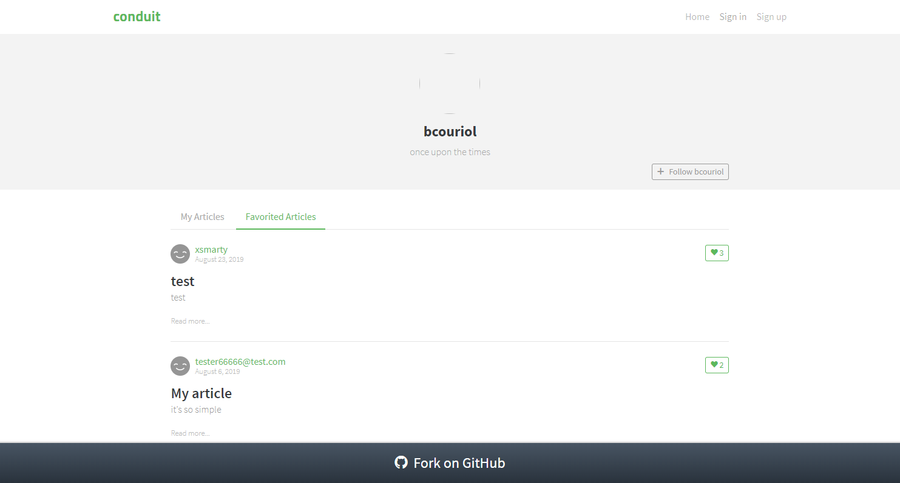
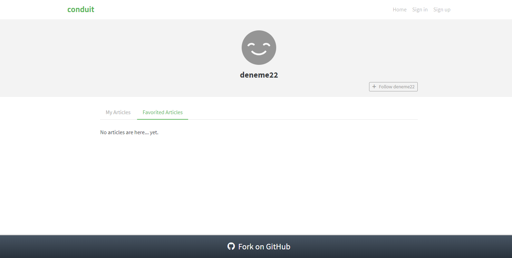
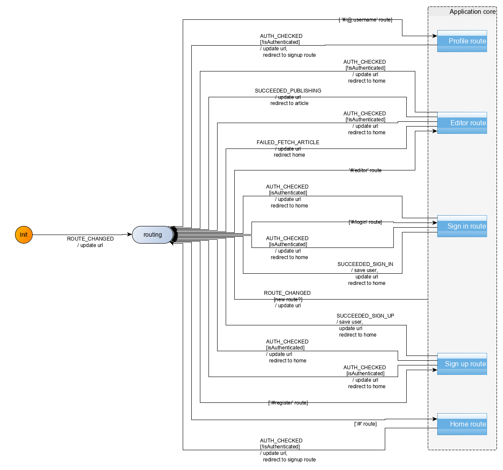
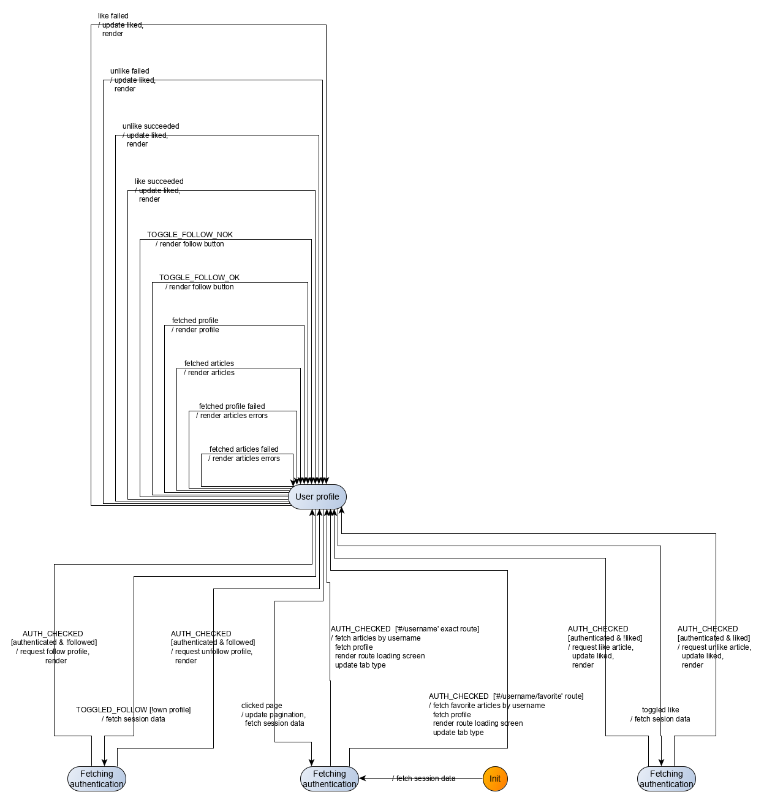

In this section, we will modelize and implement the user flows related to the *User profile* route. In that route, articles favorited by a given user (i.e. liked by that user) and articles written by that given user will be displayed. The user in question is identified by the route with the shape `#/@username`. Articles liked by a given user have a specific route of the shape `#/@username/favorites`, allowing for direct linking. 

If the (authenticated) user navigating to the route is the same as the user whose profile must be displayed, that user may edit his profile settings. Otherwise, the navigating user may follow the user whose profile page is displayed. In both cases, the navigating user may view and like/unlike any displayed articles, just like in the *Home* route.

The user needs not be authenticated to access the *User profile* route and its functionalities. The user however needs to authenticate himself to like/unlike an article, or follow a user profile. When attempting to do so, the user will be redirected to the *Sign up* page.

## UI
We already have identified the screens in the *Specifications* section. Ler's remind them here:



|Route|State|Main screen|
|:---|:---|:---:|
|`#/@bcouriol`|profile settings, authenticated user is viewing his profile, My articles tab||
|`#/@deneme22`|profile settings, profile is not that of visiting user, My articles tab||
|`#/@bcouriol/favorites`|profile settings, authenticated user is viewing his profile, Favorited tab||
|`#/@deneme22/favorites`|profile settings, profile is not that of visiting user, Favorited tab||



The UI for the *editor* route will be implemented with a *UserProfile* Svelte component. The [full source code](https://github.com/brucou/realworld-kingly-svelte/blob/with-profile-route/src/UI/UserProfile.svelte) for the `UserProfile` component can be accessed in the repository.

## UI testing
As before, we test the UI with [Storybook](https://storybook.js.org/). The [corresponding stories](https://github.com/brucou/realworld-kingly-svelte/tree/with-profile-route/stories) are available in the source repository.

## Commands
We have the following commands for the *User profile* route (some of which also being used for the *Home* route):

| Command | Command parameters |Description|
|:---|:---|:---|
| `REDIRECT`| hash to redirect to| redirects the user to a new/same hash location| 
| `FETCH_AUTHENTICATION`| -- | fetches user session data if any| 
| `FAVORITE_ARTICLE`| article slug| sends an [API request](https://github.com/gothinkster/realworld/tree/master/api#favorite-article) to like an article| 
| `UNFAVORITE_ARTICLE`| article slug| sends an [API request](https://github.com/gothinkster/realworld/tree/master/api#unfavorite-article) to unlike an article| 
| `FETCH_PROFILE`| username | sends an API request to the [*Get profile* end point](https://github.com/gothinkster/realworld/tree/master/api#get-profile)|
| `FOLLOW_PROFILE`| username | sends an API request to the [*Follow user* end point](https://github.com/gothinkster/realworld/tree/master/api#follow-user)|
| `UNFOLLOW_PROFILE`| username | sends an API request to the [*Unfollow user* end point](https://github.com/gothinkster/realworld/tree/master/api#unfollow-user)|
| `FETCH_AUTHOR_FEED`| articles' author's username and page index | sends an API request to the [*List Articles* end point](https://github.com/gothinkster/realworld/tree/master/api#list-articles)|

## Events
We have the following events for the *User profile* route (some of which also being used for the *Home* route):


| Event | Event data |Occurs when|
|:---|:---|:---|
|`ROUTE_CHANGED`| hash | user clicks on a link (direct linking or redirection for authentication) |
|`ARTICLES_FETCHED_OK`| articles data as [returned by the API](https://github.com/gothinkster/realworld/tree/master/api#multiple-articles)| articles fetch API call executed successfully|
|`ARTICLES_FETCHED_NOK`|error|articles fetch API call failed|
|`CLICKED_PAGE`|page index|user clicks on a page number in the pagination section|
|`TOGGLED_FAVORITE`|article's slug and whether the article is favorited at the moment of the toggling|user clicks to like or unlike an article|
|`FAVORITE_OK`|article and slug data|article was successfully liked by the user|
|`FAVORITE_NOK`|error and slug data|user failed to like the article|
|`UNFAVORITE_OK`|article and slug data|article was successfully unliked by the user|
|`UNFAVORITE_NOK`|error and slug data|user failed to unlike the article|
|`TOGGLED_FOLLOW`|username to follow, and whether that username is followed at the time of the toggling|user clicks to follow or unfollow a user|
|`TOGGLE_FOLLOW_OK`|profile data|user successfully followed/unfollowed a profile|
|`TOGGLE_FOLLOW_NOK`|err and profile data|user failed to follow/unfollow a profile|
|`FETCHED_PROFILE`|profile data|api response to a *Get profile* request|
|`FETCH_PROFILE_NOK`|error|api error response to a *Get profile* request|


## Commands implementation
The `REDIRECT`, `FETCH_AUTHENTICATION`, `FAVORITE_ARTICLE`, `UNFAVORITE_ARTICLE` have already been written when implementing the *Home* route. For `FETCH_PROFILE`, `FOLLOW_PROFILE`, `UNFOLLOW_PROFILE`, `FETCH_AUTHOR_FEED`, we defer to the [API](https://github.com/gothinkster/realworld/tree/master/api) passed on through effect handlers:

```javascript
  [FETCH_PROFILE]:(dispatch, params, effectHandlers) => {
    const { fetchProfile } = effectHandlers;
    const username = params;

    fetchProfile({username})
      .then(({profile}) => dispatch({[FETCHED_PROFILE]: profile}))
      .catch((err) => dispatch({[FETCH_PROFILE_NOK]: err}))
    },
  [FETCH_AUTHOR_FEED]: (dispatch, params, effectHandlers) => {
    const { fetchAuthorFeed, fetchFavoritedFeed } = effectHandlers;
    const {username, page, feedType} = params;
    const fetchFn = {[USER_PROFILE_PAGE]: fetchAuthorFeed, [FAVORITE_PROFILE_PAGE]: fetchFavoritedFeed}[feedType];

    fetchFn({username, page})
      .then (({articles, articlesCount}) => dispatch({[ARTICLES_FETCHED_OK]: {articles, articlesCount}}))
      .catch(err => dispatch({[ARTICLES_FETCHED_NOK]: err}))
  },
  [FOLLOW_PROFILE]: (dispatch, params, effectHandlers) => {
    const { follow } = effectHandlers;
    const username = params;

    follow({username})
      .then (({profile}) => dispatch({[FOLLOW_OK]: profile}))
      .catch(err => dispatch({[FOLLOW_NOK]: err}))
  },
  [UNFOLLOW_PROFILE]: (dispatch, params, effectHandlers) => {
    const { unfollow } = effectHandlers;
    const username = params;

    unfollow({username})
      .then (({profile}) => dispatch({[UNFOLLOW_OK]: profile}))
      .catch(err => dispatch({[UNFOLLOW_NOK]: err}))
  },

```

## Behaviour modelization
The modelization we reach is the following:





Zooming in on the *Profile route* compound control state:





## User scenarios test
We pick a set of scenarios which covers the transitions of our modelized graph, so that every transition in our graph is exercised at least one during our tests. We can conceptually separate those scenarios into main cases and edge cases (API request failure, unexpected inputs etc.).

In the main cases group, we will select the following tests: 

|Subset| Event sequence |
|---|---|
|(own profile, my articles)| like article, unlike article, change page|
|(own profile, favorite articles)| like article, unlike article, change page|
|(≠ profile, my articles)| follow user, unfollow user|
|(≠ profile, favorite articles)| follow user, unfollow user|

In the edge cases group, we will select the following tests: 

| Subset| Event sequence|
|---|---|
|(own profile, my articles)| profile fetch fails, article fetch fails|
|(own profile, my articles)| follow user fails, like article fails, unlike article fails|
|(own profile, my articles)| unfollow user fails, like article fails, unlike article fails|
|(unauth user, my articles)| like article fails and user is redirected to the signup page|
|(unauth user, my articles)| follow profile fails and user is redirected to the signup page|

The resulting 9 user scenarios are then gathered as follows:

 ```javascript
const userStories = [
  [
    USER_SEES_OWN_PROFILE_AND_ARTICLES_LIKES_UNLIKES_CHANGES_PAGE,
    USER_SEES_OWN_PROFILE_AND_ARTICLES_LIKES_UNLIKES_CHANGES_PAGE_INPUTS,
    USER_SEES_OWN_PROFILE_AND_ARTICLES_LIKES_UNLIKES_CHANGES_PAGE_COMMANDS
  ],
  [
    USER_SEES_OWN_PROFILE_AND_FAVORITE_ARTICLES_LIKES_UNLIKES_CHANGES_PAGE,
    USER_SEES_OWN_PROFILE_AND_FAVORITE_ARTICLES_LIKES_UNLIKES_CHANGES_PAGE_INPUTS,
    USER_SEES_OWN_PROFILE_AND_FAVORITE_ARTICLES_LIKES_UNLIKES_CHANGES_PAGE_COMMANDS
  ],
  [
    USER_SEES_PROFILE_ARTICLES_FOLLOWS_UNFOLLOWS,
    USER_SEES_PROFILE_ARTICLES_FOLLOWS_UNFOLLOWS_INPUTS,
    USER_SEES_PROFILE_ARTICLES_FOLLOWS_UNFOLLOWS_COMMANDS
  ],
  [
    USER_SEES_PROFILE_FAVORITE_ARTICLES_FOLLOWS_UNFOLLOWS,
    USER_SEES_PROFILE_FAVORITE_ARTICLES_FOLLOWS_UNFOLLOWS_INPUTS,
    USER_SEES_PROFILE_FAVORITE_ARTICLES_FOLLOWS_UNFOLLOWS_COMMANDS
  ],
  [
    USER_NAVIGATES_TO_OWN_PROFILE_SEES_NONE,
    USER_NAVIGATES_TO_OWN_PROFILE_SEES_NONE_INPUTS,
    USER_NAVIGATES_TO_OWN_PROFILE_SEES_NONE_COMMANDS
  ],
  [
    USER_NAVIGATES_TO_PROFILE_FAILS_FOLLOW_LIKE_UNLIKE,
    USER_NAVIGATES_TO_PROFILE_FAILS_FOLLOW_LIKE_UNLIKE_INPUTS,
    USER_NAVIGATES_TO_PROFILE_FAILS_FOLLOW_LIKE_UNLIKE_COMMANDS
  ],
  [
    USER_NAVIGATES_TO_PROFILE_FAILS_UNFOLLOW_LIKE_UNLIKE,
    USER_NAVIGATES_TO_PROFILE_FAILS_UNFOLLOW_LIKE_UNLIKE_INPUTS,
    USER_NAVIGATES_TO_PROFILE_FAILS_UNFOLLOW_LIKE_UNLIKE_COMMANDS
  ],
  [
    USER_NAVIGATES_TO_PROFILE_LIKES_AND_IS_REDIRECTED,
    USER_NAVIGATES_TO_PROFILE_LIKES_AND_IS_REDIRECTED_INPUTS,
    USER_NAVIGATES_TO_PROFILE_LIKES_AND_IS_REDIRECTED_COMMANDS
  ],
  [
    USER_NAVIGATES_TO_PROFILE_FOLLOWS_AND_IS_REDIRECTED,
    USER_NAVIGATES_TO_PROFILE_FOLLOWS_AND_IS_REDIRECTED_INPUTS,
    USER_NAVIGATES_TO_PROFILE_FOLLOWS_AND_IS_REDIRECTED_COMMANDS
  ]
];

```

## Refactoring
We take advantage of our TDD refactoring stage to do a little bit of cleanup in our application shell. We also initially started with events such as `FOLLOW_OK`, `UNFOLLOW_OK`, `FOLLOW_NOK`, `UNFOLLOW_NOK`, i.e. 4 events to cover the API responses linked to the follow/unfollow functionality. We brought that down to 2: `TOGGLE_FOLLOW_OK` and `TOGGLE_FOLLOW_NOK`. We also identified some possible target for refactoring (some actions are duplicated) but do not act on them just yet. When we will stop and have a look at our application performance and size, we may DRY things up further.

## Behaviour implementation
The implementation (`src/behaviour/profile.js`) derives directly from the modelization. We reproduce here the main part which are the transitions:

```javascript
export const profileTransitions = [
  {
    from: "profile",
    event: INIT_EVENT,
    to: "fetching-auth-for-profile",
    action: fetchAuthenticationAndProfileUsername
  },
  {
    from: "fetching-auth-for-profile",
    event: AUTH_CHECKED,
    guards: [
      {
        predicate: isUserProfileMyArticlesRoute,
        to: "user-profile-rendering",
        action: fetchMyArticlesAndProfileAndRender
      },
      {
        predicate: isUserProfileFavoritesRoute,
        to: "user-profile-rendering",
        action: fetchFavoriteArticlesAndProfileAndRender
      }
    ]
  },
  {
    from: "user-profile-rendering",
    event: ARTICLES_FETCHED_OK,
    to: "user-profile-rendering",
    action: renderFetchedArticles
  },
  {
    from: "user-profile-rendering",
    event: ARTICLES_FETCHED_NOK,
    to: "user-profile-rendering",
    action: renderFetchArticlesFailed
  },
  {
    from: "user-profile-rendering",
    event: FETCHED_PROFILE,
    to: "user-profile-rendering",
    action: renderFetchedProfile
  },
  {
    from: "user-profile-rendering",
    event: FETCH_PROFILE_NOK,
    to: "user-profile-rendering",
    action: renderFetchedProfileFailed
  },
  {
    from: "user-profile-rendering",
    event: TOGGLED_FOLLOW,
    to: "fetch-auth-for-profile-follow",
    action: fetchAuthentication,
  },
  {
    from: "fetch-auth-for-profile-follow",
    event: AUTH_CHECKED,
    guards: [
      {
        predicate: isUserNotAuthenticated,
        to: "routing",
        action: redirectToSignUp
      },
      {
        predicate: isUserAuthenticatedAndFollowedProfile,
        to: "user-profile-rendering",
        action: unfollowProfileAndRender
      },
      {
        predicate: isUserAuthenticatedAndUnfollowedProfile,
        to: "user-profile-rendering",
        action: followProfileAndRender
      },
    ]
  },
  {
    from: "user-profile-rendering",
    event: TOGGLE_FOLLOW_OK,
    to: "user-profile-rendering",
    action: renderToggleFollowedProfile
  },
  {
    from: "user-profile-rendering",
    event: TOGGLE_FOLLOW_NOK,
    to: "user-profile-rendering",
    action: renderToggleFollowProfileFailed
  },
  {
    from: "user-profile-rendering",
    event: FAVORITE_OK,
    to: "user-profile-rendering",
    action: renderLiked
  },
  {
    from: "user-profile-rendering",
    event: FAVORITE_NOK,
    to: "user-profile-rendering",
    action: renderLikeFailed
  },
  {
    from: "user-profile-rendering",
    event: UNFAVORITE_OK,
    to: "user-profile-rendering",
    action: renderUnliked
  },
  {
    from: "user-profile-rendering",
    event: UNFAVORITE_NOK,
    to: "user-profile-rendering",
    action: renderUnlikeFailed
  },
  {
    from: "user-profile-rendering",
    event: TOGGLED_FAVORITE,
    to: "fetch-auth-for-profile-favorite",
    action: fetchAuthenticationAndUpdateFavoriteStatusForProfile
  },
  {
    from: "fetch-auth-for-profile-favorite",
    event: AUTH_CHECKED,
    guards: [
      {
        predicate: isNotAuthenticated,
        to: "routing",
        action: redirectToSignUp
      },
      {
        predicate: and(isAuthenticated, isArticleLiked),
        to: "user-profile-rendering",
        action: unlikeAuthorArticleAndRender
      },
      {
        predicate: and(isAuthenticated, not(isArticleLiked)),
        to: "user-profile-rendering",
        action: likeAuthorArticleAndRender
      }
    ]
  },
  {
    from: "user-profile-rendering",
    event: CLICKED_PAGE,
    to: "fetching-auth-for-profile",
    action: fetchArticlesPage
  },
  { from: "profile", event: ROUTE_CHANGED, to: "routing", action: updateURL },
];
```

## Summary
We implemented the *Profile* route of our Conduit clone application. As the user interface for the *Profile* route had commonalities both at the interface and behaviour level with the *Home* route, we were able to reuse part of the *Home* route implementation. We also identified further opportunities for code size reduction.
