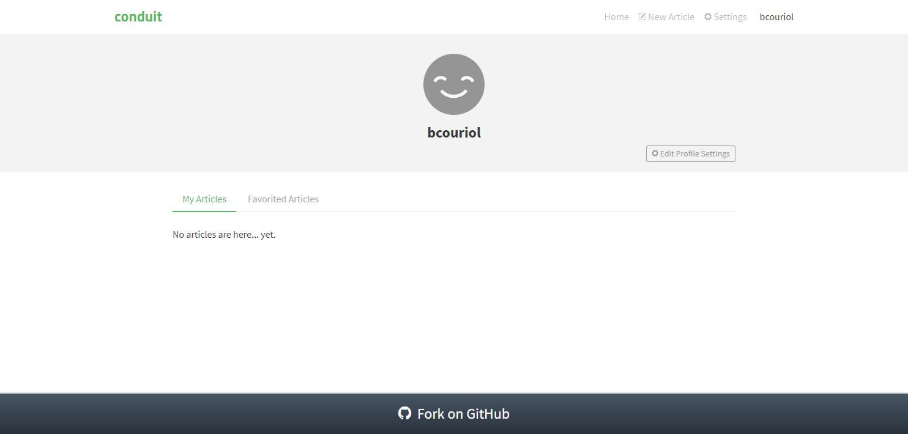

In this section, we will modelize and implement the user flows related to the *User profile* route. In that route, articles favorited by a given user (i.e. liked by that user) and articles written by that given user will be displayed. The user in question is identified by the route with the shape `#/@username`. Articles liked by a given user have a specific route of the shape `#/@username/favorites`, allowing for direct linking. 

If the (authenticated) user navigating to the route is the same as the user whose profile must be displayed, that user may edit his profile settings. Otherwise, the navigating user may follow the user whose profile page is displayed. In both cases, the navigating user may view and like/unlike any displayed articles, just like in the *Home* route.

The user needs not be authenticated to access the *User profile* route and its functionalities.

## Events
We have the following events for the *User profile* route:


| Event | Event data |Occurs when|
|:---|:---|:---|
|`ROUTE_CHANGED`| hash | user clicks on a link (direct linking or redirection for authentication) |
| `ARTICLES_FETCHED_OK`| articles data as [returned by the API](https://github.com/gothinkster/realworld/tree/master/api#multiple-articles)| articles fetch API call executed successfully|
|`ARTICLES_FETCHED_NOK`|error|articles fetch API call failed|
|`CLICKED_PAGE`|page index|user clicks on a page number in the pagination section|
|`TOGGLED_FAVORITE`|article's slug and whether the article is favorited at the moment of the toggling|user clicks to like or unlike an article|
|`FAVORITE_OK`|article and slug data|article was successfully liked by the user|
|`FAVORITE_NOK`|error and slug data|user failed to like the article|
|`UNFAVORITE_OK`|article and slug data|article was successfully unliked by the user|
|`UNFAVORITE_NOK`|error and slug data|user failed to unlike the article|
|`TOGGLED_FOLLOW`|username to follow, and whether that username is followed at the time of the toggling|user clicks to follow or unfollow a user|
|`FOLLOW_OK`|followed profile data|user successfully followed a profile|
|`FOLLOW_NOK`|err and profile data|user failed to follow a profile|
|`UNFOLLOW_OK`|unfollowed profile data|user successfully unfollowed a profile|
|`UNFOLLOW_NOK`|err and profile data|user failed to unfollow a profile|
|`FETCHED_PROFILE`|profile data|api response to a *Get profile* request|
|`FETCH_PROFILE_NOK`|error|api error response to a *Get profile* request|


## Commands
We have the following commands for the *User profile* route:

| Command | Command parameters |Description|
|:---|:---|:---|
| `REDIRECT`| hash to redirect to| redirects the user to a new/same hash location| 
| `FETCH_AUTHENTICATION`| -- | fetches user session data if any| 
| `FAVORITE_ARTICLE`| article slug| sends an [API request](https://github.com/gothinkster/realworld/tree/master/api#favorite-article) to like an article| 
| `UNFAVORITE_ARTICLE`| article slug| sends an [API request](https://github.com/gothinkster/realworld/tree/master/api#unfavorite-article) to unlike an article| 
| `FETCH_PROFILE`| username | sends an API request to the [*Get profile* end point](https://github.com/gothinkster/realworld/tree/master/api#get-profile)|
| `FOLLOW_PROFILE`| username | sends an API request to the [*Follow user* end point](https://github.com/gothinkster/realworld/tree/master/api#follow-user)|
| `UNFOLLOW_PROFILE`| username | sends an API request to the [*Unfollow user* end point](https://github.com/gothinkster/realworld/tree/master/api#unfollow-user)|
| `FETCH_AUTHOR_FEED`| articles' author's usernme and page index | sends an API request to the [*List Articles* end point](https://github.com/gothinkster/realworld/tree/master/api#list-articles)|

## UI
We already have identified the screens in the *Specifications* section. Ler's remind them here:



|Route|State|Main screen|
|:---|:---|:---:|
|`#/@bcouriol`|profile settings, authenticated user is viewing his profile, My articles tab||
|`#/@deneme22`|profile settings, profile is not that of visiting user, My articles tab||
|`#/@bcouriol/favorites`|profile settings, authenticated user is viewing his profile, Favorited tab||
|`#/@deneme22/favorites`|profile settings, profile is not that of visiting user, Favorited tab||



The UI for the *editor* route will be implemented with a *UserProfile* Svelte component. The [full source code](https://github.com/brucou/realworld-kingly-svelte/blob/with-profile-route/src/UI/UserProfile.svelte) for the `UserProfile` component can be accessed in the repository.

## UI testing
As before, we test the UI with [Storybook](https://storybook.js.org/). The [corresponding stories](https://github.com/brucou/realworld-kingly-svelte/tree/with-profile-route/stories) are available in the source repository.

## Commands implementation
**TODO**

## User scenarios test
Part of the test space here can be summarized as `[own profile, ≠ profile] x [My articles, Favorites articles]` `x {action sequence}`, where `{action sequence}` is a set of the possible action sequences that the user can perform through the user interface. The set of action sequences is as usual infinite, and we will only select a few sequences from it, chosen to cover both a wide set of user interface states and user actions. 

|Subset| Action sequence |
|---|---|
|(own profile, my articles)| like article, unlike article, change page|
|(own profile, favorite articles)| like article, unlike article, change page|
|(≠ profile, my articles)| follow user, unfollow user|
|(≠ profile, favorite articles)| like article, unlike article, change page|

Another part of the test space corresponds to what we call edge cases, i.e. unexpected or undesired behaviour of the interfaced systems (like API request failing). The formula remains as previously expressed, except that this time, the sequence of actions include failure events received from the interfaced systems.

| Subset| Action sequence|
|---|---|
|(own profile, my articles)| profile fetch fails, article fetch fails|
|(own profile, my articles)| like article fails, unlike article fails|
|(own profile, favorite articles)| like article fails, unlike article fails|
|(≠ profile, my articles)| profile fetch fails, article fetch fails|
|(≠ profile, my articles)| follow user fails, unfollow user fails|
|(≠ profile, favorite articles)| like article fails, unlike article fails|

## Behaviour modelization
**TODO**

## Refactoring
**TODO**

## Behaviour implementation
**TODO**

## Summary
**TODO**

