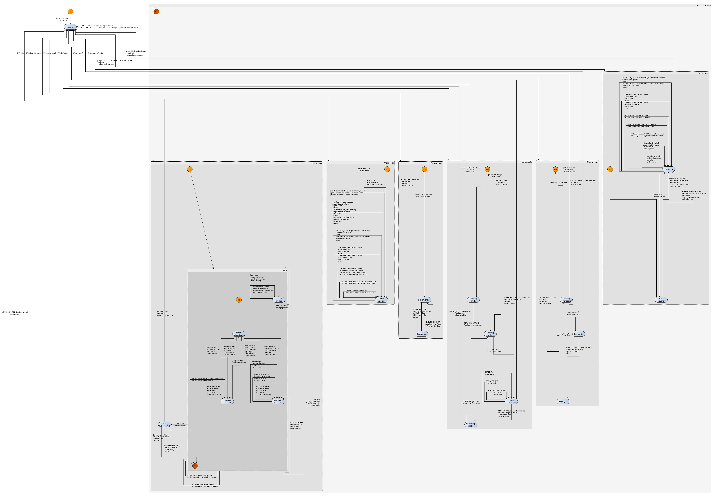

The graph that we came up with previously accurately describes the specifications for the Conduit demo app. However, anytime we need to do an action that requires authentication, we are checking the authentication of the user. Doing this leads to many control states and transitions in the graph that essentially carry  the same function. 

Instead of querying the authentication status every time, we now react to changes in authentication and keep the authentication status in the extended state of the machine. We thus no longer need to trigger an action to query the authentication status --- we only need to access it in the extended state of the machine. A lot of transitions thus disappear. 

The machine is also refactored to reduce its depth by eliminating compound states that are not factoring transitions. Eventually, the resulting graph has a depth of 3 and fewer control states and transitions: 




