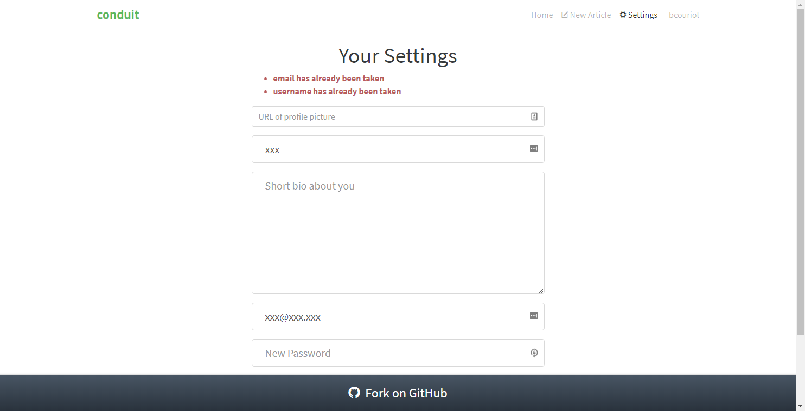

In this section, we will modelize and implement the user flows related to the *settings* route. In that route, the user may:
- update his profile picture, username, biography, email, and password 
- logout

The following rules apply:
- unauthenticated users navigating to the *settings* page should be redirected to the *home* route
- unauthenticated users cannot update a user's settings. Any attempt to do so will trigger a redirection to the *home* route 
- the form fields must be validated for the settings to be updated. Validation happens server-side with the API returns validation errors in the form of an object.

## Events
We have the following events for the *settings* route:


| Event | Event data |Occurs when|
|:---|:---|:---|
| `CLICKED_UPDATE_SETTINGS`| form data (`{image, username, bio, email, password}`)| user submits the form| 
| `FAILED_UPDATE_SETTINGS`| errors (as returned from the publishing API)| user submitted the form but the request failed|
| `UPDATED_SETTINGS`| user as [returned by the API](https://github.com/gothinkster/realworld/tree/master/api#users-for-authentication)| user submitted the form and the request succeeded|
| `CLICKED_LOG_OUT`| none | user clicks on the log out button|


Additionally, the user may click on links (like *home*). However, this is not handled directly by the machine. Instead, this is handled by the browser as any other links, triggering a change of url, which then triggers a *ROUTE_CHANGED* event to the machine.

## Commands
We have the following commands for the *settings* route:

| Command | Command parameters |Description|
|:---|:---|:---|
| `UPDATE_SETTINGS`| form data(`{image, username, bio, email, password}`)| API call to update the user settings| 
| `LOG_OUT`| none | deletes user authentication information|

## UI
We already have identified the screens in the *Specifications* section. Ler's remind them here:



|Route|State|Main screen|
|:---|:---|:---:|
|`#/settings`|Authenticated, settings||
|`#/settings`|Authenticated, settings||



The UI for the *settings* route will be implemented with a *Settings* Svelte component. The [full source code](https://github.com/brucou/realworld-kingly-svelte/blob/with-settings-route/src/UI/Settings.svelte) for the `Settings` component can be accessed in the repository.

## UI testing
As before, we test the UI with [Storybook](https://storybook.js.org/). The [corresponding stories](https://github.com/brucou/realworld-kingly-svelte/tree/with-settings-route/stories) are available in the source repository.

## Commands implementation
To implement the `UPDATE_SETTINGS`, we defer to the API. The `LOG_OUT` command only involves local operations, such as deleting user authentication information stored in local storage. The logic, as before is enclosed into functions passed as effect handlers (`updateSettings`, and `removeUserSession`):

```javascript
  [UPDATE_SETTINGS]: (dispatch, params, effectHandlers) => {
    const {image, username, bio, email, password} = params;
    const {updateSettings} = effectHandlers;

    updateSettings({user: {image, username, bio, email, password}})
      .then(({user}) => {
        dispatch({[UPDATED_SETTINGS]: user});
      })
      .catch(({errors}) => {
        dispatch({ [FAILED_UPDATE_SETTINGS]: errors });
      })
  },
  [LOG_OUT]: (dispatch, params, effectHandlers) => {
    const {removeUserSession} = effectHandlers;
    removeUserSession();
  },

```

## User scenarios test
We test four key user scenarios, checking the aforementioned behavior rules, the content of which should be clear from their identifiers in the code:

```javascript
const userStories = [
  [
    UNAUTH_USER_ON_SETTINGS_IS_REDIRECTED,
    UNAUTH_USER_ON_SETTINGS_IS_REDIRECTED_INPUTS,
    UNAUTH_USER_ON_SETTINGS_IS_REDIRECTED_COMMANDS
  ],
  [
    AUTH_USER_ON_SETTINGS_UPDATES_SETTINGS,
    AUTH_USER_ON_SETTINGS_UPDATES_SETTINGS_INPUTS,
    AUTH_USER_ON_SETTINGS_UPDATES_SETTINGS_COMMANDS
  ],
  [
    AUTH_USER_ON_SETTINGS_FAILS_UPDATE_SETTINGS,
    AUTH_USER_ON_SETTINGS_FAILS_UPDATE_SETTINGS_INPUTS,
    AUTH_USER_ON_SETTINGS_FAILS_UPDATE_SETTINGS_COMMANDS
  ],
  [
    AUTH_USER_ON_SETTINGS_AND_LOGS_OUT,
    AUTH_USER_ON_SETTINGS_AND_LOGS_OUT_INPUTS,
    AUTH_USER_ON_SETTINGS_AND_LOGS_OUT_COMMANDS
  ]
];
```

## Behaviour modelization
The modelization we reach is the following:





Zooming in on the *Editor route* compound control state:





## Refactoring
Remember than in the previous route (the *Editor* route), we identified a recurring pattern of behavior (authenticated form submission) which we abstracted in a function `getAuthenticatedFormPageTransitions`. We are going to use that function for our implementation, given that we again have the same pattern appearing for the *Settings* route.

We take advantage of our TDD refactoring stage to do a little bit of cleanup here and there in our Svelte UI code.

## Behaviour implementation
The implementation (`src/behaviour/editor.js`) derives directly from the modelization. We reproduce here the main part which are the transitions:

```javascript
export const settingsTransitions = [
  {
    from: "settings",
    event: INIT_EVENT,
    to: "fetching-authentication-settings-pre-form",
    action: resetSettingsRouteStateAndFetchAuth
  },
  { from: "settings", event: ROUTE_CHANGED, to: "routing", action: updateURL },
  { from: "editing-settings", event: CLICKED_LOG_OUT, to: "routing", action: logOutAndRedirectHome },
  getAuthenticatedFormPageTransitions({
    events: {
      AUTH_CHECKED,
      SUBMIT_TRIGGERED: CLICKED_UPDATE_SETTINGS,
      FAILED_SUBMISSION: FAILED_UPDATE_SETTINGS,
      SUCCEEDED_SUBMISSION: UPDATED_SETTINGS
    },
    states: {
      fetchingAuthenticationPreForm: "fetching-authentication-settings-pre-form",
      fetchingAuthenticationPreSubmit: "fetching-authentication-settings-pre-submit",
      enteringData: "editing-settings",
      fallback: "routing",
      submitting: "updating-settings",
      done: "routing"
    },
    isAuthenticatedGuard: isAuthenticated,
    actionFactories: {
      showInitializedForm: renderSettingsForm,
      showSubmittingForm: fetchAuthenticationAndRenderInProgressAndUpdateFormData,
      submit: updateSettings,
      fallback: redirectToHome,
      retry: renderSettingsFormWithErrorsAndFetchAuth,
      finalize: updateUrlAndRedirectToProfilePage
    }
  })
].flat();

```

Note how we use the transitions computed by the `getAuthenticatedFormPageTransitions` function.

## Summary
We implemented the *Settings* route for our Conduit clone. Implementation was pretty straight forward and again exhibited an already seen pattern which we had previously extracted, and which we reused in the implementation. The *Settings* route did not have any controlled fields, which eliminated the considerations we had in the *Editor* route.
