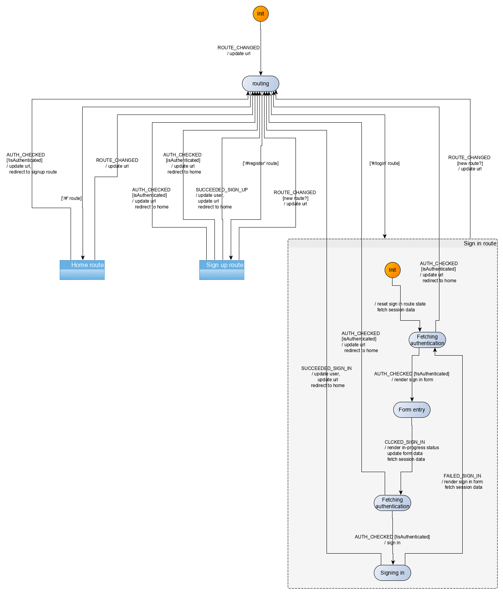

In this section, we will modelize and implement the user flows related to the sign in route. In the *sign in* route, the user logs in with his email and password. The following rules apply:
- authenticated users navigating to the *sign in* page should be redirected to the *home* route
- authenticated users cannot sign in while being logged in. Any attempt to do so will trigger a redirection to the *home* route 

The second rule is one that we added ourselves. The [demo app](https://demo.realworld.io/#/) actually lets you log in with two competing identities. I believe it is probably a bug. The reproducing sequence is as follows:
- open the login page in two separate tabs
- log in with user 1 in first tab
- log in with user 2 in second tab

You should see in each tab the user feeds corresponding to each user. Further navigation however will use the latest logged in user as current user, which is at best confusing, and in the worse case unsafe. In the context of this demo application, the impact is not huge, but we nonetheless insist here on taking a safer approach. 

## Events
We have the following events for the *sign in* route:

| Event | Event data |Occurs when|
|:---|:---|:---|
| `CLICKED_SIGNIN`| form data (`{email, password}`)| user submits the *sign in* form| 
| `FAILED_SIGN_IN`| errors (as returned from sign in API)| user submitted the *sign in* form but the request failed|
| `SUCCEEDED_SIGN_IN`| signed in user (as returned from sign in API)| user submitted the *sign in* form and the request succeeded|

Additionally, the user may click on links (like *have an account*). However, this is not handled directly by the machine. Instead, this is handled by the browser as any other links, triggering a change of url, which then triggers a *ROUTE_CHANGED* event to the machine.

## Commands
We have the following commands for the *sign in* route:

| Command | Command parameters |Description|
|:---|:---|:---|
| `REDIRECT`| hash to redirect to| redirects the user to a new/same hash location| 
| `SIGN_IN`| sign in form data (`{email, password}`)| sends an API request to sign the user in|

## UI
The screens for the *sign in* route are similar to those of the *sign up* screen with the difference that there is no `username` field in the *sign in* page.

Implementation for the `src/UI/SignIn.svelte` component is similar to that of the `SignUp` component.

The [full source code](https://github.com/brucou/realworld-kingly-svelte/blob/with-sign-in-route/src/UI/SignIn.svelte) for the `SignIn` component can be accessed in the repository.

## UI testing
As before, we test the UI with [Storybook](https://storybook.js.org/). The [corresponding stories](https://github.com/brucou/realworld-kingly-svelte/blob/with-sign-in-route/stories/RealWorld.SignIn.stories.js) are available in the source repository.

## Commands implementation
We already have implemented the `REDIRECT` command, so we will reuse that. 

To implement the sign in command, we again defer to the API and update the session repository with the new user data. The logic, as before, is enclosed into functions passed as effect handlers (`saveUser`, and `login`):

```javascript
  [SIGN_IN]: (dispatch, params, effectHandlers) => {
    const { email, password } = params;
    const { login, saveUser } = effectHandlers;

    login({ email, password })
      .then(res => {
        const { user } = res;
        saveUser(user);
        dispatch({ [SUCCEEDED_SIGN_IN]: user });
      })
      .catch(({ errors }) => {
        dispatch({ [FAILED_SIGN_IN]: errors });
      });
  }
```

## User scenarios test
We test four key user scenarios, the content of which should be clear from their identifiers in the code:

```javascript
const userStories = [
  [
    UNAUTH_USER_ON_SIGNIN_SEES_FORM,
    UNAUTH_USER_ON_SIGNIN_SEES_FORM_INPUTS,
    UNAUTH_USER_ON_SIGNIN_SEES_FORM_COMMANDS
  ],
  [
    AUTH_USER_ON_SIGNIN_SEES_FORM,
    AUTH_USER_ON_SIGNIN_SEES_FORM_INPUTS,
    AUTH_USER_ON_SIGNIN_SEES_FORM_COMMANDS
  ],
  [
    UNAUTH_USER_ON_SIGNIN_SEES_FORM_SIGNS_IN_AND_SEES_HOME_FEED,
    UNAUTH_USER_ON_SIGNIN_SEES_FORM_SIGNS_IN_AND_SEES_HOME_FEED_INPUTS,
    UNAUTH_USER_ON_SIGNIN_SEES_FORM_SIGNS_IN_AND_SEES_HOME_FEED_COMMANDS
  ],
  [
    UNAUTH_USER_ON_SIGNIN_SEES_FORM_FAILS_SIGN_IN_AND_SEES_FORM_WITH_ERRORS,
    UNAUTH_USER_ON_SIGNIN_SEES_FORM_FAILS_SIGN_IN_AND_SEES_FORM_WITH_ERRORS_INPUTS,
    UNAUTH_USER_ON_SIGNIN_SEES_FORM_FAILS_SIGN_IN_AND_SEES_FORM_WITH_ERRORS_COMMANDS
  ]
];

```

## Behaviour modelization
The behaviour to modelize is very similar to that of the *sign up* route with the difference that there is no *username* field in the *sign in* route. With that exception, the logic is the same and we reach the following modelization: 





Note how we check twice that our user is authenticated before either displaying the sign up form, or executing the sign up API request. Note also, how the nested structure of our state machine allows us to focus on the part that we are interested in visualizing, while folding the part we are not interested in.

More importantly, this *Sign in route* sub-machine has the same structure than the *Sign up route* sub-machine! That makes it a target candidate for refactoring. When it comes to DRY refactoring, we follow the [rule of three](https://blog.codinghorror.com/rule-of-three/), i.e. we will wait for a third occurrence of a sub-machine with an indentical structure before commiting to defining a reusable abstraction.

## Behaviour implementation 
The [implementation](https://github.com/brucou/realworld-kingly-svelte/blob/with-sign-in-route/src/behaviour/signIn.js) (`src/behaviour/signIn.js`) derives directly from the modelization. 

## Summary
We implemented the *sign in* route for our application, following the [implementation strategy](/real-world.html#Implementation-strategy) we previously detailed. The *sign in* route behaviour was very similar to the *sign up* route behaviour, and we have identified but delayed an opportunity to isolate the common behaviour in a refactoring.

