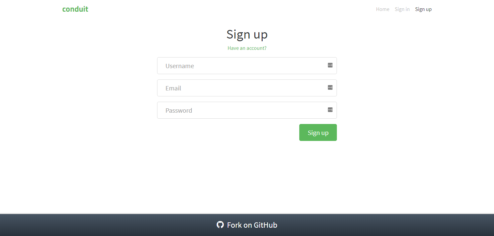
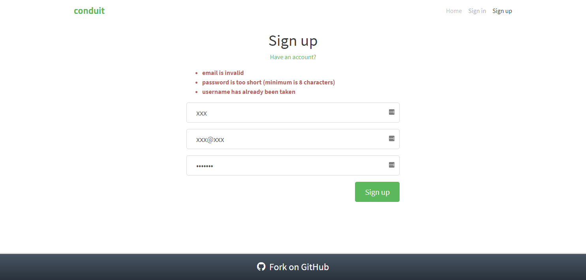
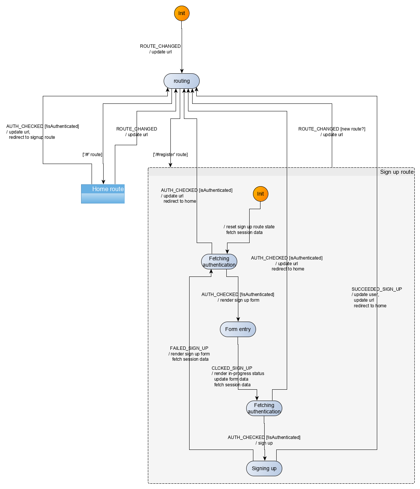

In this section, we will modelize and implement the user flows related to the sign up route. There are two main entries to that route:
- a user may directly load the route in the browser
- a user may be redirected to that route, for instance if the user is not authenticated and likes/unlikes an article from the global feed

In the *sign up* route, the user may register with a username, an email and a password. The following rules apply:
- authenticated users navigating to the *sign up* page should be redirected to the *home* route
- authenticated users cannot sign up while being logged in. Any attempt to do so will trigger a redirection to the *home* route 
- sign up form fields must be validated for the sign up to go through (validation is handled partly by the browser (email field) and partly server side, the client does no validation).

## Events
We have the following events for the *sign up* route:

| Event | Event data |Occurs when|
|:---|:---|:---|
| `CLICKED_SIGNUP`| form data (`{username, email, password}`)| user submits the *sign up* form| 
| `FAILED_SIGN_UP`| errors (as returned from sign up API)| user submitted the *sign up* form but the request failed|
| `SUCCEEDED_SIGN_UP`| signed up user (as returned from sign up API)| user submitted the *sign up* form and the request succeeded|

Additionally, the user may click on links (like *have an account*). However, this is not handled directly by the machine. Instead, this is handled by the browser as any other links, triggering a change of url, which then triggers a *ROUTE_CHANGED* event to the machine.

## Commands
We have the following commands for the *sign up* route:

| Command | Command parameters |Description|
|:---|:---|:---|
| `REDIRECT`| hash to redirect to| redirects the user to a new/same hash location| 
| `SIGN_UP`| sign up form data (`{username, email, password}`)| sends an API request to sign the user up|

## UI
We already have identified the screens in the *Specifications* section. Ler's remind them here:



|Route|State|Main screen|
|:---|:---|:---:|
|`#/register`|Authentication required by the app or requested by the user||
|`#/register`|Sign up clicked||
|`#/register`|Sign up failed||




The UI for the *sign up* route will be implemented with a *SignUp* Svelte component which will take two parameters:

| Prop | Description|
|:---|:---|
| `inProgress`| boolean which indicates that the sign up API is pending returning a response. This will be used to give a visual feedback to the user about the in-flight request| 
| `errors`| errors object returned by the sign up API in case of sign up request failure| 

There is no mystery to that component, it depending as usual exclusively on its *props*. It may be worth mentioning that we use the `FormData` browser API to get the value of the form inputs. Some implementations are listening on form input changes and maintaining a copy of the form input values. This is however not necessary and we prefer using the standard browser API, and using the DOM as single source of truth.

The [full source code](https://github.com/brucou/realworld-kingly-svelte/blob/with-sign-up-route/src/UI/SignUp.svelte) for the `SignUp` component can be accessed in the repository.

## UI testing
As before, we test the UI with [Storybook](https://storybook.js.org/). The [corresponding stories](https://github.com/brucou/realworld-kingly-svelte/blob/with-sign-up-route/stories/RealWorld.SignUp.stories.js) are available in the source repository.

## Commands implementation
To implement the redirect command (without having a reload of the page), we have to update directly the browser location. We do so with *pushState* in order to have the browser history updated without the `onhashchange` event being triggered. The latter is important as we listen on `onhashchange` to send a `ROUTE_CHANGED` to the machine, and we do not want that event to be triggered for a redirection. Just like for the previous rouet, the function realizing the redirection is passed to the corresponding command handler as effect handler: 

```javascript
  [REDIRECT]: (dispatch, params, effectHandlers) => {
    const hash = params;
    const { redirect } = effectHandlers;

    redirect(hash);
  },

```

To implement the sign up command, we defer to the API and update the session repository with the new user data. The logic, as before is enclosed into functions passed as effect handlers (`saveUser`, and `register`):

```javascript
  [SIGN_UP]: (dispatch, params, effectHandlers) => {
    const { email, username, password } = params;
    const { register, saveUser } = effectHandlers;

    register({ email, password, username })
      .then(res => {
        const { user } = res;
        saveUser(user);
        dispatch({ [SUCCEEDED_SIGN_UP]: user });
      })
      .catch(({ errors }) => {
        dispatch({ [FAILED_SIGN_UP]: errors });
      });
  }
```

## Refactoring
Writing the tests for the user scenarios, we came to realize the need to refactor our implementation to accomodate the new route, and the future routes in a way that will minimize maintainability and testing issues.

What are those issues which did not appear before?

On the one hand, we now have a lot of *props* for our `RealWorld` component. Some of these props are only relevant for one specific route. Testing the `RealWorld` component with all these *props* will quickly become cumbersome, so we create one component for each route. We will arrange our rendering code to be able to test each route component separately. This concretely means having the `RealWorld` pick the component to display as a function of the route, and pass the appropriate selection of the `RealWorld` *props* to the corresponding route component.

Svelte allows us to implement this logic relatively straightforwardly with [*dynamic components*](https://svelte.dev/tutorial/svelte-component). The `scr/App.svelte` thus goes like this:

```diff
<script>
  ...

<Fsm
  {fsmFactory}
  {env}
  {eventBus}
  {commandHandlers}
  {effectHandlers}
  {initEvent}>
  {#if _shouldRender}
    <RealWorld
      dispatch={next}
      {route}
      {tags}
      {articles}
      {page}
      {activeFeed}
      {user}
      {selectedTag}
      {favoriteStatus}
+     {inProgress}
+    {errors} />
  {/if}
</Fsm>

```

Then the `src/UI/RealWorld.svelte` component, which uses a dynamic component resolved at runtime, becomes:

```html
<script>
  import Banner from "./Banner.svelte";
  import Header from "./Header.svelte";
  import Home from "./Home.svelte";
  import SignUp from "./SignUp.svelte";
  import { routes } from "../constants";

  // Props
  // Common props
  export let dispatch;
  export let user;
  export let route;
  // Home route props
  export let tags;
  export let articles;
  export let page;
  export let activeFeed;
  export let selectedTag;
  export let favoriteStatus;
  // Sign up props
  export let inProgress;
  export let errors;

  const { home, signUp } = routes;

  // Component which will be displayed depending on the route
  const componentRoutes= {
    [home]: Home,
    [signUp]: SignUp,
  };
  // Props for the component which will be displayed
  $: componentRoutesProps={
    [home]: {user, tags, articles, page, activeFeed, selectedTag, favoriteStatus},
    [signUp]: {inProgress, errors},
  };
  $: component = componentRoutes[route]
  $: componentProps = componentRoutesProps[route]
</script>

<div>
  <Header {user} />
  <svelte:component this="{component}" {...componentProps}  {dispatch} />
</div>

```

The second maintainability issue we are confronted with is that our state machine becomes quite large to be conveniently contained in a single file. As a result, we create a `behaviour` directory and we put there the parts of the state machine concerned exclusively with a specific route in separate files, and aggregate those parts into the state machine (`src/behaviour/fsm.js`):

```javascript
import { ACTION_IDENTITY, createStateMachine } from "kingly";
import { events, routes } from "../constants";
import { allRoutesViewLens, initialAllRoutesState, updateURL } from "./common";
import { homeStates, homeTransitions, initialHomeRouteState } from "./home";
import {
  initialSignUpRouteState,
  signUpStates,
  signUpTransitions
} from "./signUp";
import { cleanHash } from "../shared/helpers";

/** @type Array<HOME_ROUTE_EVENTS> */
const [
  ROUTE_CHANGED,
  TAGS_FETCHED_OK,
  TAGS_FETCHED_NOK,
  ARTICLES_FETCHED_OK,
  ARTICLES_FETCHED_NOK,
  AUTH_CHECKED,
  CLICKED_TAG,
  CLICKED_PAGE,
  CLICKED_USER_FEED,
  CLICKED_GLOBAL_FEED,
  TOGGLED_FAVORITE,
  FAVORITE_OK,
  FAVORITE_NOK,
  UNFAVORITE_OK,
  UNFAVORITE_NOK
] = events;

const { home, allRoutes, signUp } = routes;

const INIT = "start";
const initialControlState = INIT;

const initialExtendedState = {
  [home]: initialHomeRouteState,
  [allRoutes]: initialAllRoutesState,
  [signUp]: initialSignUpRouteState
};

const states = {
  [INIT]: "",
  routing: "",
  home: homeStates,
  signUp: signUpStates
};

/** @type {Array<Transition>} */
const transitions = [
  { from: INIT, event: ROUTE_CHANGED, to: "routing", action: updateURL },
  {
    from: "routing",
    event: void 0,
    guards: [
      { predicate: isHomeRoute, to: "home", action: ACTION_IDENTITY },
      { predicate: isSignUpRoute, to: "signUp", action: ACTION_IDENTITY }
    ]
  },
  homeTransitions,
  signUpTransitions
].flat();

/**
 * @typedef {Object} Update
 *
 * This function updates a state object, spliced per a property called `route`
 * The route update basically works like this: {a, b: {c, d}}, [{b:{e}]} -> {a, b:{e}}
 * All Object.assign caveats apply
 * https://developer.mozilla.org/en-US/docs/Web/JavaScript/Reference/Global_Objects/Object/assign
 * @param {Object} extendedState
 * @param {Array.<[route, Array<Update>]>} extendedStateUpdates
 * @returns {Object}
 */
function updateState(extendedState, extendedStateUpdates) {
  const extendedStateCopy = Object.assign({}, extendedState);

  if (extendedStateUpdates.length === 0) return extendedStateCopy;

  return extendedStateUpdates.reduce((acc, extendedStateUpdate) => {
    const [route, updates] = extendedStateUpdate;
    if (route === void 0 || updates === void 0) {
      console.warn(
        `updateState: incorrect extended state update argument! [route, updates] with either route or updates undefined!`,
        extendedStateUpdate
      );
      return extendedState;
    }
    const routeState = Object.assign({}, acc[route]);
    acc[route] = updates.reduce(
      (acc, update) => Object.assign(routeState, update),
      routeState
    );

    return acc;
  }, extendedStateCopy);
}

// Guards
export function isHomeRoute(extendedState, eventData, settings) {
  const { url } = allRoutesViewLens(extendedState);
  return url === home;
}

export function isSignUpRoute(extendedState, eventData, settings) {
  const { url } = allRoutesViewLens(extendedState);
  return url === cleanHash(signUp);
}

// Action factories

// Machine definition

export const fsmDef = {
  initialControlState,
  initialExtendedState,
  states,
  events,
  transitions,
  updateState
};

export const fsmFactory = settings => createStateMachine(fsmDef, settings);

```

As can be seen in the previous code, we also decided to compartimentalize the machine's extended state per route:

```javascript
const states = {
  [INIT]: "",
  routing: "",
  home: homeStates,
  signUp: signUpStates
};

const initialExtendedState = {
  [home]: initialHomeRouteState,
  [allRoutes]: initialAllRoutesState,
  [signUp]: initialSignUpRouteState
};

```

This in turn means that we have to change the extended state updates performed by the action factories so they now address the new location of the extended state to modify. To do this in a maintainable way, we take inspiration from [functional lenses](https://medium.com/@dtipson/functional-lenses-d1aba9e52254). We do not use exactly that due to the shape of our `updateState` function, but we do create view and update helpers functions for each of our route which will update the relevant parts of the extended state. We correspondingly update our `updateState` to reflect these changes. For instance:

```javascript
export function routeViewLens(route) {
  return function(extendedState) {
    return extendedState[route];
  };
}

export function homeUpdates(updates) {
  return [[routes.home, updates]];
}

export function allRoutesUpdate(updates) {
  return [[routes.allRoutes, updates]];
}

```

The `updateState` function is now:

```javascript
function updateState(extendedState, extendedStateUpdates) {
  const extendedStateCopy = Object.assign({}, extendedState);

  if (extendedStateUpdates.length === 0) return extendedStateCopy;

  return extendedStateUpdates.reduce((acc, extendedStateUpdate) => {
    const [route, updates] = extendedStateUpdate;
    if (route === void 0 || updates === void 0) {
      console.warn(
        `updateState: incorrect extended state update argument! [route, updates] with either route or updates undefined!`,
        extendedStateUpdate
      );
      return extendedState;
    }
    const routeState = Object.assign({}, acc[route]);
    acc[route] = updates.reduce(
      (acc, update) => Object.assign(routeState, update),
      routeState
    );

    return acc;
  }, extendedStateCopy);
}

```

In short, all our modifications are oriented towards adding new routes without modifying the previous routes and common parts.

We are now ready for writing tests for our user scenarios.

## User scenarios test
We test four key user scenarios, the content of which should be clear from their identifiers in the code:

```javascript
const userStories = [
  [
    UNAUTH_USER_ON_SIGNUP_SEES_FORM,
    UNAUTH_USER_ON_SIGNUP_SEES_FORM_INPUTS,
    UNAUTH_USER_ON_SIGNUP_SEES_FORM_COMMANDS
  ],
  [
    AUTH_USER_ON_SIGNUP_IS_REDIRECTED,
    AUTH_USER_ON_SIGNUP_IS_REDIRECTED_INPUTS,
    AUTH_USER_ON_SIGNUP_IS_REDIRECTED_COMMANDS
  ],
  [
    UNAUTH_USER_ON_SIGNUP_SEES_FORM_SIGNS_UP_AND_SEES_HOME_FEED,
    UNAUTH_USER_ON_SIGNUP_SEES_FORM_SIGNS_UP_AND_SEES_HOME_FEED_INPUTS,
    UNAUTH_USER_ON_SIGNUP_SEES_FORM_SIGNS_UP_AND_SEES_HOME_FEED_COMMANDS
  ],
  [
    UNAUTH_USER_ON_SIGNUP_SEES_FORM_FAILS_SIGN_UP_AND_SEES_FORM_WITH_ERRORS,
    UNAUTH_USER_ON_SIGNUP_SEES_FORM_FAILS_SIGN_UP_AND_SEES_FORM_WITH_ERRORS_INPUTS,
    UNAUTH_USER_ON_SIGNUP_SEES_FORM_FAILS_SIGN_UP_AND_SEES_FORM_WITH_ERRORS_COMMANDS
  ]
];
```

## Behaviour modelization
The behaviour to modelize is relatively simple with the small complication to make sure that the user is not authenticated before signing up a possibly new user. We maintain the current modelization for the *home* route while adding the *sign up* behaviour to the existing machine. The final modelization is as follows:





Note how we check twice that our user is authenticated before either displaying the sign up form, or executing the sign up API request. Note also, how the nested structure of our state machine allows us to focus on the part that we are interested in visualizing, while folding the part we are not interested in.

## Behaviour implementation 
The implementation (`src/behaviour/signUp.js`) derives directly from the modelization. We reproduce here the main part which are the transitions:

```javascript
export const signUpTransitions = [
  {
    from: "signUp",
    event: INIT_EVENT,
    to: "fetching-authentication-form-entry",
    action: resetSignUpRouteStateAndFetchAuth
  },
  {
    from: "fetching-authentication-form-entry",
    event: AUTH_CHECKED,
    guards: [
      {
        predicate: isNotAuthenticated,
        to: "form-entry-sign-up",
        action: renderSignUpForm
      },
      { predicate: isAuthenticated, to: "routing", action: redirectToHome }
    ]
  },
  {
    from: "form-entry-sign-up",
    event: CLICKED_SIGNUP,
    to: "fetching-authentication-sign-up",
    action: fetchAuthenticationAndRenderInProgress
  },
  {
    from: "fetching-authentication-sign-up",
    event: AUTH_CHECKED,
    guards: [
      { predicate: isNotAuthenticated, to: "signing-up", action: signUserUp },
      { predicate: isAuthenticated, to: "routing", action: redirectToHome }
    ]
  },
  {
    from: "signing-up",
    event: FAILED_SIGN_UP,
    to: "fetching-authentication-form-entry",
    action: renderFormWithErrorsAndFetchAuth
  },
  {
    from: "signing-up",
    event: SUCCEEDED_SIGN_UP,
    to: "routing",
    action: redirectToHome
  }
];

```

The transitions are very simply the edges of the previously represented graph.

## What we learnt
Changing the shape of the extended state of the machine potentially requires reviewing *all* the state updates made by the action factories. As the machine grows, this can be cumbersome, which is why it is important to think in advance about how to structure the machine to minimize this. Here, we know that there are route-specific piece of states which will only be modified by specific section of the machine, which we have grouped in dedicated compound states (one compound state per route). As such, in the future, we will not have to review the whole machine when reviewing a piece of state, but only the part which read or update that piece of state, which we have conveniently identified beforehand. 

By separating the behaviour specification from the implementation, and by modelizing the behaviour as a state machine, we can deduce from the modelization graph that a user will not be able to sign up if he is already authenticated. Such assurance is hard to derive in a simple manner in other implementations. To do so in those alternative implementation involving components may require delving into the code, and manually tracing the user flows across the component tree. This illustrates on an admittedly small scale why state machines are so often used in safety-critical software where safety guarantees are paramount.

As a matter of fact, the [`hyperapp`](https://github.com/jorgebucaran/hyperapp) [implementation](https://hyperapp.netlify.com/register) the [Conduit demo app](https://demo.realworld.io/#/) does not implement those safety requirements. This could be simply an oversight (there are after all no written specifications for the Conduit app), or this could result from a view-first approach which favors such behavioural oversight. 

In any case, it is by specifying our behaviour with state machines that we realized, **before reaching to the implementation phase** the necessity to add an authentication check before signing up the user, while there was no specifications telling us to do so. This is another crucial advantage of state machine modelization. They make it easier to review a modelized behaviour vs. the expected behaviour, and find design bugs before they get buried deep into the code. 

## Summary
We implemented the *sign up* route for our application. We followed the [implementation strategy](/real-world.html#Implementation-strategy) we previously detailed. In the process of doing so, we came to refactor our application, keeping our architecture, but structuring the application per route to minimize the amount of code we have to modify to add future routes. We have around 10 routes to implement so it was important to do so early. We were also able with our modelization to ensure at the design level that our requirements will be indeed implemented by our implementation. For instance, our design ensures that a user clicking twice on the *sign up* button will not lead to attempting to sign in twice.
