In the previous tutorials, we saw how to implement relatively simple applications with Kingly state machines. In this tutorial, we are going to implement Conduit, which describes itself as [**the mother of all demo apps**](https://github.com/gothinkster/realworld). That application aims at replacing the  app commonly used to compare front-end frameworks. The [rationale for the RealWorld app](https://medium.com/@ericsimons/introducing-realworld-6016654d36b5) is similar to that of [TodoMVC](http://todomvc.com/): implementing the same application with different frameworks allows to make an informed comparison between frameworks. RealWorld takes it up a notch by specifying a **full-stack**, *realistic* web application. Eric Simons, cofounder of StackBlitz, and at the origin of the idea, explains:

> Reusing the best ideas from TodoMVC [...], we took a stab at solving this problem by creating the design & API spec for a real world social blogging site similar to Medium.com. We named it **Conduit**.

The Conduit app, as of today (August 2019), has 18 front-end implementations, ranging from popular frameworks (Elm, Vue, React, Angular, Aurelia) to minimalistic frameworks (AppRun, Hyperapp, Crizmas MVC), and including compile-to-JavaScript frameworks (Svelte, Stencil, Purescript, ClojureScript). The Conduit app is additionally used as a base for [benchmarking front-end frameworks](https://www.infoq.com/news/2019/04/real-world-framework-benchmark/).

The Kingly architecture allows us to pick our UI framework as we please. In this tutorial, we will do a step-by-step implementation of Conduit with Svelte. We will also provide implementations in other frameworks (React and Vue), this time without detailing much the steps taken. Because we will be using only the basic syntax of Svelte, which is akin to HTML, you should not need know much about Svelte to understand the UI implementation.

## Svelte primer
We thus quickly give the reader some Svelte basics to better understand the code. Svelte is a compiler which takes `.svelte` files and turn them into standard JavaScript. A `.svelte` file consists of three optional parts: 

```html
<script>
// imports, props, local variables definitions, and code to execute 
// once, every time the component is mounted
// For instance
import Nested from './Nested.svelte';

</script>

<style>
	p {
		color: purple;
		font-family: 'Comic Sans MS';
		font-size: 2em;
	}
</style>

// html-like Svelte code describing markup logic
// For instance
<p>This is a paragraph.</p>
<Nested/>

```

If you know [Vue.js](https://vuejs.org/v2/guide/index.html), this is very similar to Vue's [single-file components](https://vuejs.org/v2/guide/single-file-components.html).

The Svelte-compiled component(s) can thus be used in an application. For instance, the following code:

```javascript
import App from "./App.svelte";

const app = new App({
  target: document.body,
  props: {
    name: "world"
  }
});

export default app;
```

compiles `App.svelte` to a standard JavaScript class which is then instantiated with a set of properties and a DOM anchor element (here `document.body`). Instantiating the class leads to the display of the component at the configured location in the DOM.

For more details about Svelte syntax, the [Svelte tutorials](https://svelte.dev/tutorial/basics) are remarkably well done. As mentioned, we will only us Svelte basic syntax, so only 5/18 sections are relevant to fully understand the code for our Conduit clone!

## Specifications
Conduit's [API specs](https://github.com/gothinkster/realworld/tree/master/api) are organized around end points prefixed by `https://conduit.productionready.io/api`. For instance `https://conduit.productionready.io/api/articles` corresponds to `GET /api/articles` and will return the most recent articles globally by default.

There is no written UI specs for Conduit. However, a [reference implementation](https://demo.realworld.io/#/) is provided, from which we can derive the following routes:


 |Route|State|Main screen|
|:---|:---|:---:|
|`#/`|Not authenticated, page 1|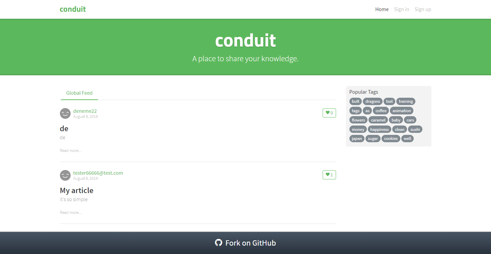|
|`#/`|Not authenticated, page 47|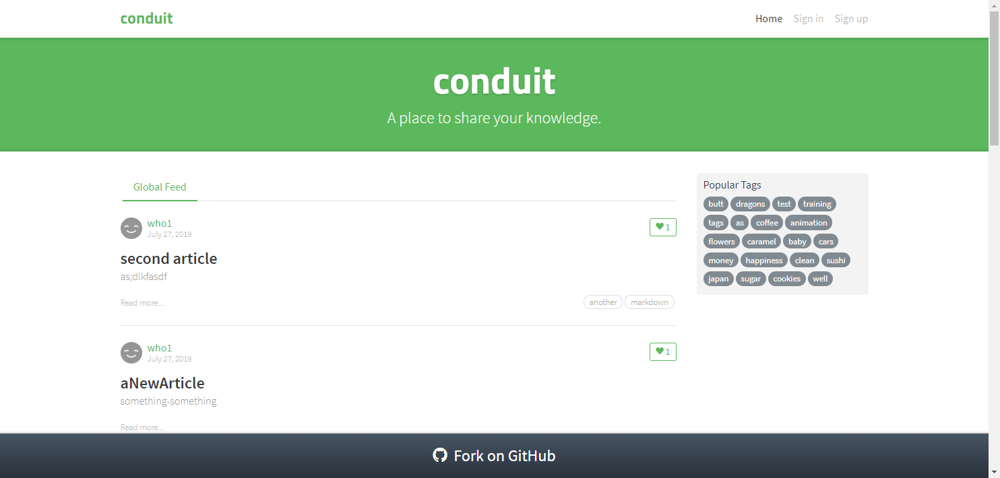|
|`#/`|Not authenticated, filtered by tag|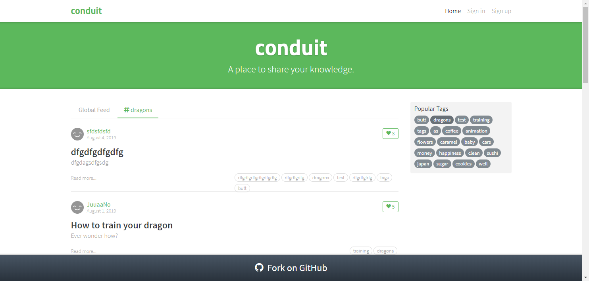|
|`#/`|Authenticated, home, page 1|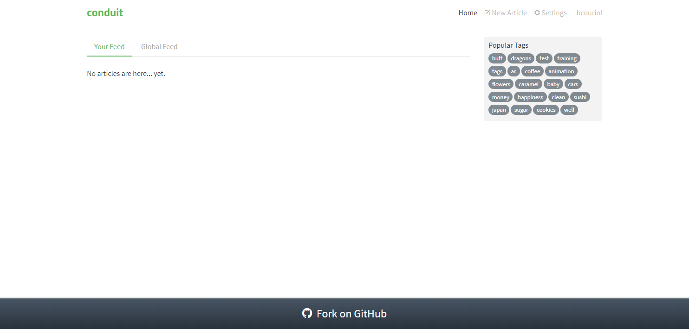|
|`#/`|Authenticated, global feed, page 1|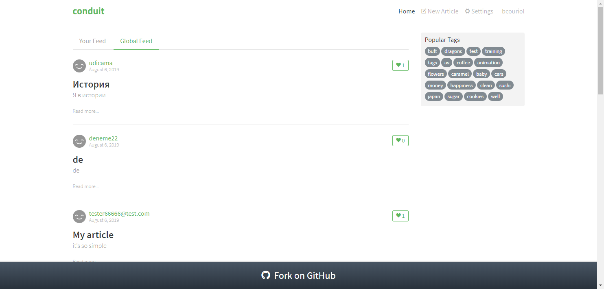|
|`#/`|Authenticated, filtered, page 1|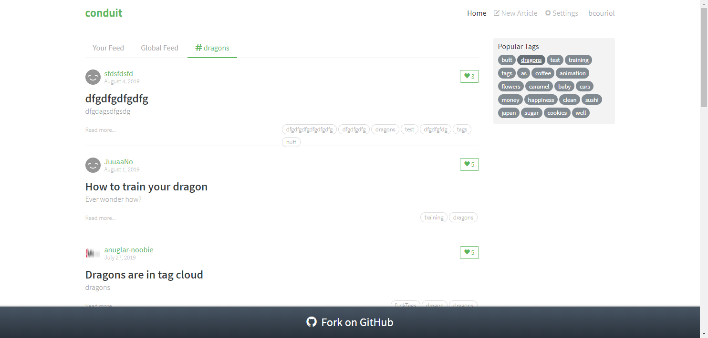|
|`#/settings`|Authenticated, settings|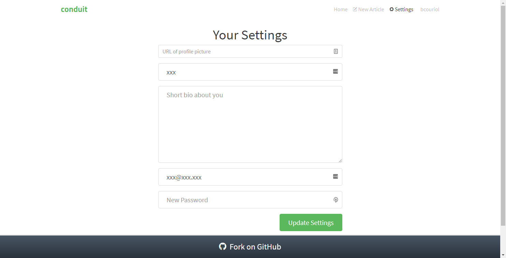|
|`#/settings`|Authenticated, settings|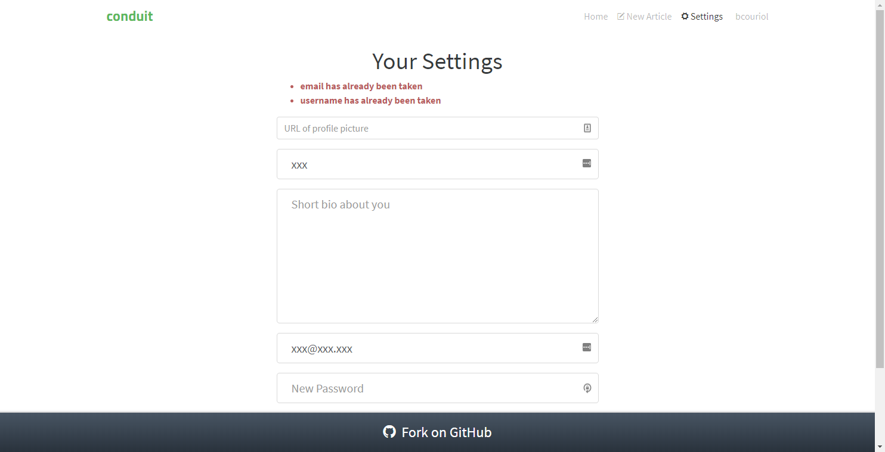|
|`#/@me`|Authenticated, profile settings, my article tab|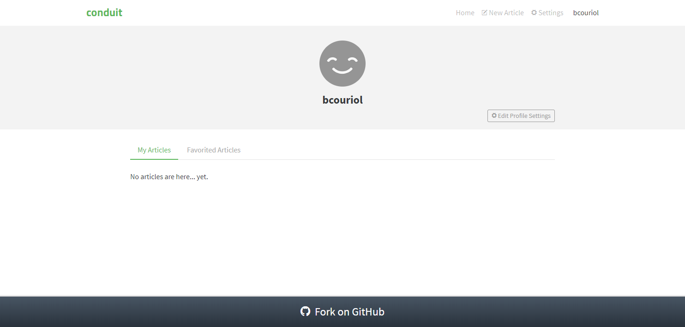|
|`#/@me`|Authenticated, profile settings, favorites tab|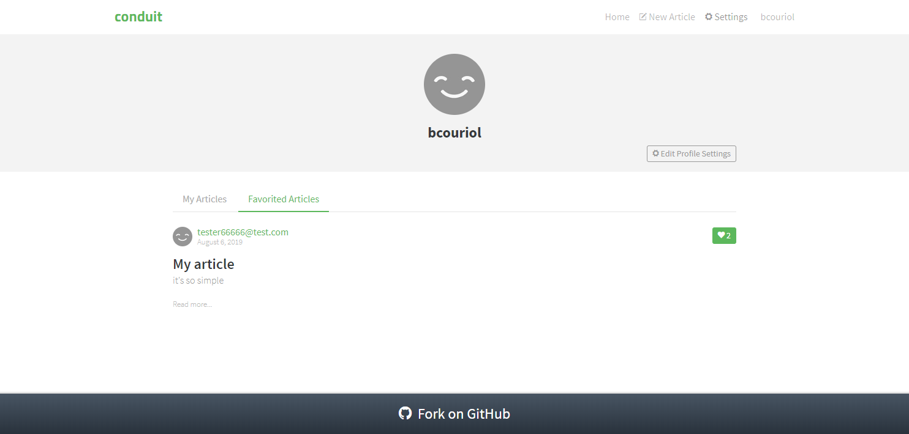|
|`#/article/hi-there-fosy10`|Not authenticated, article chosen|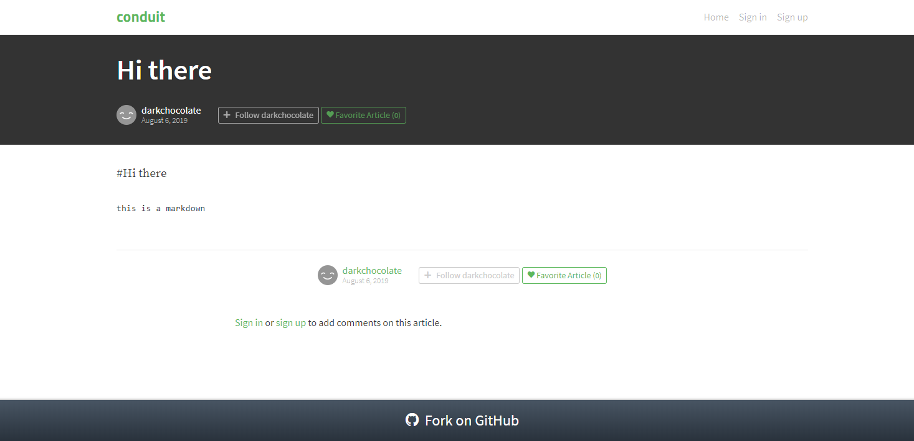|
|`#/article/my-article-lzrbg0`|Authenticated, article chosen|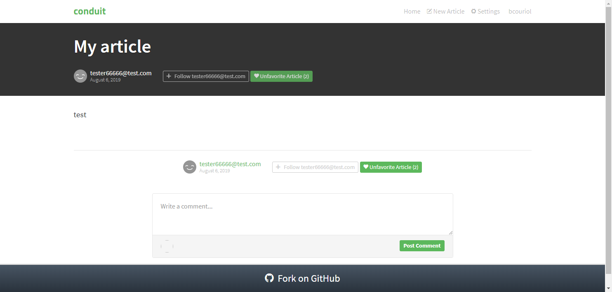|
|`#/article/my-article-lzrbg0`|Authenticated, comment posted|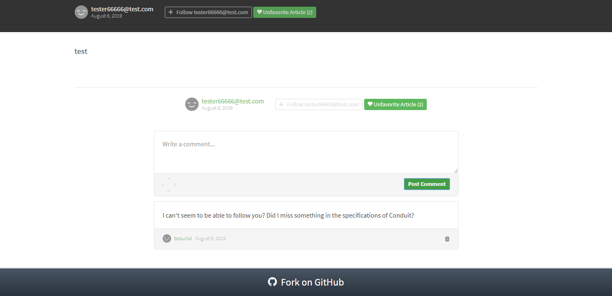|
|`#/editor`|Authenticated, new article|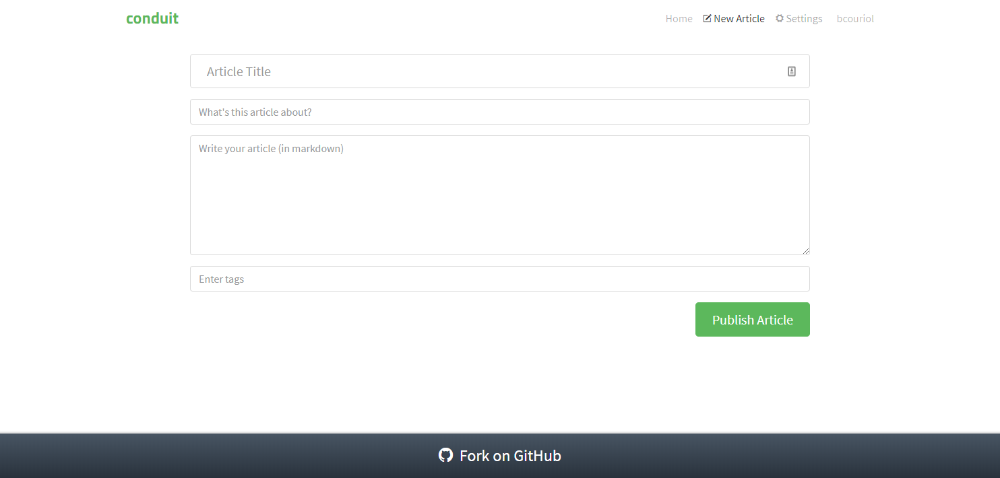|
|`#/article/<title>-x4fafc`|Authenticated, published article|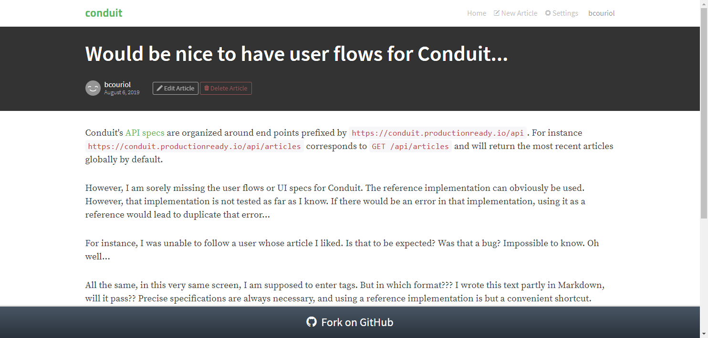|
|`#/editor/<title>-x4fafc`|Authenticated, edit article|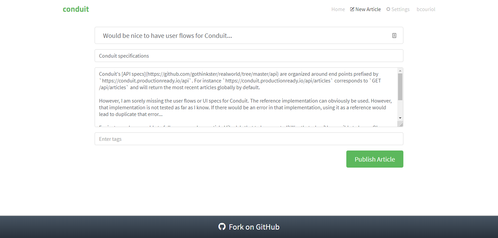|
|`#/@deneme22`|Clicked on user|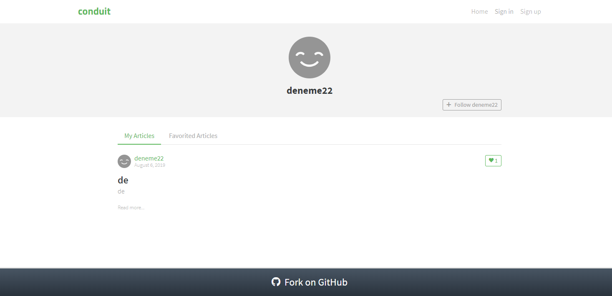|
|`#/register`|Authentication required||
|`#/register`|Sign up clicked||
|`#/register`|Sign up failed||
|`#/login`|Sign in clicked|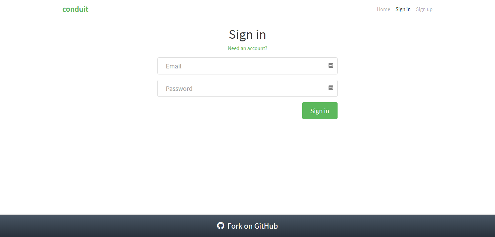|



Note that it is unclear if the reference implementation is exempt of bugs. It is however the reference implementation, and we will seek to replicate its behaviour unless we have a good reason not to.


Authentication is required to:

- follow a user
- like an article
- post a comment
- publish an article
- and obviously to modify one's settings and profile

The *Sign in* and *Sign up* screens will display validation information in case of errors while attempting login or signing up. Markwdown can be used in published articles, but not in posted comments. 

Other general front-end specs can be found [here](https://github.com/gothinkster/realworld/tree/master/spec#frontend-specs).

## Specifications analysis
While not an overly complex application, Conduit has enough features and a complex enough control flow to be challenging to implement. As the former section exemplifies, the same route can correspond to different states of the application and may result in different screens being displayed and different control flow being applied. 

Good, that is exactly what state machines are good at modelizing.

The application is complex enough to warrant thinking ahead about architecture before entering the implementation phase.

## Architecture
We have two obvious interfaced systems: the browser DOM and the API server with a series of endpoints. We have to handle authentication, so we will add a third interfaced systems (local storage) to keep track of a user session. Authentication state does not belong to application state as its life span is greater than the application's.

The whole application will be handled with a single state machine. The Kingly architecture will be used, separating commands from command execution. API commands will be gather in a domain module with all the allowed domain operations (typically CRUD operations on domain objects -- articles, comments, etc.). 

This leads us to the following architecture:


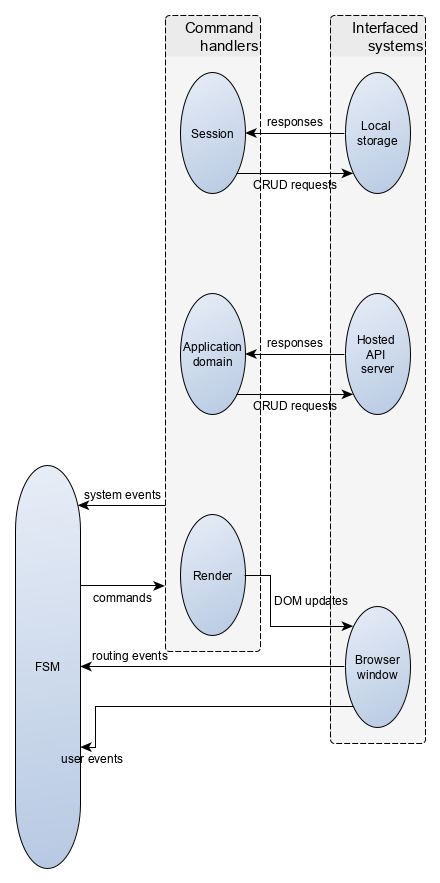


## Cross-cutting concerns
Routing and authentication will be omnipresent parts of the application. It is thus convenient to think ahead how to integrate those. 

Routing in Conduit is driven by the hash tag. As such there is no reload when updating the route. Instead the browser emits a `hashchange` event. If the user loads or reloads a page, the route is available in the `location` property of the global `window` object. Lastly, we also have to deal with the *Back* and *Forward* buttons. To that effect, we can use the `popstate` event. In summary:

| User action | Event| 
|:---|:---|
|load/reload|none, route available in `window.location`|
|link clicked leading to route change|`hashchange`|
|browser's back button clicked| `popstate`| 
|browser's forward button clicked| `popstate`| 

By subscribing to the aforementioned events, and forwarding them to the Kingly machine, we can handle hash-routing without need of an external library.

Authentication consists of login and registration (sign up). The Conduit API specs provide a [login endpoint](https://github.com/gothinkster/realworld/tree/master/api#authentication) and a [registration endpoint](https://github.com/gothinkster/realworld/tree/master/api#registration) which we will use to that purpose. The returned user data will be stored locally on the user browser (using the `LocalStorage` browser API). This means a successful log-in API call must result in an update of local storage. Similarly a successful log out must update accordingly `LocalStorage`. With this set, identifying whether a user is authenticated becomes a matter of reading the user log-in data in the local storage. 

## Implementation strategy
This being a reasonably complex application, we are going to follow an iterative implementation process. At each implementation step, we will seek to implement a larger portion of the specification.

In each step, we will follow the same process:
- select the user flows we want to implement 
- identify both the corresponding events, and the triggered actions
- implement the UI
- test the UI with storybook
- implement the actions (we will skip testing the actions, as they are pretty straight forward)
- write tests for the user flows
- modelize the behaviour of the application corresponding to those user flows
- implement the corresponding Kingly machine and pass the predefined tests
- use property-based testing and generative testing to further test the implementation
- update the implementation to pass the possibly failing tests

In each step, we will seek to implement a route. We start with the home route.
