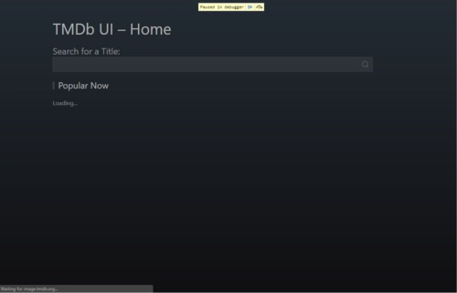
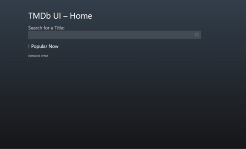
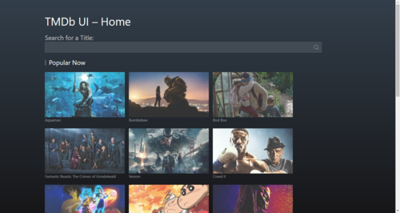
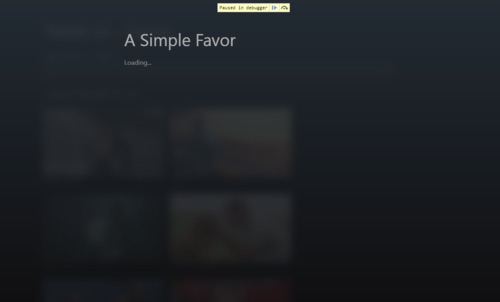
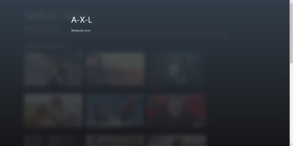
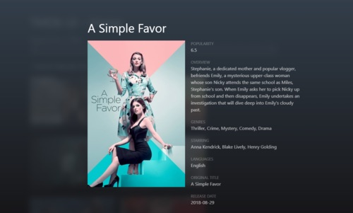

In this tutorial, we will implement an online interface to [The Movie Database (TMDB)](https://www.themoviedb.org/?language=en-US). In doing so, we will illustrate an analysis technique called [step-wise refinement](http://people.cs.pitt.edu/~chang/153/c06design/c04.htm). This top-down approach fits well state machine modelling and naturally leads to a breakdown on the application logic in a hierarchy of states. We will also use this tutorial to show how routing can be easily implemented with state machines. With respect to the state machine formalism, we will make use of compound states, and eventless states.

## Interface behaviour
The online interface to the TMDB mainly consists of an input field through which the user enters the name of a movie. The behaviour is as follows:
- As the user types in, requests are issued to the TMDB database through its defined REST API, and the received responses are displayed with a maximum of 20 movies per request. 
- Users can additionally pick one of the displayed movie, which leads to issueing another request to TMDB, this time to get additional details about the movie, such as the synopsis of the movie. 
- On receiving that request, the extra movie details are displayed. The user can then click to discard the detailed movie view and return to the previous screen.
- Request may fail in which case an error screen is displayed

## Routes
Additionally the following routes will be defined, allowing to bookrmark a search:

| Route | Shows |
|:---|:---|
|`TMDB_APP_SLUG/`|Screen with most popular movies| 
|`TMDB_APP_SLUG/:query`|Screen with movies related to `query`| 
|`TMDB_APP_SLUG/:query:/:id`|Screen with detail of the movie identified by `id`| 
 
## UI
Follows some screen samples of the application in different states:


|Route|Fetching|Failure|Success|
|:---|:---:|:---:|:---:|
|'/'|||
|'/:query'|||
|'/:query/:id'|||

